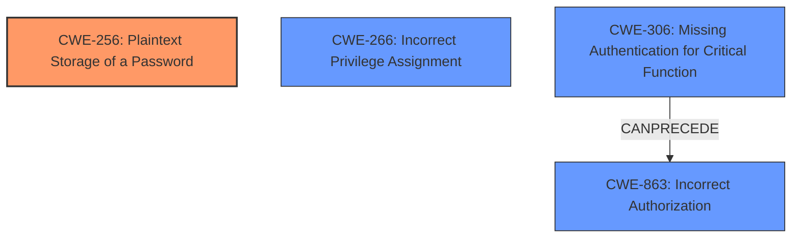

# Analysis Report for CVE-2024-39344

# Vulnerability Analysis Report: CVE-2024-39344

## Description

An issue was discovered in the Docusign API package 8.142.14 for Salesforce. The Apttus_DocuApi__DocusignAuthentication__mdt object is installed via the marketplace from this package and stores some configuration information in a manner that could be compromised. With the default settings when installed for all users, the object can be accessible and (via its fields) could disclose some keys. These disclosed components can be combined to create a valid session via the Docusign API. This will generally lead to a complete compromise of the Docusign account because the session is for an administrator service account and may have permission to re-authenticate as specific users with the same authorization flow.

## Vulnerability Description Key Phrases

- **Rootcause:** improper storage of sensitive information
- **Impact:** complete compromise of Docusign account
- **Product:** Docusign API package
- **Version:** 8.142.14
- **Component:** Apttus_DocuApi__DocusignAuthentication__mdt object

## Analysis (with Relationship Data)

# Summary
| CWE ID    | CWE Name                                                        | Confidence | CWE Abstraction Level | CWE Vulnerability Mapping Label | CWE-Vulnerability Mapping Notes |
| :-------- | :-------------------------------------------------------------- | :--------- | :-------------------- | :------------------------------ | :------------------------------ |
| CWE-256   | Plaintext Storage of a Password                                 | 0.9        | Base                  | Allowed                       | Primary CWE                     |
| CWE-266   | Incorrect Privilege Assignment                                  | 0.7        | Base                  | Allowed                       | Secondary Candidate             |
| CWE-306   | Missing Authentication for Critical Function                    | 0.6        | Base                  | Allowed                       | Secondary Candidate             |
| CWE-863   | Incorrect Authorization                                         | 0.6        | Class                  | Allowed-with-Review           | Secondary Candidate             |

## Evidence and Confidence

*   **Confidence Score:** 0.8
*   **Evidence Strength:** HIGH

## Relationship Analysis
The primary CWE is CWE-256, which directly reflects the **improper storage of sensitive information**. Other CWEs considered relate to privilege management, authentication, and authorization, forming a potential chain of weaknesses. For example, **incorrect privilege assignment** (CWE-266) could lead to the **missing authentication** (CWE-306) or **incorrect authorization** (CWE-863). The hierarchical relationships and chain patterns helped to refine the selection and prioritize the root cause. Abstraction levels were chosen to be as specific as the evidence allows, focusing on Base level CWEs where possible.



## Vulnerability Chain
1.  **Root Cause:** **Improper Storage of Sensitive Information** (CWE-256) in the `Apttus_DocuApi__DocusignAuthentication__mdt` object.
2.  **Incorrect Privilege Assignment** (CWE-266): The object is accessible to all users due to default settings, potentially combined with privilege issues in how the API keys are managed.
3.  **Missing Authentication for Critical Function** (CWE-306) or **Incorrect Authorization** (CWE-863): The disclosed keys can be used to create a valid session, bypassing or incorrectly performing authentication and authorization checks.
4.  **Impact:** Complete compromise of the Docusign account, including potential re-authentication as specific users.

## Summary of Analysis
The initial analysis focused on identifying the root cause and related weaknesses based on the provided evidence. The primary weakness identified is CWE-256 (Plaintext Storage of a Password) due to the **improper storage of sensitive API keys**. The vulnerability description and CVE summary clearly indicate that the API keys are stored in a manner that could be compromised. The retriever results and enhanced context provide additional candidate CWEs related to authorization and privilege management, which are considered as secondary contributing factors. The final selection prioritizes the root cause (CWE-256) while acknowledging the potential impact of other weaknesses like incorrect privilege assignment (CWE-266), missing authentication (CWE-306), and incorrect authorization (CWE-863). The selected CWEs are at the optimal level of specificity, providing a clear and accurate representation of the vulnerability.

Relevant CWE Information:

*   **CWE-256: Plaintext Storage of a Password**
    *   The vulnerability involves storing API keys in a custom metadata object without proper encryption or protection. This directly aligns with CWE-256, which describes the storage of sensitive information in plaintext.
    *   The security implication is that unauthorized users can easily access and use these keys to compromise the Docusign account.
    *   This is the primary weakness because it directly leads to the disclosure of sensitive credentials.
    *   Mapping Guidance: Allowed.
*   **CWE-266: Incorrect Privilege Assignment**
    *   The vulnerability description mentions that the object can be accessible to all users with default settings. This suggests that the privileges for accessing the metadata object are incorrectly assigned, allowing unauthorized users to read the sensitive data.
    *   This weakness could contribute to the overall vulnerability by making it easier for attackers to access the API keys.
    *   Mapping Guidance: Allowed.
*   **CWE-306: Missing Authentication for Critical Function**
    *   The disclosed keys can be used to create a valid session, potentially bypassing authentication checks. This suggests a lack of proper authentication mechanisms for accessing critical functions within the Docusign API.
    *   This weakness could be exploited by attackers to gain unauthorized access to the Docusign account.
    *   Mapping Guidance: Allowed.
*   **CWE-863: Incorrect Authorization**
    *   The vulnerability description mentions that the session created using the disclosed keys may have permission to re-authenticate as specific users. This suggests that the authorization checks are not correctly performed, allowing unauthorized users to perform actions they should not be allowed to perform.
    *   This weakness could be exploited by attackers to impersonate other users within the Docusign account.
    *   Mapping Guidance: Allowed-with-Review.

CWEs Considered but Not Used:

*   CWE-201: Insertion of Sensitive Information Into Sent Data - This CWE focuses on sending sensitive data, whereas the vulnerability is about storing it insecurely.
*   CWE-285: Improper Authorization - Considered but less specific than CWE-863 for this case.
*   CWE-269: Improper Privilege Management - Discouraged and less specific than CWE-266.
*   CWE-532: Insertion of Sensitive Information into Log File - Not applicable as the sensitive information is stored in a metadata object, not a log file.
*   CWE-226: Sensitive Information in Resource Not Removed Before Reuse - Not applicable as the issue is with initial storage, not reuse.
*   CWE-639: Authorization Bypass Through User-Controlled Key - While relevant, CWE-256 is the more direct root cause.
* CWE-732: Incorrect Permission Assignment for Critical Resource - While the issue involves permissions, CWE-266 more directly captures the incorrect privilege assignment aspect.


## CWE Relationship Analysis

Current CWEs represent these abstraction levels: .


### Vulnerability Chain Analysis

**Chain starting from CWE-863:**
- 863 (Incorrect Authorization) - ROOT


**Chain starting from CWE-226:**
- 226 (Sensitive Information in Resource Not Removed Before Reuse) - ROOT


### CWE Relationship Diagram

```mermaid
graph TD
    classDef primary fill:#f96,stroke:#333,stroke-width:2px
    classDef secondary fill:#69f,stroke:#333
    classDef tertiary fill:#9e9,stroke:#333
```


*Report generated on 2025-07-13 11:16:42*
