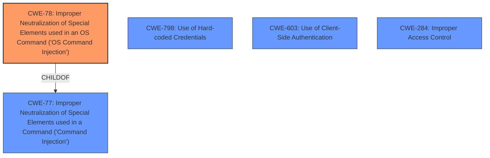

# Analysis for CVE-2024-39373

# Summary
| CWE ID | CWE Name | Confidence | CWE Abstraction Level | CWE Vulnerability Mapping Label | CWE-Vulnerability Mapping Notes |
|---|---|---|---|---|---|
| CWE-78 | Improper Neutralization of Special Elements used in an OS Command ('OS Command Injection') | 1.0 | Base | Allowed | Primary CWE |
| CWE-798 | Use of Hard-coded Credentials | 0.7 | Base | Allowed | Secondary Candidate |
| CWE-603 | Use of Client-Side Authentication | 0.6 | Base | Allowed | Secondary Candidate |
| CWE-284 | Improper Access Control | 0.6 | Class | Allowed-with-Review | Secondary Candidate |

## Evidence and Confidence

*   **Confidence Score:** 0.8
*   **Evidence Strength:** HIGH

## Relationship Analysis
The primary CWE is CWE-78, which is a base-level weakness and a child of CWE-77. The relationships show that CWE-78 can follow CWE-184, indicating a potential chain where incomplete input validation leads to command injection. We also considered CWE-94 and CWE-89, but they were not as directly relevant as CWE-78.

## Vulnerability Chain
The vulnerability chain starts with the **improper neutralization** of special elements in a command, leading to OS command injection. This allows an attacker to gain unauthorized access to the system with administrative privileges. There's also the presence of hard-coded credentials and client-side authentication which further weakens the security posture. The chain is:
1.  **CWE-78: Improper Neutralization of Special Elements used in an OS Command ('OS Command Injection')**
2.  CWE-798: Use of Hard-coded Credentials
3.  CWE-603: Use of Client-Side Authentication
4.  CWE-284: Improper Access Control

## Summary of Analysis
The initial analysis identified several potential CWEs. However, after considering the vulnerability description, CVE reference links, and retriever results, CWE-78 was chosen as the primary CWE due to its direct relevance to the **command injection** vulnerability. The CVE reference specifically mentions **"Improper neutralization of special elements used in a command ('Command Injection')"** as the root cause. The other CWEs (CWE-798, CWE-603, and CWE-284) are listed in the CVE reference links content summary as weaknesses also present, and contribute to the overall security vulnerability.

The selection is based on evidence from the vulnerability description and CVE reference links, making it specific and accurate. The other considered CWEs were either too high-level or did not directly address the **root cause** of the vulnerability.

Relevant CWE Information:

# Enhanced Context (25 CWEs)
The following CWEs were identified as potentially relevant to this vulnerability:

## CWE-78: Improper Neutralization of Special Elements used in an OS Command ('OS Command Injection')
**Abstraction Level**: base
**Similarity Score**: 4.33
**Source**: graph

**Description**:
CWE-78: Improper Neutralization of Special Elements used in an OS Command ('OS Command Injection')

**Mapping Guidance**:
- Usage: Allowed
- Rationale: This CWE entry is at the Base level of abstraction, which is a preferred level of abstraction for mapping to the root causes of vulnerabilities.

**Relationships**:
- CANFOLLOW -> CWE-184
- CANALSOBE -> CWE-88
- CHILDOF -> CWE-77
- CHILDOF -> CWE-77
- CHILDOF -> CWE-74

**Technical Explanation for CWE-78:**
CWE-78 accurately describes the vulnerability where the system fails to properly neutralize special elements used in an OS command. This allows an attacker to inject malicious commands that the system executes. The security implication is that an attacker can gain full control of the system. This is a base-level CWE, providing a specific description of the vulnerability. The relationship to CWE-77 (Improper Neutralization of Special Elements used in a Command) shows that it is a specific type of command injection.

**CWE-798: Use of Hard-coded Credentials**
From the **CVE Reference Links Content Summary**:
*Weaknesses/vulnerabilities present*: Use of Hard-coded Credentials (CWE-798)

**Technical Explanation for CWE-798:**
The presence of hard-coded credentials allows attackers to bypass authentication mechanisms, potentially gaining unauthorized access to sensitive information or administrative privileges.

**CWE-603: Use of Client-Side Authentication**
From the **CVE Reference Links Content Summary**:
*Weaknesses/vulnerabilities present*: Use of Client-Side Authentication (CWE-603)

**Technical Explanation for CWE-603:**
Relying on client-side authentication can be easily bypassed by attackers, as they have full control over the client-side environment. This can lead to unauthorized access and privilege escalation.

**CWE-284: Improper Access Control**
From the **CVE Reference Links Content Summary**:
*Weaknesses/vulnerabilities present*: Improper Access Control (CWE-284).

**Technical Explanation for CWE-284:**
Improper access control means that the system does not correctly restrict access to resources or actions, allowing unauthorized users to perform privileged operations. The CWE mapping guidance was used and is appropriate.