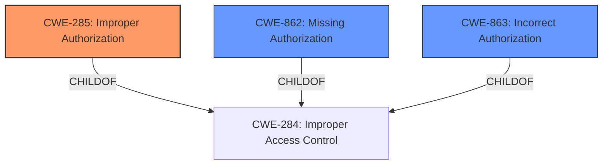

# Enhanced Analysis for CVE-2024-39405

# Summary
| CWE ID  | CWE Name                                              | Confidence | CWE Abstraction Level | CWE Vulnerability Mapping Label | CWE-Vulnerability Mapping Notes |
| :-------- | :---------------------------------------------------- | :--------- | :---------------------- | :------------------------------ | :-------------------------------- |
| CWE-285 | Improper Authorization                                | 0.85       | Class                   | Primary CWE                     | Discouraged                      |
| CWE-863 | Incorrect Authorization                               | 0.75       | Class                   | Secondary Candidate             | Allowed-with-Review               |
| CWE-862 | Missing Authorization                                 | 0.65       | Class                   | Secondary Candidate             | Allowed-with-Review               |

## Evidence and Confidence

*   **Confidence Score:** 0.80
*   **Evidence Strength:** MEDIUM

## Relationship Analysis
The primary relationship impacting the CWE selection is the hierarchical relationship between CWE-284 (Improper Access Control), CWE-285 (Improper Authorization), CWE-862 (Missing Authorization), and CWE-863 (Incorrect Authorization). CWE-285 is chosen as the primary because the vulnerability description specifically mentions "**Improper Authorization vulnerability**". Both CWE-862 and CWE-863 are considered as secondary candidates because they represent specific types of authorization issues, and it is unclear whether authorization is missing or incorrect. The abstraction levels influenced the choice, preferring more specific classifications over the general CWE-284.



## Vulnerability Chain
The vulnerability chain starts with an **Improper Authorization** (CWE-285) due to the **lack of proper restriction or enforcement of permissions**. This leads to a Security feature bypass.
- Root Cause: Improper Authorization (CWE-285)
- Impact: Security Feature Bypass

## Summary of Analysis
The initial analysis focused on identifying the root cause of the vulnerability, which the description clearly states as an "**Improper Authorization vulnerability**". The CVE Reference Links Content Summary reinforces this by stating the root cause is "Improper Access Control (CWE-284)". However, since the vulnerability description specifically mentions "Authorization", CWE-285 is a more appropriate choice than CWE-284.

The Retriever Results listed several candidate CWEs, with CWE-284, CWE-285, CWE-863, CWE-639, and CWE-862 having high similarity scores. Given the guidance to prefer more specific CWEs when available and the clear indication of an authorization problem, I selected CWE-285 as the primary CWE. CWE-862 and CWE-863 were considered as secondary candidates because it is unclear if Authorization is missing (CWE-862) or Incorrect (CWE-863).

The final decision is based on the evidence from the vulnerability description and the CVE Reference Links Content Summary, combined with the CWE relationship analysis and mapping guidance. The selected CWEs are at the optimal level of specificity, providing a clear and accurate representation of the vulnerability.

Relevant CWE Information:

**CWE-285: Improper Authorization**

*   **Technical Explanation:** The product does not perform or incorrectly performs an authorization check when an actor attempts to access a resource or perform an action. In this case, a low-privileged attacker can bypass security measures and modify minor information.
*   **Security Implications:** Unauthorized access to resources or functionality, leading to security feature bypass.
*   **Relationship:** Child of CWE-284 (Improper Access Control).
*   **Mapping Guidance Influence:** Choosing CWE-285 over CWE-284 due to the explicit mention of "Authorization" in the vulnerability description and the guidance to prefer more specific CWEs.
*   **Primary/Secondary:** Primary

**CWE-863: Incorrect Authorization**

*   **Technical Explanation:** The product performs an authorization check when an actor attempts to access a resource or perform an action, but it does not correctly perform the check.
*   **Security Implications:** Unauthorized access to resources or functionality, leading to security feature bypass.
*   **Relationship:** Child of CWE-284 (Improper Access Control).
*   **Mapping Guidance Influence:** Considered because it's a more specific form of authorization failure.
*   **Primary/Secondary:** Secondary

**CWE-862: Missing Authorization**

*   **Technical Explanation:** The product does not perform any authorization check before an actor attempts to access a resource or perform an action.
*   **Security Implications:** Unauthorized access to resources or functionality, leading to security feature bypass.
*   **Relationship:** Child of CWE-284 (Improper Access Control).
*   **Mapping Guidance Influence:** Considered because it's a more specific form of authorization failure.
*   **Primary/Secondary:** Secondary

**CWEs Considered But Not Used:**

*   CWE-284: Improper Access Control - While the CVE Reference Links Content Summary mentions this, the vulnerability description specifies "Improper Authorization", making CWE-285 a more precise fit.
*   CWE-639: Authorization Bypass Through User-Controlled Key - This CWE is too specific; the vulnerability description doesn't mention user-controlled keys.
*   CWE-306: Missing Authentication for Critical Function - The vulnerability description doesn't indicate any missing authentication. The issue is about authorization after authentication.


## CWE Relationship Analysis

Current CWEs represent these abstraction levels: .


### Vulnerability Chain Analysis

**Chain starting from CWE-863:**
- 863 (Incorrect Authorization) - ROOT


**Chain starting from CWE-862:**
- 862 (Missing Authorization) - ROOT


### CWE Relationship Diagram

```mermaid
graph TD
    classDef primary fill:#f96,stroke:#333,stroke-width:2px
    classDef secondary fill:#69f,stroke:#333
    classDef tertiary fill:#9e9,stroke:#333
```