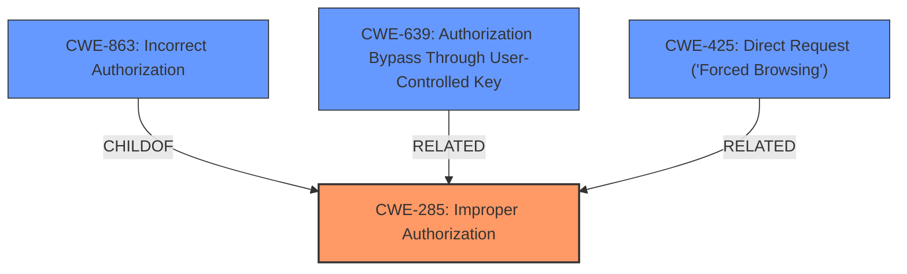

# Raw Analyzer Response for CVE-2024-39413

# Summary
| CWE ID  | CWE Name                                                     | Confidence | CWE Abstraction Level | CWE Vulnerability Mapping Label | CWE-Vulnerability Mapping Notes |
| :-------- | :----------------------------------------------------------- | :--------- | :---------------------- | :------------------------------ | :------------------------------ |
| CWE-285   | Improper Authorization                                       | 0.9        | Class                   | Primary                         | Discouraged                    |
| CWE-863   | Incorrect Authorization                                      | 0.7        | Class                   | Secondary                       | Allowed-with-Review           |
| CWE-639   | Authorization Bypass Through User-Controlled Key             | 0.6        | Base                    | Secondary                       | Allowed                        |
| CWE-425   | Direct Request ('Forced Browsing')                           | 0.6        | Base                    | Secondary                       | Allowed                        |

## Evidence and Confidence

*   **Confidence Score:** 0.8
*   **Evidence Strength:** HIGH

## Relationship Analysis

The primary CWE is CWE-285, **Improper Authorization**, which is a class-level CWE. CWE-863, **Incorrect Authorization**, is a more specific child of CWE-285, as it describes cases where an authorization check exists but is performed incorrectly. CWE-639, **Authorization Bypass Through User-Controlled Key**, and CWE-425, **Direct Request ('Forced Browsing')**, are base-level CWEs that can potentially lead to authorization bypasses. The selection prioritizes the **Improper Authorization** at the class level because the description indicates a general **improper authorization** issue without specifying the exact mechanism.

## Vulnerability Chain

The vulnerability chain starts with the **improper authorization**, leading to a security feature bypass and minor information disclosure.

Improper Authorization (CWE-285) -> Security Feature Bypass -> Information Disclosure

## Summary of Analysis

The initial analysis focused on identifying the root cause of the vulnerability, which is described as an **Improper Authorization** issue in Adobe Commerce. The primary CWE selected is CWE-285, **Improper Authorization**, as it directly corresponds to the reported root cause.

The retriever results and similar CVE descriptions also pointed to CWE-863, **Incorrect Authorization**, and CWE-639, **Authorization Bypass Through User-Controlled Key**. While CWE-863 could be a more specific case of CWE-285, the provided information doesn't give enough detail to choose it over the broader CWE-285. The same applies to CWE-639 and CWE-425, as they represent specific types of authorization bypasses but the description doesn't suggest a specific mechanism.

The final decision to use CWE-285 as the primary CWE is based on the evidence "Improper Authorization vulnerability that could result in a Security feature bypass". This is a direct match to the definition of CWE-285.

CWE-863, CWE-639, and CWE-425 were considered as secondary CWEs to provide more context.

Relevant CWE Information:

*   **CWE-285: Improper Authorization** - The product does not perform or incorrectly performs an authorization check when an actor attempts to access a resource or perform an action.
*   **CWE-863: Incorrect Authorization** - The product performs an authorization check when an actor attempts to access a resource or perform an action, but it does not correctly perform the check.
*   **CWE-639: Authorization Bypass Through User-Controlled Key** - The system's authorization functionality does not prevent one user from gaining access to another user's data or record by modifying the key value identifying the data.
*   **CWE-425: Direct Request ('Forced Browsing')** - The web application does not adequately enforce appropriate authorization on all restricted URLs, scripts, or files.

Other CWEs Considered but Not Used:

*   CWE-284: Improper Access Control - This was considered but not used because CWE-285 is more specific and directly relates to the authorization issue.
*   CWE-306: Missing Authentication for Critical Function - This was not used because the issue is related to authorization, not authentication.
*   CWE-20: Improper Input Validation - This was not used because the vulnerability is not related to input validation.
*   CWE-770: Allocation of Resources Without Limits or Throttling - Not relevant to the described vulnerability.
*   CWE-471: Modification of Assumed-Immutable Data (MAID) - Not relevant to the described vulnerability.