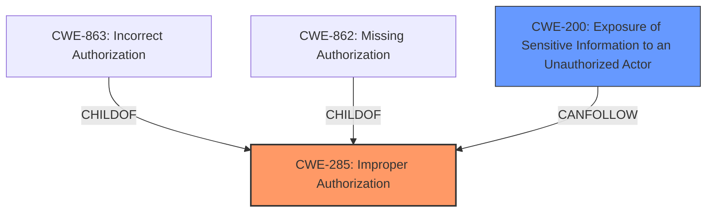

# Raw Analyzer Response for CVE-2024-39418

# Summary
| CWE ID | CWE Name | Confidence | CWE Abstraction Level | CWE Vulnerability Mapping Label | CWE-Vulnerability Mapping Notes |
|---|---|---|---|---|---|
| CWE-285 | Improper Authorization | 0.9 | Class | Primary CWE | Discouraged |
| CWE-200 | Exposure of Sensitive Information to an Unauthorized Actor | 0.5 | Class | Secondary Candidate | Discouraged |

## Evidence and Confidence

*   **Confidence Score:** 0.7
*   **Evidence Strength:** MEDIUM

## Relationship Analysis
The primary relationship that influenced the CWE selection is the parent-child relationship. CWE-285, Improper Authorization, is a class-level CWE. The retriever results also suggested more specific CWEs like CWE-863 (Incorrect Authorization) and CWE-862 (Missing Authorization). However, the provided vulnerability description only mentions "Improper Authorization" without specifying whether the authorization check was incorrect or missing. Therefore, the more general CWE-285 is appropriate.

## Vulnerability Chain
The vulnerability chain starts with the **Improper Authorization** (CWE-285), which leads to a security feature bypass, allowing a low-privileged attacker to view and edit low-sensitivity information. This can potentially lead to Exposure of Sensitive Information (CWE-200).

## Summary of Analysis
The initial analysis identified **Improper Authorization** as the root cause of the vulnerability, aligning with the provided description. The retriever results suggested more specific authorization-related CWEs, but the lack of detail in the description makes CWE-285 the most appropriate choice. The relationship analysis shows that CWE-862 and CWE-863 are children of CWE-285, but there is no indication of whether the authorization was missing or incorrect.

The assessment is heavily based on the provided evidence, specifically the "Vulnerability Description Key Phrases" section, which explicitly states the **rootcause** as **Improper Authorization**.

The selected CWEs are at the optimal level of specificity because the available information doesn't allow for a more granular classification. The "CWE for similar CVE Descriptions" section lists CWE-NVD-noinfo as the primary match, but this is not a valid CWE. The next most common CWE is CWE-863 (Incorrect Authorization), but without more information on whether the authorization was implemented incorrectly rather than missing, CWE-285 is a better choice.

Relevant CWE Information:

# Enhanced Context (25 CWEs)
The following CWEs were identified as potentially relevant to this vulnerability:

## CWE-285: Improper Authorization
**Abstraction Level**: Class
**Similarity Score**: 1419.42
**Source**: sparse

**Description**:
The product does not perform or incorrectly performs an authorization check when an actor attempts to access a resource or perform an action.

**Mapping Guidance**:
- Usage: Discouraged
- Rationale: CWE-285 is high-level and lower-level CWEs can frequently be used instead. It is a level-1 Class (i.e., a child of a Pillar).

**Why Used**: The vulnerability description explicitly states "**Improper Authorization**" as the root cause. While the mapping guidance discourages using this CWE directly if a more specific one is available, the description lacks sufficient detail to determine if the authorization was missing or incorrect.

## CWE-200: Exposure of Sensitive Information to an Unauthorized Actor
**Abstraction Level**: class
**Similarity Score**: 2.55
**Source**: graph

**Description**:
CWE-200: Exposure of Sensitive Information to an Unauthorized Actor

**Mapping Guidance**:
- Usage: Discouraged
- Rationale: CWE-200 is commonly misused to represent the loss of confidentiality in a vulnerability, but confidentiality loss is a technical impact - not a root cause error. As of CWE 4.9, over 400 CWE entries can lead to a loss of confidentiality. Other options are often available. [REF-1287].

**Why Used**: The vulnerability description mentions that a low-privileged attacker can "view and edit low-sensitivity information," which could lead to the exposure of sensitive information. While the description specifies "low-sensitivity information," this still represents a potential information exposure issue, making CWE-200 a secondary candidate.

## CWE-863: Incorrect Authorization
**Abstraction Level**: Class
**Similarity Score**: 1392.72
**Source**: sparse

**Description**:
The product performs an authorization check when an actor attempts to access a resource or perform an action, but it does not correctly perform the check.

**Mapping Guidance**:
- Usage: Allowed-with-Review
- Rationale: This CWE entry is a Class and might have Base-level children that would be more appropriate

**Why Not Used**: This CWE was considered, but the description does not state whether the authorization was performed incorrectly. It only states that it was **Improper**, which is too vague.

## CWE-862: Missing Authorization
**Abstraction Level**: Class
**Similarity Score**: 1392.72
**Source**: sparse

**Description**:
The product does not perform an authorization check when an actor attempts to access a resource or perform an action.

**Mapping Guidance**:
- Usage: Allowed-with-Review
- Rationale: This CWE entry is a Class and might have Base-level children that would be more appropriate

**Why Not Used**: This CWE was considered, but the description does not state whether the authorization was missing. It only states that it was **Improper**, which is too vague.