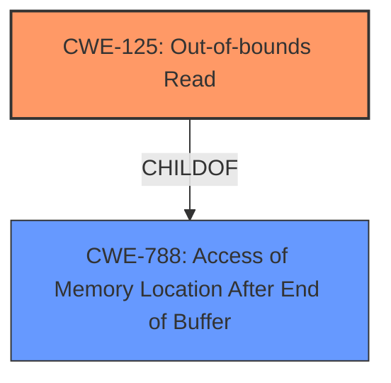

# Analysis for CVE-2024-39426

# Summary
| CWE ID | CWE Name | Confidence | CWE Abstraction Level | CWE Vulnerability Mapping Label | CWE-Vulnerability Mapping Notes |
|---|---|---|---|---|---|
| CWE-125 | Out-of-bounds Read | 1.0 | Base | Primary | Allowed |
| CWE-788 | Access of Memory Location After End of Buffer | 0.7 | Base | Secondary | Discouraged |

## Evidence and Confidence

*   **Confidence Score:** 0.9
*   **Evidence Strength:** HIGH

## Relationship Analysis
The primary relationship that influenced my decision was the parent-child relationship between CWE-788 and CWE-125. While the vulnerability description and CVE summary both point to an out-of-bounds read, the summary also mentions the root cause is "Access of memory location after end of buffer", suggesting CWE-788 might be applicable. However, CWE-788 is discouraged for direct mapping when more specific options exist. Since the vulnerability description explicitly states "**out-of-bounds read vulnerability**," CWE-125 is the more appropriate, specific choice.

## Vulnerability Chain
The vulnerability chain starts with parsing a crafted file, leading to an **out-of-bounds read vulnerability**, ultimately resulting in the ability to execute code in the context of the current user. The root cause is the **out-of-bounds read** during file parsing.

## Summary of Analysis
Initially, the **out-of-bounds read vulnerability** pointed directly to CWE-125. The CVE Reference Links Content Summary further clarifies the root cause as "Access of memory location after end of buffer" and "Access of Memory Location After End of Buffer (CWE-788)". However, CWE-788 is discouraged when more specific options are available. Given that the vulnerability is explicitly described as an "**out-of-bounds read vulnerability**" and CWE-125 is a more specific classification, I have selected CWE-125 as the primary CWE with high confidence. The presence of "Access of memory location after end of buffer" makes CWE-788 a consideration, but less specific than CWE-125.

Relevant CWE Information:

# Enhanced Context (25 CWEs)
The following CWEs were identified as potentially relevant to this vulnerability:

## CWE-788: Access of Memory Location After End of Buffer
**Abstraction Level**: Base
**Similarity Score**: 0.75
**Source**: dense

**Description**:
The product reads or writes to a buffer using an index or pointer that references a memory location after the end of the buffer.

**Mapping Guidance**:
- Usage: Discouraged
- Rationale: The CWE entry might be misused when lower-level CWE entries might be available. It also overlaps existing CWE entries and might be deprecated in the future.

## CWE-125: Out-of-bounds Read
**Abstraction Level**: Base
**Similarity Score**: 0.70
**Source**: dense

**Description**:
The product reads data past the end, or before the beginning, of the intended buffer.

**Mapping Guidance**:
- Usage: Allowed
- Rationale: This CWE entry is at the Base level of abstraction, which is a preferred level of abstraction for mapping to the root causes of vulnerabilities.

---

**CWE-125: Out-of-bounds Read**
*   **Explanation:** The vulnerability description explicitly states an "**out-of-bounds read vulnerability**." This directly corresponds to the definition of CWE-125, which involves reading data past the boundaries of an intended buffer. The **weakness** allows an attacker to read sensitive information or potentially trigger other vulnerabilities.
*   **Security Implications:** An **out-of-bounds read** can lead to information disclosure, denial of service, or, in some cases, arbitrary code execution.
*   **Relationship:** CWE-125 is a base-level CWE.
*   **Mapping Guidance Influence:** The MITRE mapping guidance allows for the use of CWE-125.
*   **Usage:** Primary CWE

**CWE-788: Access of Memory Location After End of Buffer**
*   **Explanation:** The "Root cause of vulnerability" in the CVE Reference Links Content Summary states: "Access of memory location after end of buffer". While this could be an applicable CWE, it is discouraged when more specific options exist. The **out-of-bounds read** is a more specific description of the **weakness**.
*   **Security Implications:** Accessing memory outside the bounds of a buffer can lead to crashes, information disclosure, or arbitrary code execution.
*   **Relationship:** CWE-788 is a parent of CWE-125 (Out-of-bounds Read).
*   **Mapping Guidance Influence:** The MITRE mapping guidance discourages the use of CWE-788 when lower-level CWE entries are available.
*   **Usage:** Secondary CWE

**CWEs Considered but Not Used:**

*   CWE-787 (Out-of-bounds Write): This CWE was not selected because the vulnerability is specifically described as an **out-of-bounds read**, not a write.
*   CWE-120 (Buffer Copy without Checking Size of Input): This CWE was not selected because the description indicates parsing a crafted file which may or may not involve copying buffers.
*   CWE-190 (Integer Overflow or Wraparound): This CWE was not selected because there is no evidence in the description to suggest an integer overflow is the root cause.
*   CWE-824 (Access of Uninitialized Pointer): This CWE was not selected because there is no mention of uninitialized pointers.
*   CWE-843 (Access of Resource Using Incompatible Type ('Type Confusion')): This CWE was not selected because the description does not suggest type confusion as a cause.