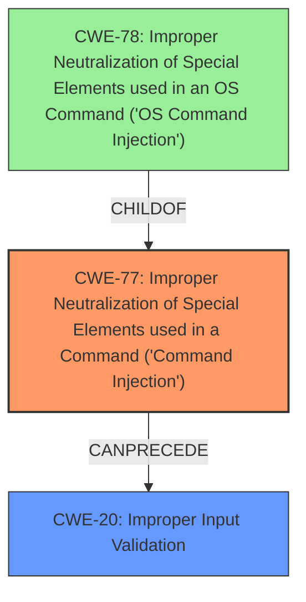

# Enhanced Analysis for CVE-2024-39436

# Summary
| CWE ID | CWE Name | Confidence | CWE Abstraction Level | CWE Vulnerability Mapping Label | CWE-Vulnerability Mapping Notes |
|---|---|---|---|---|---|
| CWE-77 | Improper Neutralization of Special Elements used in a Command ('Command Injection') | 0.9 | Class | Primary | Allowed-with-Review |
| CWE-20 | Improper Input Validation | 0.7 | Class | Secondary | Discouraged |

## Evidence and Confidence

*   **Confidence Score:** 0.8
*   **Evidence Strength:** MEDIUM

## Relationship Analysis
The primary relationship that influenced the CWE selection is that CWE-77 is a more specific type of injection than CWE-74 (Improper Neutralization of Special Elements in Output Used by a Downstream Component ('Injection')). CWE-77 is also related to CWE-78 (Improper Neutralization of Special Elements used in an OS Command ('OS Command Injection')), with CWE-78 being a base level CWE and a child of CWE-77, however, since there is no mention of OS commands specifically, CWE-77 is chosen. CWE-20 is also considered as a general case of **improper input validation** that leads to the **command injection**.



## Vulnerability Chain
The vulnerability chain starts with **improper input validation** (CWE-20), which allows for **command injection** (CWE-77). This leads to a local escalation of privilege.

## Summary of Analysis
The vulnerability description clearly states "**command injection** due to **improper input validation**". This directly maps to CWE-77.
The retriever results also list CWE-77 as the top combined result.
CWE-20 is added as a secondary weakness because **improper input validation** is the root cause that enables the **command injection**.
CWE-862 was listed as the primary CWE match for similar CVE Descriptions, however, there is no direct mention of missing authorization. There is a mention of local escalation of privilege, but without more details, this is not enough information to select it.
I am choosing CWE-77 and CWE-20 because they are the most specific and relevant based on the provided evidence.

Relevant CWE Information:

# Enhanced Context (25 CWEs)
The following CWEs were identified as potentially relevant to this vulnerability:


## CWE Relationship Analysis

Current CWEs represent these abstraction levels: .


### Vulnerability Chain Analysis

**Chain starting from CWE-862:**
- 862 (Missing Authorization) - ROOT


**Chain starting from CWE-77:**
- 77 (Improper Neutralization of Special Elements used in a Command ('Command Injection')) - ROOT


### CWE Relationship Diagram

```mermaid
graph TD
    classDef primary fill:#f96,stroke:#333,stroke-width:2px
    classDef secondary fill:#69f,stroke:#333
    classDef tertiary fill:#9e9,stroke:#333
```