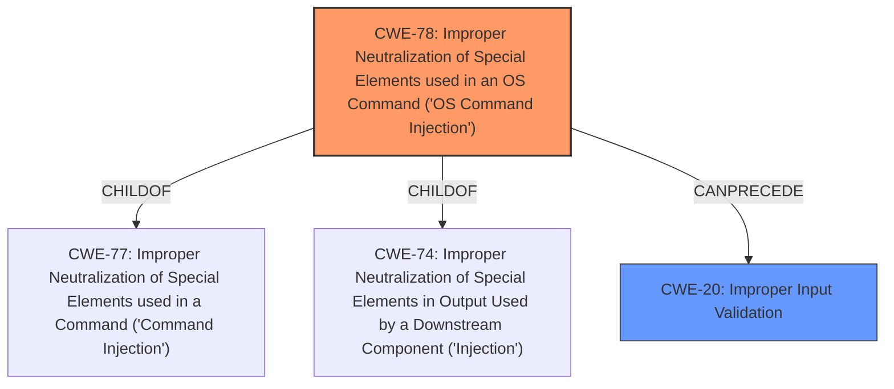

# Enhanced Analysis for CVE-2024-39437

# Summary
| CWE ID  | CWE Name                                                                                                 | Confidence | CWE Abstraction Level | CWE Vulnerability Mapping Label | CWE-Vulnerability Mapping Notes |
| :-------- | :--------------------------------------------------------------------------------------------------------- | :--------- | :---------------------- | :------------------------------ | :------------------------------ |
| CWE-78  | Improper Neutralization of Special Elements used in an OS Command ('OS Command Injection') | 0.75       | Base                      | Primary CWE                   | Allowed                         |
| CWE-20  | Improper Input Validation                                                                    | 0.50       | Class                     | Secondary Candidate             | Discouraged                    |

## Evidence and Confidence

*   **Confidence Score:** 0.70
*   **Evidence Strength:** MEDIUM

## Relationship Analysis
The primary weakness is **command injection**, which stems from **improper input validation**. CWE-78 is a more specific child of CWE-77 and CWE-74. CWE-20 is a general class of weakness, and while relevant, it's less specific than CWE-78 in this context. The choice of CWE-78 as the primary CWE is based on the explicit mention of "command injection" in the vulnerability description and the fact that it is at the base level.



## Vulnerability Chain
The vulnerability chain starts with **improper input validation** (CWE-20), which leads to **command injection** (CWE-78). The impact of this is local escalation of privilege.

## Summary of Analysis
The vulnerability description explicitly states "command injection due to improper input validation." This directly points to CWE-78 (Improper Neutralization of Special Elements used in an OS Command ('Command Injection')) as the primary weakness. While **improper input validation** is mentioned (CWE-20), it's a more general weakness, and CWE-78 is a more specific and accurate representation of the vulnerability. The high retriever score for CWE-77 and CWE-78 support this selection.

The decision is based on the evidence provided in the vulnerability description, focusing on the root cause and the type of injection. I'm using CWE-78, which is at the base level, as the primary CWE because the description uses the term "command injection" which strongly indicates CWE-78.

CWE-862 (Missing Authorization) and privilege-related CWEs were considered, especially given the impact of "local escalation of privilege," but the explicit mention of "command injection" makes CWE-78 a more appropriate primary CWE. Authorization issues may be a secondary concern, but the primary root cause appears to be related to command injection.

CWE-79 (Improper Neutralization of Input During Web Page Generation ('Cross-site Scripting')) was also considered but is not relevant because the vulnerability is related to command injection, not cross-site scripting.


## CWE Relationship Analysis

Current CWEs represent these abstraction levels: .


### Vulnerability Chain Analysis

**Chain starting from CWE-862:**
- 862 (Missing Authorization) - ROOT


**Chain starting from CWE-77:**
- 77 (Improper Neutralization of Special Elements used in a Command ('Command Injection')) - ROOT


### CWE Relationship Diagram

```mermaid
graph TD
    classDef primary fill:#f96,stroke:#333,stroke-width:2px
    classDef secondary fill:#69f,stroke:#333
    classDef tertiary fill:#9e9,stroke:#333
```