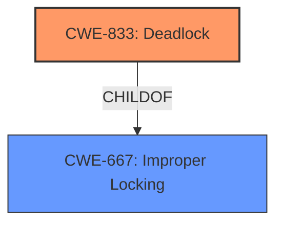

# Analysis for CVE-2024-39468

# Summary
| CWE ID | CWE Name | Confidence | CWE Abstraction Level | CWE Vulnerability Mapping Label | CWE-Vulnerability Mapping Notes |
|---|---|---|---|---|---|
| CWE-833 | Deadlock | 1.0 | Base | Primary | Allowed |
| CWE-667 | Improper Locking | 0.7 | Class | Secondary | Allowed-with-Review |

## Evidence and Confidence

*   **Confidence Score:** 0.9
*   **Evidence Strength:** HIGH

## Relationship Analysis
The primary relationship influencing the decision is the parent-child relationship between CWE-667 (Improper Locking) and CWE-833 (Deadlock). Since the vulnerability description explicitly mentions a **deadlock**, CWE-833 is chosen as the primary CWE. CWE-667 is considered a secondary factor since improper locking can lead to a deadlock.

## Vulnerability Chain
The vulnerability chain involves an **improper locking** mechanism leading directly to a **deadlock** condition.
  - **Root Cause:** Improper Locking (`cifs_tcp_ses_lock` held during `cifs_put_smb_ses` call)
  - **Weakness:** Deadlock (Freezing the CIFS client)
  - **Impact:** Denial of Service

## Summary of Analysis
The initial analysis focused on identifying the most accurate CWE based on the vulnerability description and the provided information. The description clearly states a **deadlock** in the smb client, making CWE-833 the primary candidate.

The evidence supporting this decision comes directly from the "Vulnerability Description" and "CVE Reference Links Content Summary," which explicitly mention the **deadlock** and the conditions under which it occurs. The fix also confirms that releasing the lock prevents the **deadlock**, reinforcing the connection.

The graph relationships show that CWE-833 is a child of CWE-667 (Improper Locking). While improper locking contributes to the vulnerability, the specific manifestation is a deadlock. Therefore, CWE-833 is at the optimal level of specificity.

Relevant CWE Information:

# Enhanced Context (25 CWEs)
The following CWEs were identified as potentially relevant to this vulnerability:

## CWE-833: Deadlock
**Abstraction Level**: Base
**Similarity Score**: 0.78
**Source**: dense

**Description**:
The product contains multiple threads or executable segments that are waiting for each other to release a necessary lock, resulting in deadlock.

**Mapping Guidance**:
- Usage: Allowed
- Rationale: This CWE entry is at the Base level of abstraction, which is a preferred level of abstraction for mapping to the root causes of vulnerabilities.

## CWE-667: Improper Locking
**Abstraction Level**: Class
**Similarity Score**: 0.75
**Source**: dense

**Description**:
The product does not properly acquire or release a lock on a resource, leading to unexpected resource state changes and behaviors.

**Mapping Guidance**:
- Usage: Allowed-with-Review
- Rationale: This CWE entry is a Class and might have Base-level children that would be more appropriate

### Not Used:
*   **CWE-663: Use of a Non-reentrant Function in a Concurrent Context**: While concurrency is involved, the core issue is the deadlock caused by improper locking, not the use of non-reentrant functions.
*   **CWE-362: Concurrent Execution using Shared Resource with Improper Synchronization ('Race Condition')**: A race condition is a possibility with concurrency, but the description emphasizes the deadlock.
*   **CWE-367: Time-of-check Time-of-use (TOCTOU) Race Condition**: This is related to race conditions, but the vulnerability focuses on the deadlock.
*   **CWE-755: Improper Handling of Exceptional Conditions**: This is too generic.
*   **CWE-303: Incorrect Implementation of Authentication Algorithm**: This is not related to authentication.
*   **CWE-1391: Use of Weak Credentials**: This is not related to credentials.
*   **CWE-404: Improper Resource Shutdown or Release**: While `cifs_put_smb_ses` involves resource release, the problem is the lock held during that operation, leading to a deadlock, not the release itself.
*   **CWE-703: Improper Check or Handling of Exceptional Conditions**: Too generic.
*   **CWE-330: Use of Insufficiently Random Values**: Not related to randomness.
*   **CWE-497: Exposure of Sensitive System Information to an Unauthorized Control Sphere**: Not related to information exposure.
*   **CWE-252: Unchecked Return Value**: Not related to return values.