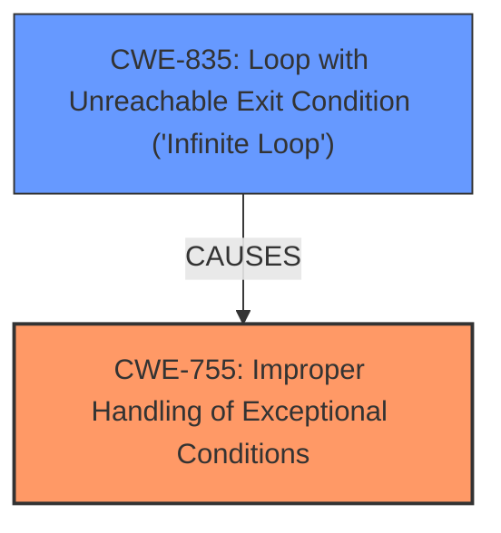

# Enhanced Analysis for CVE-2024-39469

# Summary

| CWE ID   | CWE Name                                                                                          | Confidence | CWE Abstraction Level | CWE Vulnerability Mapping Label | CWE-Vulnerability Mapping Notes |
| :--------- | :-------------------------------------------------------------------------------------------------- | :--------- | :---------------------- | :------------------------------ | :------------------------------ |
| CWE-755 | Improper Handling of Exceptional Conditions | 0.75      | Class                  | Allowed | The product does not handle or incorrectly handles an exceptional condition. |
| CWE-835    | Loop with Unreachable Exit Condition ('Infinite Loop')                                               | 0.65       | Base                    | Allowed                         | The product contains an iteration or loop with an exit condition that cannot be reached, i.e., an infinite loop.   |

## Evidence and Confidence

*   **Confidence Score:** 0.70
*   **Evidence Strength:** MEDIUM

## Relationship Analysis

The primary CWE identified is CWE-755, representing the **incorrect error handling**. CWE-835 is included as a secondary CWE because the **incorrect error handling** can lead to an infinite loop due to the program continuing to loop despite errors.



## Vulnerability Chain

The vulnerability chain starts with **incorrect error handling** (CWE-755) in `nilfs_empty_dir()`, which leads to a misjudgment of empty directories and can cause a long loop with I/O (CWE-835) if the directory's inode `i_size` is also corrupted. This can then cause the log writer thread to wait and hang, leading to a denial-of-service. The root cause is the **incorrect error handling**, and the impact includes file system corruption and denial of service.

## Summary of Analysis

The initial analysis identified CWE-755 as the primary weakness, representing the **incorrect error handling**. The description clearly states that the `nilfs_empty_dir()` function has **incorrect error handling**, which is the root cause of the vulnerability. The function doesn't properly handle I/O read errors and `nilfs_check_folio()` failures.
The secondary weakness is CWE-835, which represents the potential for an infinite loop. The description notes that the function continues to loop on failed folio/page reads, which can lead to an infinite loop if the inode's `i_size` is also corrupted.
The evidence supporting these classifications comes directly from the "CVE Reference Links Content Summary" and "Vulnerability Description Key Phrases" section, which highlights the **incorrect error handling** as the root cause.

Relevant CWE Information:

# Enhanced Context (25 CWEs)
The following CWEs were identified as potentially relevant to this vulnerability:

CWE-835: Loop with Unreachable Exit Condition ('Infinite Loop')
Abstraction Level: Base
Similarity Score: 0.72
Source: dense

Description:
The product contains an iteration or loop with an exit condition that cannot be reached, i.e., an infinite loop.

Mapping Guidance:
- Usage: Allowed
- Rationale: This CWE entry is at the Base level of abstraction, which is a preferred level of abstraction for mapping to the root causes of vulnerabilities.

CWE-755: Improper Handling of Exceptional Conditions
Abstraction Level: Class
Similarity Score: 0.72
Source: dense

Description:
The product does not handle or incorrectly handles an exceptional condition.

Mapping Guidance:
- Usage: Discouraged
- Rationale: This CWE entry is a level-1 Class (i.e., a child of a Pillar). It might have lower-level children that would be more appropriate


## CWE Relationship Analysis

Current CWEs represent these abstraction levels: .


### Vulnerability Chain Analysis

**Chain starting from CWE-835:**
- 835 (Loop with Unreachable Exit Condition ('Infinite Loop')) - ROOT


**Chain starting from CWE-755:**
- 755 (Improper Handling of Exceptional Conditions) - ROOT


### CWE Relationship Diagram

```mermaid
graph TD
    classDef primary fill:#f96,stroke:#333,stroke-width:2px
    classDef secondary fill:#69f,stroke:#333
    classDef tertiary fill:#9e9,stroke:#333
```