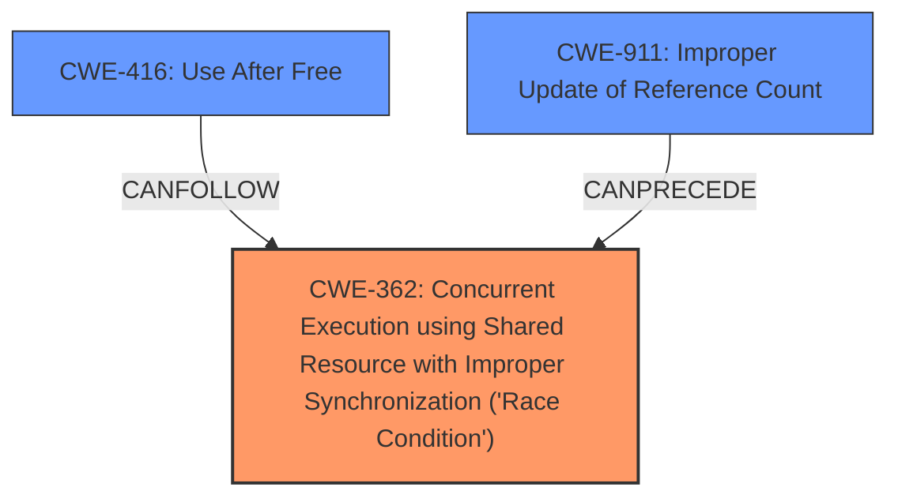

# Raw Analyzer Response for CVE-2024-39486

# Summary

| CWE ID | CWE Name | Confidence | CWE Abstraction Level | CWE Vulnerability Mapping Label | CWE-Vulnerability Mapping Notes |
|---|---|---|---|---|---|
| CWE-362 | Concurrent Execution using Shared Resource with Improper Synchronization ('Race Condition') | 0.9 | Class | Allowed-with-Review | Primary CWE. The vulnerability is caused by a race condition. |
| CWE-416 | Use After Free | 0.7 | Base | Allowed | The race condition leads to a use-after-free. |
| CWE-911 | Improper Update of Reference Count | 0.6 | Base | Allowed | The root cause of the race condition is the refcount of the `struct pid` being incremented *after* the pointer was stored in `filp->pid`. |

## Evidence and Confidence

*   **Confidence Score:** 0.8
*   **Evidence Strength:** HIGH

## Relationship Analysis
The primary weakness is CWE-362, a Class-level CWE describing a race condition. The vulnerability leads to a CWE-416, which is a base level CWE, describing a use-after-free. The root cause of the race condition is related to CWE-911 because the refcount of the `struct pid` was not updated correctly.

## Vulnerability Chain
The vulnerability chain starts with **improper update of a reference count** (CWE-911), leading to a **race condition** (CWE-362), which ultimately results in a **use-after-free** (CWE-416).

## Summary of Analysis
The analysis is based on the provided vulnerability description and CVE reference. The primary cause is a **race condition** (CWE-362) in the `drm_file_update_pid()` function. The reference material states the race condition leads to a **use-after-free** (CWE-416) of a `struct pid`. The root cause of the race condition is due to **improper update of the reference count** (CWE-911).

The evidence supporting this is:
- "rootcause: **race condition in drm_file_update_pid()**"
- "impact: use-after-free of a struct pid"
- "The primary issue is that the refcount of the `struct pid` was incremented *after* the pointer was stored in `filp->pid`"

CWE-362 is a Class, and the mapping guidance suggests there may be a more appropriate Base-level child. However, none of the children seem to fit as well as CWE-362 itself. CWE-416 and CWE-911 are both Base level.

Relevant CWE Information:

# Enhanced Context (25 CWEs)
The following CWEs were identified as potentially relevant to this vulnerability:

## CWE-362: Concurrent Execution using Shared Resource with Improper Synchronization ('Race Condition')
**Abstraction Level**: Class
**Similarity Score**: 0.79
**Source**: dense

**Description**:
The product contains a concurrent code sequence that requires temporary, exclusive access to a shared resource, but a timing window exists in which the shared resource can be modified by another code sequence operating concurrently.

**Mapping Guidance**:
- Usage: Allowed-with-Review
- Rationale: This CWE entry is a Class and might have Base-level children that would be more appropriate

This accurately describes the vulnerability as there is a timing window where the shared resource can be modified by another concurrent code sequence.

## CWE-367: Time-of-check Time-of-use (TOCTOU) Race Condition
**Abstraction Level**: Base
**Similarity Score**: 0.77
**Source**: dense

**Description**:
The product checks the state of a resource before using that resource, but the resource's state can change between the check and the use in a way that invalidates the results of the check. This can cause the product to perform invalid actions when the resource is in an unexpected state.

**Mapping Guidance**:
- Usage: Allowed
- Rationale: This CWE entry is at the Base level of abstraction, which is a preferred level of abstraction for mapping to the root causes of vulnerabilities.

While there is a race condition, it is not necessarily a TOCTOU. The core issue is the refcount being updated in the wrong order, which allows a UAF.

## CWE-366: Race Condition within a Thread
**Abstraction Level**: Base
**Similarity Score**: 0.77
**Source**: dense

**Description**:
If two threads of execution use a resource simultaneously, there exists the possibility that resources may be used while invalid, in turn making the state of execution undefined.

**Mapping Guidance**:
- Usage: Allowed
- Rationale: This CWE entry is at the Base level of abstraction, which is a preferred level of abstraction for mapping to the root causes of vulnerabilities.

This is a good option, but it is not as precise as CWE-362. The race condition exists across multiple processes, not just within a single thread.

## CWE-667: Improper Locking
**Abstraction Level**: Class
**Similarity Score**: 0.76
**Source**: dense

**Description**:
The product does not properly acquire or release a lock on a resource, leading to unexpected resource state changes and behaviors.

**Mapping Guidance**:
- Usage: Allowed-with-Review
- Rationale: This CWE entry is a Class and might have Base-level children that would be more appropriate

While the race condition involves locks, the **improper locking** is not the root cause. The **incorrect refcounting** is the root cause, allowing a race to occur.

## CWE-909: Missing Initialization of Resource
**Abstraction Level**: Class
**Similarity Score**: 0.70
**Source**: dense

**Description**:
The product does not initialize a critical resource.

**Mapping Guidance**:
- Usage: Allowed-with-Review
- Rationale: This CWE entry is a Class and might have Base-level children that would be more appropriate

This is not the issue. The resource *is* initialized, but the refcount is not correctly updated.

## CWE-755: Improper Handling of Exceptional Conditions
**Abstraction Level**: Class
**Similarity Score**: 0.70
**Source**: dense

**Description**:
The product does not handle or incorrectly handles an exceptional condition.

**Mapping Guidance**:
- Usage: Discouraged
- Rationale: This CWE entry is a level-1 Class (i.e., a child of a Pillar). It might have lower-level children that would be more appropriate

This is not the primary issue. The race condition is the primary issue, not the handling of exceptional conditions.

## CWE-131: Incorrect Calculation of Buffer Size
**Abstraction Level**: Base
**Similarity Score**: 0.70
**Source**: dense

**Description**:
The product does not correctly calculate the size to be used when allocating a buffer, which could lead to a buffer overflow.

**Mapping Guidance**:
- Usage: Allowed
- Rationale: This CWE entry is at the Base level of abstraction, which is a preferred level of abstraction for mapping to the root causes of vulnerabilities.

This is not relevant to the vulnerability, which is a race condition and use-after-free, and not related to buffer sizes.

## CWE-404: Improper Resource Shutdown or Release
**Abstraction Level**: Class
**Similarity Score**: 0.70
**Source**: dense

**Description**:
The product does not release or incorrectly releases a resource before it is made available for re-use.

**Mapping Guidance**:
- Usage: Allowed-with-Review
- Rationale: This CWE entry is a Class and might have Base-level children that would be more appropriate

This is related to the UAF, but the root cause is not the improper shutdown or release. It is the race condition that leads to the UAF.

## CWE-911: Improper Update of Reference Count
**Abstraction Level**: Base
**Similarity Score**: 0.69
**Source**: dense

**Description**:
The product uses a reference count to manage a resource, but it does not update or incorrectly updates the reference count.

**Mapping Guidance**:
- Usage: Allowed
- Rationale: This CWE entry is at the Base level of abstraction, which is a preferred level of abstraction for mapping to the root causes of vulnerabilities.

This is directly relevant to the vulnerability. The refcount is not updated in the correct order, leading to the race condition