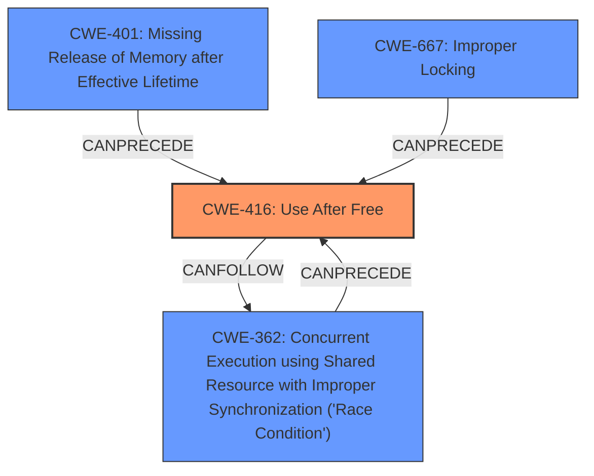

# Analysis for CVE-2024-39493

# Summary
| CWE ID | CWE Name | Confidence | CWE Abstraction Level | CWE Vulnerability Mapping Label | CWE-Vulnerability Mapping Notes |
|---|---|---|---|---|---|
| CWE-416 | Use After Free | 0.9 | Variant | WEAKNESS | Allowed |
| CWE-401 | Missing Release of Memory after Effective Lifetime | 0.7 | Base | WEAKNESS | Allowed |
| CWE-362 | Concurrent Execution using Shared Resource with Improper Synchronization ('Race Condition') | 0.6 | Class | ROOTCAUSE | Allowed-with-Review |

## Evidence and Confidence

*   **Confidence Score:** 0.8
*   **Evidence Strength:** MEDIUM

## Relationship Analysis
The primary weakness is **Use After Free (UAF)**, which is a variant of memory corruption issues. While the root cause seems to involve concurrency issues and improper synchronization which could lead to the UAF, the direct vulnerability manifested is clearly a UAF. There's a hierarchical relationship where CWE-416 is a variant that can result from concurrent execution problems. There is also a **memory leak**, which is a **Missing Release of Memory after Effective Lifetime**. The relationship between these is that the **memory leak** can delay the **UAF** or exacerbate the issue.

## Vulnerability Chain
The vulnerability chain starts with a potential **race condition** or **improper locking** scenario (CWE-362 or CWE-667) due to the **improper** use of `completion_done`. This leads to a **use-after-free (UAF)** condition (CWE-416), where memory is accessed after it has been freed. Additionally, a **memory leak** (CWE-401) occurs because memory is not properly released, potentially delaying the UAF or exacerbating the issue.

ROOTCAUSE (CWE-362 or CWE-667) -> WEAKNESS (CWE-416) -> WEAKNESS (CWE-401)

## Summary of Analysis
The analysis is based on the provided vulnerability description, focusing on the **rootcause** and **weakness** phrases. The primary **weakness** is the **use-after-free (UAF)** condition, which is directly stated in the description. The **rootcause** appears to be related to improper synchronization or locking, leading to the UAF. Additionally, the presence of a **memory leak** is noted.

The graph relationships highlight the connection between concurrency issues, memory management, and the resulting UAF. The selected CWEs are at the optimal level of specificity, with CWE-416 being a variant that accurately represents the UAF condition, and CWE-401 representing the **memory leak**, and CWE-362 representing the potential **race condition**.

CWE-416 is the most direct representation of the vulnerability as described: "the caller has not yet called wait_for_completion, resulting in another potential UAF". The fix involves using `cancel_work_sync` and then freeing the memory safely, which directly addresses the UAF condition. Confidence in this mapping is high.

CWE-401 is selected as a secondary CWE because the description mentions a **memory leak**: "Fix ADF_DEV_RESET_SYNC **memory leak**". This indicates that memory is not being properly released, leading to a **missing release of memory**. Confidence in this mapping is medium.

CWE-362 is considered as a possible **rootcause**, since the description mentions a potential **race condition** due to the improper use of `completion_done`. This could lead to the UAF if the completion is not properly synchronized. Confidence in this mapping is medium.

CWE-667 was considered, as it is related to synchronization issues. However, the description does not explicitly mention locking, so CWE-362 is a slightly better fit for the concurrency aspect.

CWE-125 (Out-of-bounds Read), CWE-909 (Missing Initialization of Resource), CWE-367 (Time-of-check Time-of-use (TOCTOU) Race Condition) were considered but not chosen because they do not directly reflect the described vulnerability. The primary issue is the **use-after-free** condition and the associated **memory leak**, not out-of-bounds access or missing initialization.

The final decision is to map the vulnerability to CWE-416 as the primary weakness, with CWE-401 and CWE-362 as secondary issues contributing to the vulnerability.