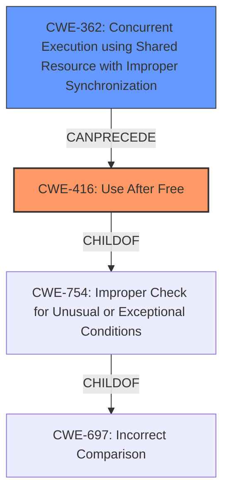

# Enhanced Analysis for CVE-2024-39503

# Summary
| CWE ID    | CWE Name                                                                   | Confidence | CWE Abstraction Level | CWE Vulnerability Mapping Label | CWE-Vulnerability Mapping Notes |
| :---------- | :------------------------------------------------------------------------- | :--------- | :---------------------- | :------------------------------ | :------------------------------ |
| CWE-416     | Use After Free                                                             | 0.9        | Variant               | Primary                         | Allowed                         |
| CWE-362     | Concurrent Execution using Shared Resource with Improper Synchronization | 0.8        | Class                   | Secondary                       | Allowed-with-Review             |

## Evidence and Confidence

*   **Confidence Score:** 0.85
*   **Evidence Strength:** HIGH

## Relationship Analysis
The primary relationship is that the **race condition** (CWE-362) can lead to a **use-after-free** (CWE-416). CWE-416 is a variant of CWE-754 (Improper Check for Unusual or Exceptional Conditions), which is a child of CWE-697 (Incorrect Comparison). CWE-362 is a class-level CWE, and while more specific CWEs exist, the description aligns well.



## Vulnerability Chain
The vulnerability chain starts with a **race condition** (CWE-362) in the netfilter ipset code. This leads to the namespace cleanup destroying the listset type while the garbage collector is running. The garbage collector then attempts to use data from the destroyed set, resulting in a **use-after-free** (CWE-416).

## Summary of Analysis
The analysis indicates that the primary weakness is CWE-416 (Use After Free), which is a direct result of a **race condition** (CWE-362). The vulnerability description clearly states that "The namespace cleanup can destroy the listset type of sets while the gc of the set type is waiting to run in rcu cleanup. The latter uses data from the destroyed set which thus leads **use after free**". The retriever results also highlight CWE-362 as a highly relevant CWE due to the **race condition**. CWE-416 is chosen as the primary CWE because it represents the direct consequence of the **race condition**. The relationship graph supports this by showing that race conditions can precede use-after-free vulnerabilities. CWE-362 is kept as a secondary CWE as it is the condition that allows for the **use-after-free** to occur.

Relevant CWE Information:
# Enhanced Context (25 CWEs)
The following CWEs were identified as potentially relevant to this vulnerability:

# Vulnerability Description

In the Linux kernel, the following vulnerability has been resolved netfilter ipset Fix **race** between namespace cleanup and gc in the listset type Lion Ackermann reported that there is a **race condition** between namespace cleanup in ipset and the garbage collection of the listset type. The namespace cleanup can destroy the listset type of sets while the gc of the set type is waiting to run in rcu cleanup. The latter uses data from the destroyed set which thus leads **use after free**. The patch contains the following parts - When destroying all sets, first remove the garbage collectors, then wait if needed and then destroy the sets. - Fix the badly ordered wait then remove gc for the destroy a single set case. - Fix the missing rcu locking in the listset type in the userspace test case. - Use proper RCU list handlings in the listset type. The patch depends on c1193d9bbbd3 (netfilter ipset Add list flush to cancel_gc).

# Keyphrase-Specific CWE Analysis
This vulnerability contains multiple keyphrases that may map to different CWEs.
Please analyze each keyphrase separately and determine the most appropriate CWE(s) for each.

## ROOTCAUSE: 'race condition'

Relevant CWEs for this ROOTCAUSE:

### 1. CWE-362: Concurrent Execution using Shared Resource with Improper Synchronization ('Race Condition') (Score: 864.64)

The product contains a concurrent code sequence that requires temporary, exclusive access to a shared resource, but a timing window exists in which the shared resource can be modified by another code sequence operating concurrently....

## ROOTCAUSE: 'use after free'

Relevant CWEs for this ROOTCAUSE:

### 1. CWE-362: Concurrent Execution using Shared Resource with Improper Synchronization ('Race Condition') (Score: 864.64)

The product contains a concurrent code sequence that requires temporary, exclusive access to a shared resource, but a timing window exists in which the shared resource can be modified by another code sequence operating concurrently....


## CWE Relationship Analysis

Current CWEs represent these abstraction levels: .


### Vulnerability Chain Analysis

**Chain starting from CWE-416:**
- 416 (Use After Free) - ROOT


**Chain starting from CWE-362:**
- 362 (Concurrent Execution using Shared Resource with Improper Synchronization ('Race Condition')) - ROOT


### CWE Relationship Diagram

```mermaid
graph TD
    classDef primary fill:#f96,stroke:#333,stroke-width:2px
    classDef secondary fill:#69f,stroke:#333
    classDef tertiary fill:#9e9,stroke:#333
```