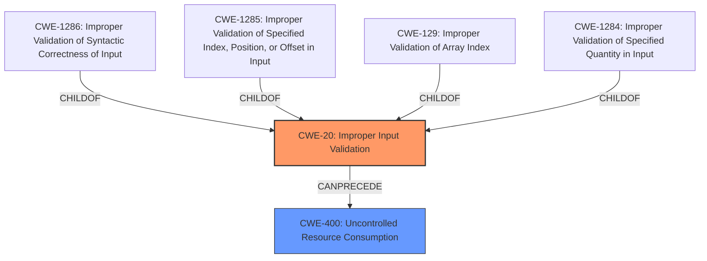

# Raw Analyzer Response for CVE-2024-39511

# Summary
| CWE ID  | CWE Name                                                               | Confidence | CWE Abstraction Level | CWE Vulnerability Mapping Label | CWE-Vulnerability Mapping Notes |
| :-------- | :--------------------------------------------------------------------- | :--------- | :-------------------- | :------------------------------ | :------------------------------ |
| CWE-20   | CWE-20: Improper Input Validation                                       | 0.9        | Class                 | Primary                         | Allowed                         |
| CWE-400  | CWE-400: Uncontrolled Resource Consumption                               | 0.7        | Class                | Secondary                       | Allowed                         |

## Evidence and Confidence

*   **Confidence Score:** 0.8
*   **Evidence Strength:** HIGH

## Relationship Analysis
The primary weakness is **Improper Input Validation (CWE-20)**, a class-level CWE. While more specific base or variant CWEs related to input validation exist, the description doesn't provide enough detail to pinpoint the exact type of **improper validation**. **CWE-20** is a parent of many input validation related weaknesses such as **CWE-1286, CWE-1285, CWE-129, CWE-1284**. **CWE-400** can result from **Improper Input Validation** when an attacker can influence resource consumption via maliciously crafted input.

## Vulnerability Chain
The vulnerability chain starts with **Improper Input Validation (CWE-20)**. Because of the **improper input validation**, an attacker can send specific operational dot1x commands which causes the dot1x daemon to crash. The crash leads to a Denial of Service (**DoS**), which is **CWE-400**.

## Summary of Analysis
The primary **weakness** is **Improper Input Validation (CWE-20)**, as the vulnerability description explicitly states "An **Improper Input Validation** vulnerability...". The vulnerability occurs when a local, low-privileged attacker with access to the CLI can cause a Denial of Service (DoS) by running a specific operational dot1x command, crashing the dot1x daemon. The retriever results also list **CWE-1286** and **CWE-1285**, which are children of **CWE-20**, but the description doesn't specify what type of input is not validated correctly, so **CWE-20** is a better fit. The impact of the vulnerability is Denial of Service (DoS), which maps to **CWE-400: Uncontrolled Resource Consumption**. The attacker causes a sustained DoS condition by running the command repeatedly.

The selected CWEs are at the optimal level of specificity because the description clearly identifies the **root cause** as **improper input validation** without specifying further details about the type of input or the validation process.

Other CWEs considered but not used:

*   **CWE-1286: Improper Validation of Syntactic Correctness of Input**, **CWE-1285: Improper Validation of Specified Index, Position, or Offset in Input**, **CWE-129: Improper Validation of Array Index**, **CWE-1284: Improper Validation of Specified Quantity in Input**: These are more specific types of input validation issues and could be applicable if the vulnerability description provided details about the specific type of input that is not being validated correctly. Since the description only mentions **improper input validation** in general, **CWE-20** is a better fit.
*   **CWE-401: Missing Release of Memory after Effective Lifetime**: This is not directly related to the vulnerability description.
*   **CWE-269: Improper Privilege Management**: The vulnerability description mentions a "low-privileged attacker", but the root cause is **improper input validation**, not privilege management.