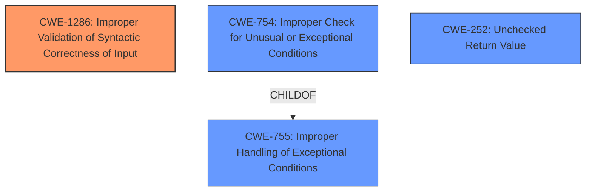

# Analysis Report for CVE-2024-39513

# Vulnerability Analysis Report: CVE-2024-39513

## Description

An **Improper Input Validation** vulnerability in the Packet Forwarding Engine (PFE) of Juniper Networks Junos OS Evolved allows a local, low-privileged attacker to cause a Denial of Service (DoS). When a specific clear command is run, the Advanced Forwarding Toolkit manager (evo-aftmand-bt or evo-aftmand-zx) crashes and restarts. The crash impacts all traffic going through the FPCs, causing a DoS. Running the command repeatedly leads to a sustained DoS condition. This issue affects Junos OS Evolved * All versions before 20.4R3-S9-EVO, * from 21.2-EVO before 21.2R3-S7-EVO, * from 21.3-EVO before 21.3R3-S5-EVO, * from 21.4-EVO before 21.4R3-S6-EVO, * from 22.1-EVO before 22.1R3-S4-EVO, * from 22.2-EVO before 22.2R3-S3-EVO, * from 22.3-EVO before 22.3R3-S3-EVO, * from 22.4-EVO before 22.4R3-EVO, * from 23.2-EVO before 23.2R2-EVO.

## Vulnerability Description Key Phrases

- **Rootcause:** ['Improper Input Validation', 'Input Validation vulnerability']
- **Impact:** Denial of Service (DoS)
- **Vector:** specific clear command
- **Attacker:** local low-privileged attacker
- **Product:** Juniper Networks Junos OS Evolved
- **Version:** ["['All versions before 20.4R3-S9-EVO'", "'from 21.2-EVO before 21.2R3-S7-EVO'", "'from 21.3-EVO before 21.3R3-S5-EVO'", "'from 21.4-EVO before 21.4R3-S6-EVO'", "'from 22.1-EVO before 22.1R3-S4-EVO'", "'from 22.2-EVO before 22.2R3-S3-EVO'", "'from 22.3-EVO before 22.3R3-S3-EVO'", "'from 22.4-EVO before 22.4R3-EVO'", "'from 23.2-EVO before 23.2R2-EVO']"]
- **Component:** Packet Forwarding Engine (PFE) of Juniper Networks Junos OS Evolved

## Analysis (with Relationship Data)

# Summary

| CWE ID    | CWE Name                                                        | Confidence | CWE Abstraction Level | CWE Vulnerability Mapping Label | CWE-Vulnerability Mapping Notes |
| :-------- | :-------------------------------------------------------------- | :--------- | :-------------------- | :------------------------------ | :------------------------------ |
| CWE-1286  | Improper Validation of Syntactic Correctness of Input           | 0.9        | Base                  | Primary                         | Allowed                         |
| CWE-754 | Improper Check for Unusual or Exceptional Conditions | 0.6        | Class                  | Secondary                         | Allowed-with-Review                         |
| CWE-755 | Improper Handling of Exceptional Conditions | 0.6        | Class                  | Secondary                         | Discouraged                         |
| CWE-252 | Unchecked Return Value | 0.6        | Base                  | Secondary                         | Allowed                         |

## Evidence and Confidence

*   **Confidence Score:** 0.8
*   **Evidence Strength:** HIGH

## Relationship Analysis

The primary weakness is **Improper Input Validation**, which maps directly to CWE-1286. The analysis considered potential follow-on conditions that can be mapped to other CWEs.
CWE-1286 is a Base level CWE. There are no child CWEs that provide a more specific match.
CWE-754 and CWE-755 are related to exceptional conditions and could arise from the initial **improper input validation**, but are not root causes.
CWE-252 is related to a return value not being checked which could also arise from the initial **improper input validation**, but is not a root cause.



## Vulnerability Chain

The vulnerability chain starts with **Improper Input Validation** (CWE-1286). This leads to a crash due to the command not being validated, which results in a Denial of Service (DoS).
There may be follow-on exceptional conditions (CWE-754 and CWE-755) that could be a result of the unvalidated input. Similarly, the lack of checking the return value (CWE-252) can also result from the unvalidated input.

## Summary of Analysis

The primary weakness is **Improper Input Validation**. This is evidenced by the description stating "An **Improper Input Validation** vulnerability in the Packet Forwarding Engine (PFE) of Juniper Networks Junos OS Evolved allows a local, low-privileged attacker to cause a Denial of Service (DoS)." This clearly indicates that the root cause is related to how the input is handled. The description also states "When a specific clear command is run, the Advanced Forwarding Toolkit manager (evo-aftmand-bt or evo-aftmand-zx) crashes and restarts." This further supports the claim that a specific input (clear command) triggers the vulnerability.

CWE-1286, **Improper Validation of Syntactic Correctness of Input**, aligns well with the vulnerability description. The product does not validate or incorrectly validates that the input complies with the syntax.

CWE-754 and CWE-755 were considered as these address exceptional conditions.

CWE-252 was considered, as it addresses the return value from a method or function not being checked.

The evidence supports the selection of CWE-1286 as the primary CWE. The other CWEs are secondary, due to the possibility that they could arise from the initial **improper input validation**.


## CWE Relationship Analysis

Current CWEs represent these abstraction levels: .


### Vulnerability Chain Analysis

**Chain starting from CWE-252:**
- 252 (Unchecked Return Value) - ROOT


**Chain starting from CWE-1286:**
- 1286 (Improper Validation of Syntactic Correctness of Input) - ROOT


### CWE Relationship Diagram

```mermaid
graph TD
    classDef primary fill:#f96,stroke:#333,stroke-width:2px
    classDef secondary fill:#69f,stroke:#333
    classDef tertiary fill:#9e9,stroke:#333
```


*Report generated on 2025-07-13 11:29:41*
