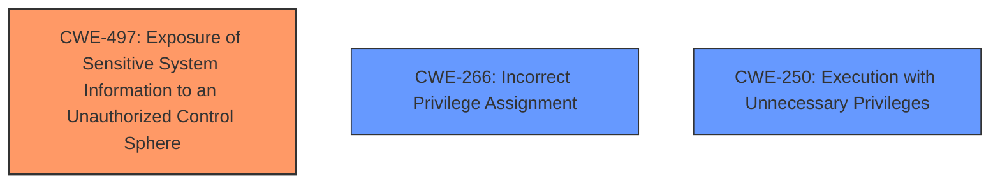

# Analysis Report for CVE-2024-39527

# Vulnerability Analysis Report: CVE-2024-39527

## Description

An Exposure of Sensitive Information to an Unauthorized Actor vulnerability in the command-line interface (CLI) of Juniper Networks Junos OS on SRX Series devices allows a local, low-privileged user with access to the Junos CLI to view the contents of protected files on the file system. Through the execution of crafted CLI commands, a user with limited permissions (e.g., a low privilege login class user) can access protected files that should not be accessible to the user. These files may contain sensitive information that can be used to cause further impact to the system. This issue affects Junos OS on SRX Series * All versions before 21.4R3-S8, * 22.2 before 22.2R3-S5, * 22.3 before 22.3R3-S4, * 22.4 before 22.4R3-S4, * 23.2 before 23.2R2-S2, * 23.4 before 23.4R2.

## Vulnerability Description Key Phrases

- **Impact:** ['Exposure of Sensitive Information to an Unauthorized Actor', 'view the contents of protected files']
- **Vector:** crafted CLI commands
- **Attacker:** local low-privileged user
- **Product:** Juniper Networks Junos OS
- **Version:** ["['All versions before 21.4R3-S8'", "'22.2 before 22.2R3-S5'", "'22.3 before 22.3R3-S4'", "'22.4 before 22.4R3-S4'", "'23.2 before 23.2R2-S2'", "'23.4 before 23.4R2']"]
- **Component:** command-line interface (CLI)

## Analysis (with Relationship Data)

# Summary
| CWE ID  | CWE Name | Confidence | CWE Abstraction Level | CWE Vulnerability Mapping Label | CWE-Vulnerability Mapping Notes |
|----------------|----------------------------------------------------|-------------------|-------------------------|-----------------------------------|------------------------------------|
| **CWE-497** | Exposure of Sensitive System Information to an Unauthorized Control Sphere | 0.9 | Base | Primary | Allowed |
| CWE-266 | Incorrect Privilege Assignment | 0.7 | Base | Secondary Candidate | Allowed |
| CWE-250 | Execution with Unnecessary Privileges | 0.6 | Base | Secondary Candidate | Allowed |

## Evidence and Confidence

*   **Confidence Score:** 0.8
*   **Evidence Strength:** MEDIUM

## Relationship Analysis
The primary CWE identified is CWE-497, representing the exposure of sensitive information. CWE-266 and CWE-250 are considered as secondary candidates relating to privilege management issues. CWE-497 is a base level CWE which is preferred.



## Vulnerability Chain
The vulnerability chain starts with a low-privileged user exploiting crafted CLI commands, leading to the exposure of sensitive information in protected files.
  - Root Cause: **Improper** access control, leading to a low-privileged user being able to run a command to access sensitive information
  - Weakness: Exposure of Sensitive Information to an Unauthorized Actor
  - Impact: Allows a local, low-privileged user to view the contents of protected files on the file system. These files may contain sensitive information that can be used to cause further impact to the system.

## Summary of Analysis
The primary weakness is the **exposure of sensitive information** to an unauthorized actor (CWE-497). The vulnerability description explicitly states this **impact**, and the crafted CLI commands serve as the means of exploitation.

The guidance on privileges and permissions, combined with the vulnerability description, led to the consideration of CWE-266 and CWE-250. The vulnerability involves a local, low-privileged user gaining access to information they should not have. This could indicate either an **incorrect privilege assignment** (CWE-266) or the execution of a command with **unnecessary privileges** (CWE-250). However, the information available does not provide enough detail to confidently confirm that this is the case. Therefore, they are considered as secondary candidates.

The selection of CWE-497 is at the optimal level of specificity because it clearly and accurately describes the core issue, which is the **exposure of sensitive information**. It is a base level CWE.

Relevant CWE Information:

*   **CWE-497: Exposure of Sensitive System Information to an Unauthorized Control Sphere**
    *   The vulnerability description directly aligns with this CWE as it involves a low-privileged user gaining access to protected files containing sensitive information.
    *   Security Implications: Unauthorized access to sensitive information can lead to further system compromise, data breaches, and other security incidents.

*   **CWE-266: Incorrect Privilege Assignment**
    *   This CWE was considered because the vulnerability involves a low-privileged user accessing protected files. It is possible that the user was incorrectly assigned privileges that allowed them to access these files.
    *   Security Implications: Incorrect privilege assignments can lead to users gaining unauthorized access to resources and performing actions they should not be allowed to perform.

*   **CWE-250: Execution with Unnecessary Privileges**
    *   This CWE was considered because the CLI command being executed might be running with higher privileges than necessary, allowing the user to access protected files.
    *   Security Implications: Execution with unnecessary privileges can create new weaknesses or amplify the consequences of other weaknesses.

Other CWEs Considered but Not Used:

*   CWE-269: Improper Privilege Management - This CWE is too general and doesn't accurately reflect the specific vulnerability. Also it is discouraged.
*   CWE-285: Improper Authorization - It is not clear that an authorization check is present but flawed.
*   CWE-306: Missing Authentication for Critical Function - Authentication is not the primary issue; the vulnerability occurs after a user has already authenticated.


## CWE Relationship Analysis

Current CWEs represent these abstraction levels: .


### Vulnerability Chain Analysis

**Chain starting from CWE-306:**
- 306 (Missing Authentication for Critical Function) - ROOT


**Chain starting from CWE-269:**
- 269 (Improper Privilege Management) - ROOT


### CWE Relationship Diagram

```mermaid
graph TD
    classDef primary fill:#f96,stroke:#333,stroke-width:2px
    classDef secondary fill:#69f,stroke:#333
    classDef tertiary fill:#9e9,stroke:#333
```


*Report generated on 2025-07-13 11:30:09*
