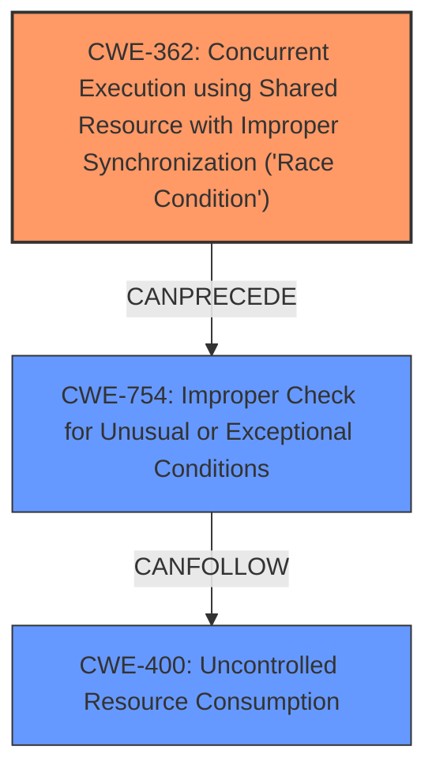

# Analysis for CVE-2024-39559

# Summary
| CWE ID  | CWE Name  | Confidence | CWE Abstraction Level | CWE Vulnerability Mapping Label | CWE-Vulnerability Mapping Notes |
|----------------|--------------------------------------------------------------------------------------------------------------------|----------------|---------------------------|---------------------------------------|------------------------------------------|
| CWE-362 | Concurrent Execution using Shared Resource with Improper Synchronization ('Race Condition') | 0.9 | Class  | Primary | Allowed-with-Review |
| CWE-754 | Improper Check for Unusual or Exceptional Conditions | 0.7 | Class | Secondary | Allowed-with-Review |
| CWE-400 | Uncontrolled Resource Consumption  | 0.6 | Base | Secondary | Allowed |

## Evidence and Confidence

*   **Confidence Score:** 0.8
*   **Evidence Strength:** HIGH

## Relationship Analysis
The analysis revealed a vulnerability chain starting with a **race condition** (CWE-362) that leads to **improper checks** (CWE-754) and eventually results in **uncontrolled resource consumption** (CWE-400), causing a denial of service. CWE-362 is a Class, while CWE-754 is a Class and CWE-400 is a Base. We chose CWE-362 as the primary because the **race condition** is a necessary condition for the vulnerability to manifest. CWE-754 is related to **Improper Check for Unusual or Exceptional Conditions** which appears to be a consequence of the race condition, while CWE-400 is the impact resulting from both.

## Vulnerability Chain
The vulnerability chain starts with a **race condition** (CWE-362) where concurrent code sequences improperly synchronize access to a shared resource. This leads to an **improper check for unusual or exceptional conditions** (CWE-754) due to the inconsistent state of the resource. The lack of proper handling results in **uncontrolled resource consumption** (CWE-400), ultimately causing a denial of service.

CWE-362 (Race Condition) -> CWE-754 (Improper Check) -> CWE-400 (Uncontrolled Resource Consumption) -> Denial of Service

## Summary of Analysis
The primary weakness is identified as CWE-362, due to the **race condition** being the root cause. The vulnerability description explicitly mentions "**race condition**" and that the receipt of a specific packet must occur within a specific timing window. This aligns with the definition of CWE-362.

Secondary weaknesses include CWE-754, because the **Improper Check for Unusual or Exceptional Conditions** allows the **race condition** to result in a exploitable condition. And CWE-400, because the **improper handling** of the **race condition** results in a denial of service through resource exhaustion.

The selection is based on the vulnerability description and the provided keyphrases. The retriever scores and relationship analysis support this classification, with CWE-362 as the root cause leading to CWE-754 and then the final impact being CWE-400. The chosen CWEs are at an appropriate level of specificity (Class and Base), providing a detailed understanding of the vulnerability.

Relevant CWE Information:

# Enhanced Context (25 CWEs)
The following CWEs were identified as potentially relevant to this vulnerability:

## CWE-703: Improper Check or Handling of Exceptional Conditions
**Abstraction Level**: Pillar
**Similarity Score**: 0.75
**Source**: dense

**Description**:
The product does not properly anticipate or handle exceptional conditions that rarely occur during normal operation of the product.

**Mapping Guidance**:
- Usage: Discouraged
- Rationale: This CWE entry is extremely high-level, a Pillar.
- *Not Used* High level of abstraction.

## CWE-754: Improper Check for Unusual or Exceptional Conditions
**Abstraction Level**: Class
**Similarity Score**: 0.74
**Source**: dense

**Description**:
The product does not check or incorrectly checks for unusual or exceptional conditions that are not expected to occur frequently during day to day operation of the product.

**Mapping Guidance**:
- Usage: Allowed-with-Review
- Rationale: This CWE entry is a Class and might have Base-level children that would be more appropriate

## CWE-755: Improper Handling of Exceptional Conditions
**Abstraction Level**: Class
**Similarity Score**: 0.74
**Source**: dense

**Description**:
The product does not handle or incorrectly handles an exceptional condition.

**Mapping Guidance**:
- Usage: Discouraged
- Rationale: This CWE entry is a level-1 Class (i.e., a child of a Pillar). It might have lower-level children that would be more appropriate
- *Not Used* High level of abstraction.

## CWE-696: Incorrect Behavior Order
**Abstraction Level**: Class
**Similarity Score**: 0.74
**Source**: dense

**Description**:
The product performs multiple related behaviors, but the behaviors are performed in the wrong order in ways which may produce resultant weaknesses.

**Mapping Guidance**:
- Usage: Allowed-with-Review
- Rationale: This CWE entry is a Class and might have Base-level children that would be more appropriate
- *Not Used* Does not fit the vulnerability description.

## CWE-664: Improper Control of a Resource Through its Lifetime
**Abstraction Level**: Pillar
**Similarity Score**: 0.73
**Source**: dense

**Description**:
The product does not maintain or incorrectly maintains control over a resource throughout its lifetime of creation, use, and release.

**Mapping Guidance**:
- Usage: Discouraged
- Rationale: This CWE entry is high-level when lower-level children are available.
- *Not Used* High level of abstraction.

## CWE-668: Exposure of Resource to Wrong Sphere
**Abstraction Level**: Class
**Similarity Score**: 0.73
**Source**: dense

**Description**:
The product exposes a resource to the wrong control sphere, providing unintended actors with inappropriate access to the resource.

**Mapping Guidance**:
- Usage: Discouraged
- Rationale: CWE-668 is high-level and is often misused as a catch-all when lower-level CWE IDs might be applicable. It is sometimes used for low-information vulnerability reports [REF-1287]. It is a level-1 Class (i.e., a child of a Pillar). It is not useful for trend analysis.
- *Not Used* Does not fit the vulnerability description.

## CWE-345: Insufficient Verification of Data Authenticity
**Abstraction Level**: Class
**Similarity Score**: 0.72
**Source**: dense

**Description**:
The product does not sufficiently verify the origin or authenticity of data, in a way that causes it to accept invalid data.

**Mapping Guidance**:
- Usage: Discouraged
- Rationale: This CWE entry is a level-1 Class (i.e., a child of a Pillar). It might have lower-level children that would be more appropriate
- *Not Used* Does not fit the vulnerability description.

## CWE-799: Improper Control of Interaction Frequency
**Abstraction Level**: Class
**Similarity Score**: 0.71
**Source**: dense

**Description**:
The product does not properly limit the number or frequency of interactions that it has with an actor, such as the number of incoming requests.

**Mapping Guidance**:
- Usage: Allowed-with-Review
- Rationale: This CWE entry is a Class and might have Base-level children that would be more appropriate
- *Not Used* Does not fit the vulnerability description.

## CWE-497: Exposure of Sensitive System Information to an Unauthorized Control Sphere
**Abstraction Level**: Base
**Similarity Score**: 0.71
**Source**: dense

**Description**:
The product does not properly prevent sensitive system-level information from being accessed by unauthorized actors who do not have the same level of access to the underlying system as the product does.

**Mapping Guidance**:
- Usage: Allowed
- Rationale: This CWE entry is at the Base level of abstraction, which is a preferred level of abstraction for mapping to the root causes of vulnerabilities.
- *Not Used* Does not fit the vulnerability description.

## CWE-657: Violation of Secure Design Principles
**Abstraction Level**: Class
**Similarity Score**: 0.71
**Source**: dense

**Description**:
The product violates well-established principles for secure design.

**Mapping Guidance**:
- Usage: Discour