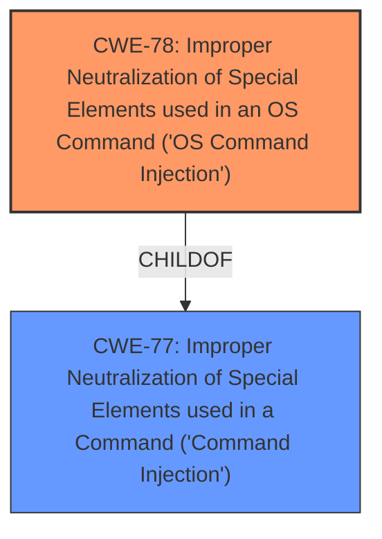

# Enhanced Analysis for CVE-2024-39568

# Summary
| CWE ID  | CWE Name                                                                     | Confidence | CWE Abstraction Level | CWE Vulnerability Mapping Label | CWE-Vulnerability Mapping Notes |
| :------- | :--------------------------------------------------------------------------- | :--------- | :-------------------- | :------------------------------ | :------------------------------ |
| CWE-78  | Improper Neutralization of Special Elements used in an OS Command ('OS Command Injection') | 1          | Base                  | Primary                         | Allowed                       |

## Evidence and Confidence

*   **Confidence Score:** 1
*   **Evidence Strength:** HIGH

## Relationship Analysis
The primary CWE is CWE-78, which is a base-level CWE. It is a child of CWE-77. The analysis focused on identifying the most specific CWE that accurately reflects the root cause, leading to the selection of CWE-78.



## Vulnerability Chain
The vulnerability chain starts with the **missing server side input sanitation**, leading to **command injection**, and culminating in arbitrary code execution with system privileges.
  - Root Cause: **Missing server side input sanitation**
  - Weakness: **Command Injection**
  - Impact: Arbitrary code execution with system privileges

## Summary of Analysis
The analysis identified a **command injection** vulnerability due to **missing server-side input sanitation** in SINEMA Remote Connect Client. The selection of CWE-78 is based on the specific vulnerability details and the CWE specifications. The vulnerability description clearly indicates that the **command injection** occurs in the context of OS commands, making CWE-78 the more appropriate choice. The evidence from the "Vulnerability Description Key Phrases" and "CVE Reference Links Content Summary" sections supports this classification.

Relevant CWE Information:

# Enhanced Context (25 CWEs)
The following CWEs were identified as potentially relevant to this vulnerability:

## CWE Classification:

### CWE-78: Improper Neutralization of Special Elements used in an OS Command ('OS Command Injection')

*   **Technical Explanation:** The vulnerability involves the injection of OS commands due to the **lack of proper input sanitization**. This allows an attacker to execute arbitrary commands on the system.
*   **Security Implications:** This can lead to complete system compromise, data theft, or denial of service.
*   **Relationship Analysis:** CWE-78 is a base CWE and a child of CWE-77. The choice of CWE-78 is more specific as the command injection is directly related to OS commands.
*   **Mapping Guidance Influence:** The official MITRE mapping guidance allows the use of CWE-78, which is at the base level of abstraction.
*   **Evidence:** The "Vulnerability Description" states "system service of affected applications is vulnerable to **command injection** due to **missing server side input sanitation** when loading proxy configurations."

### Other CWEs Considered:

*   **CWE-77: Improper Neutralization of Special Elements used in a Command ('Command Injection')** - This was the initial top match but was deemed less specific than CWE-78. While command injection is present, the context is OS commands, making CWE-78 more appropriate.
*   **CWE-20: Improper Input Validation** - This is a higher-level class and less descriptive of the specific vulnerability. The root cause is the **missing input sanitization**, but the impact is **command injection**, making CWE-78 a better fit.


## CWE Relationship Analysis

Current CWEs represent these abstraction levels: .


### Vulnerability Chain Analysis

**Chain starting from CWE-77:**
- 77 (Improper Neutralization of Special Elements used in a Command ('Command Injection')) - ROOT


**Chain starting from CWE-78:**
- 78 (Improper Neutralization of Special Elements used in an OS Command ('OS Command Injection')) - ROOT


### CWE Relationship Diagram

```mermaid
graph TD
    classDef primary fill:#f96,stroke:#333,stroke-width:2px
    classDef secondary fill:#69f,stroke:#333
    classDef tertiary fill:#9e9,stroke:#333
```