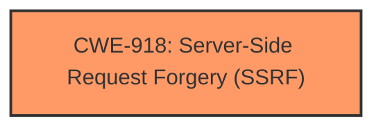

# Enhanced Analysis for CVE-2024-39573

# Summary
| CWE ID | CWE Name | Confidence | CWE Abstraction Level | CWE Vulnerability Mapping Label | CWE-Vulnerability Mapping Notes |
|---|---|---|---|---|---|
| CWE-918 | Server-Side Request Forgery (SSRF) | 1.0 | Base | Primary | Allowed |

## Evidence and Confidence

*   **Confidence Score:** 1.0
*   **Evidence Strength:** HIGH

## Relationship Analysis
The primary relationship identified is that CWE-918 is a Base level CWE, which is the preferred level of abstraction for mapping. There is no parent or child relationship in the results that are relevant to this vulnerability.



## Vulnerability Chain
The vulnerability chain starts with **unsafe RewriteRules**, leading to **SSRF**, and resulting in the setup of URLs to be handled by `mod_proxy`.

## Summary of Analysis
The primary vulnerability is clearly **SSRF** caused by **unsafe RewriteRules** in mod_rewrite. This allows an attacker to cause the server to make requests to arbitrary URLs. The "CVE Reference Links Content Summary" section also identifies **SSRF** as the primary vulnerability. The retriever results also strongly suggest CWE-918 as the most relevant CWE.

Relevant CWE Information:

# Enhanced Context (25 CWEs)
The following CWEs were identified as potentially relevant to this vulnerability:

## CWE-918: Server-Side Request Forgery (SSRF)
**Abstraction Level**: Base
**Similarity Score**: 0.79
**Source**: dense

**Description**:
The web server receives a URL or similar request from an upstream component and retrieves the contents of this URL, but it does not sufficiently ensure that the request is being sent to the expected destination.

**Mapping Guidance**:
- Usage: Allowed
- Rationale: This CWE entry is at the Base level of abstraction, which is a preferred level of abstraction for mapping to the root causes of vulnerabilities.

CWE-918 matches the description of the vulnerability where the **unsafe RewriteRules** (root cause) leads to the server making requests to unintended destinations (SSRF).

I considered other CWEs from the retriever results, such as CWE-22, CWE-79, CWE-113, and CWE-611, but they do not accurately reflect the nature of the vulnerability which is primarily a Server-Side Request Forgery. While other weaknesses might be present or could be chained to the **SSRF**, the root cause and primary weakness is the **SSRF** itself.


## CWE Relationship Analysis

Current CWEs represent these abstraction levels: .


### Vulnerability Chain Analysis

**Chain starting from CWE-611:**
- 611 (Improper Restriction of XML External Entity Reference) - ROOT


**Chain starting from CWE-22:**
- 22 (Improper Limitation of a Pathname to a Restricted Directory ('Path Traversal')) - ROOT


### CWE Relationship Diagram

```mermaid
graph TD
    classDef primary fill:#f96,stroke:#333,stroke-width:2px
    classDef secondary fill:#69f,stroke:#333
    classDef tertiary fill:#9e9,stroke:#333
```