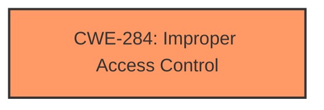

# Enhanced Analysis for CVE-2024-39580

# Summary
| CWE ID | CWE Name | Confidence | CWE Abstraction Level | CWE Vulnerability Mapping Label | CWE-Vulnerability Mapping Notes |
|---|---|---|---|---|---|
| CWE-284 | Improper Access Control | 0.8 | Pillar | Allowed | Primary CWE. The vulnerability description states "**Improper Access Control**" and the reference link summary confirms it. |

## Evidence and Confidence

*   **Confidence Score:** 0.8
*   **Evidence Strength:** HIGH

## Relationship Analysis
The primary identified CWE is CWE-284, which is a high-level category. The analysis considered more specific child CWEs like CWE-285 (Improper Authorization), CWE-862 (Missing Authorization), and CWE-863 (Incorrect Authorization), but the provided information does not give enough information to allow selection of a child CWE. Therefore, the broader CWE-284 is more appropriate.



## Vulnerability Chain
The vulnerability chain starts with **Improper Access Control** (CWE-284), which leads to Elevation of Privileges.

## Summary of Analysis
The initial assessment, based on the vulnerability description and reference links, points to **Improper Access Control** as the root cause. The description explicitly mentions "**Improper Access Control**" as the vulnerability. The impact is Elevation of Privileges, achieved by a high privileged attacker with local access.

The Retriever Results list several CWEs, including CWE-119, CWE-732, CWE-269, CWE-274, CWE-284, CWE-287, CWE-378, CWE-256 and CWE-280. Among these, CWE-284 (Improper Access Control) is the most relevant high-level category but not the top ranked entry.

The classification guidance clarifies the differences between Authentication, Authorization, and Access Control. It also discusses privileges versus permissions. Given that the **root cause** is "**Improper Access Control**" and there isn't enough information to determine if the vulnerability is an authentication or authorization issue, CWE-284 is the most appropriate choice.

The selection of CWE-284 is at a higher level of abstraction (Pillar). However, without more specific details, it's the most accurate representation of the vulnerability. More specific CWEs, like CWE-285, CWE-862, and CWE-863, would require further clarification on whether the access control issue stems from missing or incorrect authorization checks.


## CWE Relationship Analysis

Current CWEs represent these abstraction levels: .


### Vulnerability Chain Analysis

**Chain starting from CWE-274:**
- 274 (Improper Handling of Insufficient Privileges) - ROOT


**Chain starting from CWE-863:**
- 863 (Incorrect Authorization) - ROOT


### CWE Relationship Diagram

```mermaid
graph TD
    classDef primary fill:#f96,stroke:#333,stroke-width:2px
    classDef secondary fill:#69f,stroke:#333
    classDef tertiary fill:#9e9,stroke:#333
```