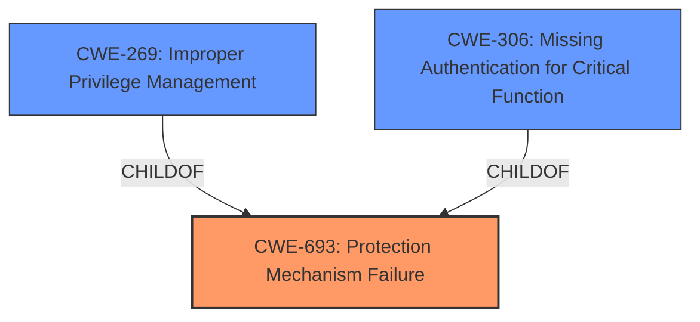

# Analysis for CVE-2024-39599

# Summary
| CWE ID    | CWE Name                                                                                 | Confidence | CWE Abstraction Level | CWE Vulnerability Mapping Label | CWE-Vulnerability Mapping Notes |
| :---------- | :--------------------------------------------------------------------------------------- | :--------- | :---------------------- | :------------------------------ | :-------------------------------- |
| CWE-693     | Protection Mechanism Failure                                                              | 0.9        | Pillar                  | Primary                         | Discouraged                     |
| CWE-269     | Improper Privilege Management                                                              | 0.7        | Class                   | Secondary                         | Allowed-with-Review                     |
| CWE-306     | Missing Authentication for Critical Function                                                              | 0.6        | Base                  | Secondary                         | Allowed                     |

## Evidence and Confidence

*   **Confidence Score:** 0.8
*   **Evidence Strength:** MEDIUM

## Relationship Analysis
The primary CWE is CWE-693, which is a high-level Pillar. While generally discouraged, the description focuses on a **Protection Mechanism Failure** without specifying the exact nature of the failure. CWE-693 is a parent of many other CWEs related to security mechanisms, which could be more specific. CWE-269, which is a child of CWE-664, is considered because the **failure** to implement the **protection mechanism** correctly may lead to **improper privilege management**. CWE-306 is considered because the **protection mechanism** that is failing could be due to **missing authentication**. The abstraction levels influenced the selection by guiding toward more specific weaknesses where possible, but the evidence only supports the higher-level CWE-693 as the primary issue.

## Vulnerability Chain
The vulnerability chain starts with a **Protection Mechanism Failure** (CWE-693) due to a **programming error**. This allows a developer to **bypass the configured malware scanner API**. The **failure** of the protection mechanism could lead to **improper privilege management** (CWE-269). This leads to a low impact on the applications confidentiality, integrity, and availability. Another possible failure of the **protection mechanism** could be a result of **missing authentication** (CWE-306).

## Summary of Analysis
The initial assessment focused on identifying the root cause of the vulnerability based on the provided description. The key phrases "Protection Mechanism Failure" and "programming error" pointed towards CWE-693 as the primary weakness. While CWE-693 is a high-level Pillar, the lack of specific details about the failure made it difficult to pinpoint a more precise CWE. The retriever results also suggested CWE-693 as a strong candidate.

The analysis considered alternative CWEs, such as CWE-269, CWE-94, CWE-749, and CWE-444, but these were deemed less relevant as they represent potential consequences or related weaknesses rather than the direct cause. CWE-269 was added as a secondary issue because it is a likely result of the **Protection Mechanism Failure**. CWE-306 was added as a secondary issue because it is a likely result of the **Protection Mechanism Failure**.

The hierarchical relationships between CWEs were examined to ensure that the selected CWEs were at the appropriate level of abstraction. While more specific CWEs exist under CWE-693, the available evidence did not support a more granular classification. The final decision was based on a combination of content matching, relationship analysis, and mapping guidance, with a focus on identifying the root cause of the vulnerability. The confidence level is high, as the evidence directly supports the selection of CWE-693 as the primary weakness, but is lower on the secondary issues due to lack of evidence.

Relevant CWE Information:

# Enhanced Context (25 CWEs)
The following CWEs were identified as potentially relevant to this vulnerability:

## CWE-807: Reliance on Untrusted Inputs in a Security Decision
**Abstraction Level**: Base
**Similarity Score**: 0.74
**Source**: dense

**Description**:
The product uses a protection mechanism that relies on the existence or values of an input, but the input can be modified by an untrusted actor in a way that bypasses the protection mechanism.

**Mapping Guidance**:
- Usage: Allowed
- Rationale: This CWE entry is at the Base level of abstraction, which is a preferred level of abstraction for mapping to the root causes of vulnerabilities.

## CWE-668: Exposure of Resource to Wrong Sphere
**Abstraction Level**: Class
**Similarity Score**: 0.74
**Source**: dense

**Description**:
The product exposes a resource to the wrong control sphere, providing unintended actors with inappropriate access to the resource.

**Mapping Guidance**:
- Usage: Discouraged
- Rationale: CWE-668 is high-level and is often misused as a catch-all when lower-level CWE IDs might be applicable. It is sometimes used for low-information vulnerability reports [REF-1287]. It is a level-1 Class (i.e., a child of a Pillar). It is not useful for trend analysis.

## CWE-657: Violation of Secure Design Principles
**Abstraction Level**: Class
**Similarity Score**: 0.74
**Source**: dense

**Description**:
The product violates well-established principles for secure design.

**Mapping Guidance**:
- Usage: Discouraged
- Rationale: This CWE entry is a level-1 Class (i.e., a child of a Pillar). It might have lower-level children that would be more appropriate

## CWE-303: Incorrect Implementation of Authentication Algorithm
**Abstraction Level**: Base
**Similarity Score**: 0.74
**Source**: dense

**Description**:
The requirements for the product dictate the use of an established authentication algorithm, but the implementation of the algorithm is incorrect.

**Mapping Guidance**:
- Usage: Allowed
- Rationale: This CWE entry is at the Base level of abstraction, which is a preferred level of abstraction for mapping to the root causes of vulnerabilities.

## CWE-497: Exposure of Sensitive System Information to an Unauthorized Control Sphere
**Abstraction Level**: Base
**Similarity Score**: 0.74
**Source**: dense

**Description**:
The product does not properly prevent sensitive system-level information from being accessed by unauthorized actors who do not have the same level of access to the underlying system as the product does.

**Mapping Guidance**:
- Usage: Allowed
- Rationale: This CWE entry is at the Base level of abstraction, which is a preferred level of abstraction for mapping to the root causes of vulnerabilities.

## CWE-693: Protection Mechanism Failure
**Abstraction Level**: Pillar
**Similarity Score**: 0.73
**Source**: dense

**Description**:
The product does not use or incorrectly uses a protection mechanism that provides sufficient defense against directed attacks against the product.

**Mapping Guidance**:
- Usage: Discouraged
- Rationale: This CWE entry is extremely high-level, a Pillar.

## CWE-74: Improper Neutralization of Special Elements in Output Used by a Downstream Component ('Injection')
**Abstraction Level**: Class
**Similarity Score**: 0.73
**Source**: dense

**Description**:
The product constructs all or part of a command, data structure, or record using externally-influenced input from an upstream component, but it does not neutralize or incorrectly neutralizes special elements that could modify how it is parsed or interpreted when it is sent to a downstream component.

**Mapping Guidance**:
- Usage: Discouraged
- Rationale: CWE-74 is high-level and often misused when lower-level weaknesses are more appropriate.

## CWE-1391: Use of Weak Credentials
**Abstraction Level**: Class
**Similarity Score**: 0.72
**Source**: dense

**Description**:
The product uses weak credentials (such as a default key or hard-coded password) that can be calculated, derived, reused, or guessed by an attacker.

**Mapping Guidance**:
- Usage: Allowed-with-Review
- Rationale: This CWE entry is a Class and might have Base-level children that would be more appropriate

## CWE-345: Insufficient Verification of Data Authenticity
**Abstraction Level**: Class
**Similarity Score**: 0.72
**Source**: dense

**Description**:
The product does not sufficiently verify the origin or authenticity of data, in a way that causes it to accept invalid data.

**Mapping Guidance**:
- Usage: Discouraged
- Rationale: This CWE entry is a level-1 Class (i.e., a child of a Pillar). It might have lower-level children that would be more appropriate

## CWE-703: Improper Check or Handling of Exceptional Conditions
**Abstraction Level**: Pillar
**Similarity Score**: