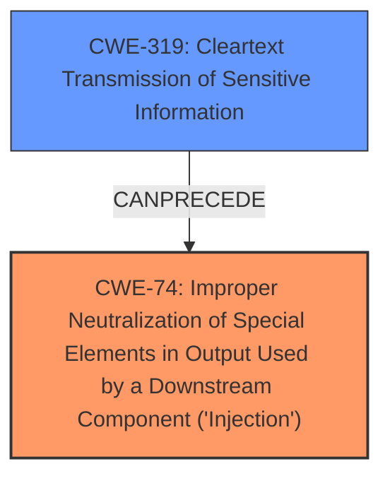

# Enhanced Analysis for CVE-2024-39604

# Summary
| CWE ID | CWE Name | Confidence | CWE Abstraction Level | CWE Vulnerability Mapping Label | CWE-Vulnerability Mapping Notes |
|---|---|---|---|---|---|
| CWE-74 | Improper Neutralization of Special Elements in Output Used by a Downstream Component ('Injection') | 0.9 | Class | Allowed | Primary CWE. This is the root cause as the `update_filter_url.sh` script does not sanitize the content retrieved from the URLs before using it in a `curl` command.|
| CWE-319 | Cleartext Transmission of Sensitive Information | 0.7 | Base | Allowed | Secondary CWE. The use of HTTP allows for a Man-in-the-Middle (MITM) attack. |

## Evidence and Confidence

*   **Confidence Score:** 0.8
*   **Evidence Strength:** HIGH

## Relationship Analysis
The primary CWE is CWE-74, which is a Class-level CWE. Although it is discouraged to use Class-level CWEs, there isn't a more specific Base-level CWE that fits the vulnerability description. CWE-74 is the root cause as the `update_filter_url.sh` script does not sanitize the content retrieved from the URLs before using it in a `curl` command. This leads to argument injection and ultimately allows for arbitrary command execution.

CWE-319 is a Base-level CWE that describes the insecure communication over HTTP, which enables the MITM attack.



## Vulnerability Chain
The vulnerability chain starts with the **insecure communication** over HTTP (CWE-319), which allows for a Man-in-the-Middle (MITM) attack. The attacker then injects malicious content into the HTTP response. The `update_filter_url.sh` script **fails to properly neutralize** special elements in the output used by a downstream component (CWE-74), which is the `curl` command. This leads to argument injection and ultimately allows for arbitrary command execution.

## Summary of Analysis
The analysis is based on the Talos Vulnerability Report for CVE-2024-39604. The report provides sufficient evidence to identify the root cause and contributing factors of the vulnerability.

The primary weakness is the lack of input validation in the `update_filter_url.sh` script, which leads to CWE-74. The use of HTTP instead of HTTPS (CWE-319) enables the MITM attack, which is a prerequisite for exploiting the injection vulnerability.

The selected CWEs are at the optimal level of specificity given the available information. While CWE-74 is a Class-level CWE, there isn't a more specific Base-level CWE that accurately represents the vulnerability.

Relevant CWE Information:
*   **CWE-74:** The product constructs all or part of a command, data structure, or record using externally-influenced input from an upstream component, but it does not neutralize or incorrectly neutralizes special elements that could modify how it is parsed or interpreted when it is sent to a downstream component.
*   **CWE-319:** The product transmits sensitive information in cleartext, which can be intercepted and read by unauthorized actors.

The retriever results listed several CWEs, but most of them were not relevant or specific enough to the vulnerability.
*   CWE-78 (Improper Neutralization of Special Elements used in an OS Command ('OS Command Injection')) and CWE-89 (Improper Neutralization of Special Elements used in an SQL Command ('SQL Injection')) were considered but not selected because the injection is not directly into an OS command or SQL command, but rather into the arguments of a `curl` command.
*   CWE-79 (Improper Neutralization of Input During Web Page Generation ('Cross-site Scripting')) was not selected because the vulnerability is not related to web page generation.
*   CWE-120 (Buffer Copy without Checking Size of Input ('Classic Buffer Overflow')) and CWE-190 (Integer Overflow or Wraparound) were not selected as they are not relevant to the root cause of the vulnerability.
*   CWE-425 (Direct Request ('Forced Browsing')) was not selected because the vulnerability is not related to direct requests or forced browsing.
*   CWE-134 (Use of Externally-Controlled Format String) was not selected because there is no format string being used.
*   CWE-1287 (Improper Validation of Specified Type of Input) was not selected because while input validation is missing, the more specific CWE-74 is a better fit.
*   CWE-790 (Improper Filtering of Special Elements) was not selected because the description specifically mentions "special elements in output used by a downstream component" which is closer to CWE-74.


## CWE Relationship Analysis

Current CWEs represent these abstraction levels: .


### Vulnerability Chain Analysis

**Chain starting from CWE-89:**
- 89 (Improper Neutralization of Special Elements used in an SQL Command ('SQL Injection')) - ROOT


**Chain starting from CWE-319:**
- 319 (Cleartext Transmission of Sensitive Information) - ROOT


### CWE Relationship Diagram

```mermaid
graph TD
    classDef primary fill:#f96,stroke:#333,stroke-width:2px
    classDef secondary fill:#69f,stroke:#333
    classDef tertiary fill:#9e9,stroke:#333
```