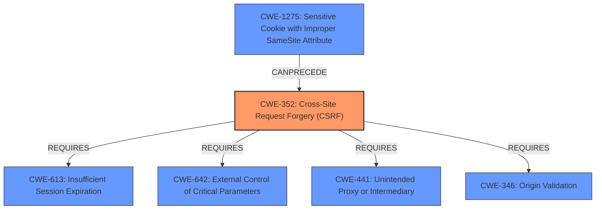

# Analysis for CVE-2024-39623

# Summary
| CWE ID | CWE Name | Confidence | CWE Abstraction Level | CWE Vulnerability Mapping Label | CWE-Vulnerability Mapping Notes |
|---|---|---|---|---|---|
| CWE-352 | Cross-Site Request Forgery (CSRF) | 1.0 | Compound | Allowed | Primary CWE |

## Evidence and Confidence

*   **Confidence Score:** 1.0
*   **Evidence Strength:** HIGH

## Relationship Analysis
The primary identified CWE is CWE-352, Cross-Site Request Forgery (CSRF), which is a compound CWE. There aren't direct parent-child relationships significantly impacting the selection, given that CWE-352 is itself a combination of multiple weaknesses. The CANFOLLOW relationship from CWE-1275 to CWE-352 and the REQUIRES relationships (CWE-613, CWE-642, CWE-441, CWE-346) for CWE-352 highlight the dependencies and potential contributing factors for a CSRF vulnerability. The compound nature of CWE-352 encapsulates these underlying weaknesses.

## Vulnerability Chain
The vulnerability chain starts with the **root cause**: **Cross-Site Request Forgery** (**CWE-352**). This leads to the **impact**: Authentication Bypass, where an attacker can force a logged-in user to perform actions without their consent.

## Summary of Analysis
The primary assessment is based on the vulnerability description, which explicitly mentions a **Cross-Site Request Forgery** (**CWE-352**) vulnerability leading to Authentication Bypass. The "CVE Reference Links Content Summary" confirms that the ListingPro theme lacks proper CSRF protection, allowing attackers to force logged-in users to execute unwanted actions. The provided information strongly supports the selection of CWE-352 as the primary weakness.

The retriever results also listed CWE-352 as the top candidate with the highest score. The evidence provided is sufficient to confidently assign CWE-352.

Relevant CWE Information:

# Enhanced Context (25 CWEs)

## CWE-352: Cross-Site Request Forgery (CSRF)
**Abstraction Level**: Compound
**Similarity Score**: 1488.50
**Source**: sparse

**Description**:
The web application does not, or can not, sufficiently verify whether a well-formed, valid, consistent request was intentionally provided by the user who submitted the request.

**Mapping Guidance**:
- Usage: Allowed
- Rationale: This is a well-known Composite of multiple weaknesses that must all occur simultaneously, although it is attack-oriented in nature.

### How the vulnerability's details match the CWE's characteristics
The vulnerability description states that there is a **Cross-Site Request Forgery** (**CWE-352**) issue, and the CVE reference confirms the lack of proper CSRF protection. This aligns directly with the CWE-352 description, which focuses on the application's failure to verify the legitimacy of user-submitted requests.

### The security implications and potential impact
The security implication is that an attacker can trick a logged-in user into performing actions they did not intend to, potentially leading to unauthorized changes, data theft, or other malicious activities. The impact, as described, is authentication bypass, where the attacker can force higher privileged users to execute unwanted actions.

### Any parent-child relationships or chain patterns that influenced your mapping
CWE-352 is a compound weakness, meaning it's composed of multiple underlying weaknesses. The REQUIRES relationships (CWE-613, CWE-642, CWE-441, CWE-346) highlight the dependencies and potential contributing factors for a CSRF vulnerability. For instance, **CWE-1275** CANPRECEDE **CWE-352** which indicates that a sensitive cookie without proper attributes could lead to a **CSRF** vulnerability.

### Whether the weakness is primary or secondary in the vulnerability
**CWE-352** is the primary weakness, as it is the **root cause** of the vulnerability.

### How the official MITRE mapping guidance influenced your decision
The MITRE mapping guidance for CWE-352 states that its usage is "Allowed" and that it is a well-known composite of multiple weaknesses that must occur simultaneously. This guidance supports the decision to map the vulnerability to CWE-352, given the evidence of a CSRF issue.