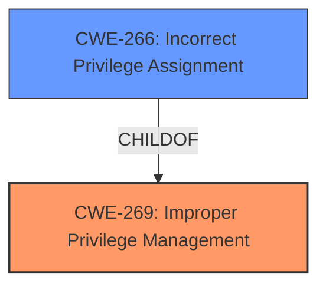

# Enhanced Analysis for CVE-2024-39633

# Summary
| CWE ID | CWE Name | Confidence | CWE Abstraction Level | CWE Vulnerability Mapping Label | CWE-Vulnerability Mapping Notes |
|---|---|---|---|---|---|
| CWE-269 | Improper Privilege Management | 0.75 | Class | Primary | Discouraged |
| CWE-266 | Incorrect Privilege Assignment | 0.65 | Base | Secondary | Allowed |

## Evidence and Confidence

*   **Confidence Score:** 0.70
*   **Evidence Strength:** MEDIUM

## Relationship Analysis
The analysis focuses on the hierarchical relationship between CWE-269 (Improper Privilege Management) and its child CWE-266 (Incorrect Privilege Assignment). While the description points to a broader issue of privilege management, there's an indication that the problem stems from incorrect assignment of privileges. The guidance advises caution with CWE-269, suggesting a more specific child CWE if available.



## Vulnerability Chain
The vulnerability chain starts with **Improper Privilege Management** (CWE-269), leading to a Privilege Escalation impact. The root cause is further specified as **Incorrect Privilege Assignment** (CWE-266), where a low-privileged user can gain higher privileges.

## Summary of Analysis
The initial analysis focused on **Improper Privilege Management** (CWE-269) as the primary weakness. However, the additional information in the CVE Reference Links Content Summary suggests a more specific root cause: a low-privileged user gaining higher privileges. This points towards **Incorrect Privilege Assignment** (CWE-266).

Given that CWE-269 is a Class-level CWE and the guidance discourages its use when a more specific Base-level CWE is available, I'm selecting CWE-266 as a secondary candidate. I am retaining CWE-269 since it is mentioned as the **rootcause** in the Vulnerability Description Key Phrases. My assessment is primarily based on the provided evidence, specifically the "Root cause of vulnerability" from the CVE Reference Links Content Summary: "The vulnerability is a privilege escalation issue." and "Weaknesses/vulnerabilities present": "The plugin contains a flaw that allows a low-privileged user to gain higher privileges.".

The selected CWEs are at the optimal level of specificity, with CWE-266 providing a more detailed understanding of the root cause than the more general CWE-269.

Relevant CWE Information:

# Enhanced Context (25 CWEs)
The following CWEs were identified as potentially relevant to this vulnerability:

## CWE-266: Incorrect Privilege Assignment
**Abstraction Level**: Base
**Similarity Score**: 0.80
**Source**: dense

**Description**:
A product incorrectly assigns a privilege to a particular actor, creating an unintended sphere of control for that actor.

**Mapping Guidance**:
- Usage: Allowed
- Rationale: This CWE entry is at the Base level of abstraction, which is a preferred level of abstraction for mapping to the root causes of vulnerabilities.

## CWE-269: Improper Privilege Management
**Abstraction Level**: Class
**Similarity Score**: 1397.23
**Source**: sparse

**Description**:
The product does not properly assign, modify, track, or check privileges for an actor, creating an unintended sphere of control for that actor.

**Mapping Guidance**:
- Usage: Discouraged
- Rationale: CWE-269 is commonly misused. It can be conflated with "privilege escalation," which is a technical impact that is listed in many low-information vulnerability reports [REF-1287]. It is not useful for trend analysis.

# Complete CWE Specifications

CWE-472: External Control of Assumed-Immutable Web Parameter
Not selected: This CWE relates to the external control of web parameters, which is not directly applicable to the provided vulnerability description.

CWE-266: Incorrect Privilege Assignment
Selected as secondary candidate. The vulnerability description indicates an issue with privilege management, and the CVE reference suggests that a low-privileged user can gain higher privileges. This aligns with the concept of incorrect privilege assignment.

CWE-425: Direct Request ('Forced Browsing')
Not selected: This CWE is related to unauthorized access to URLs, scripts, or files, which is not the primary issue described in the vulnerability description.

CWE-345: Insufficient Verification of Data Authenticity
Not selected: This CWE relates to the lack of data authenticity verification, which is not the core issue described in the vulnerability.

CWE-269: Improper Privilege Management
Selected as primary CWE. The vulnerability description explicitly mentions "**Improper Privilege Management**" as the root cause.

CWE-667: Improper Locking
Not selected: This CWE relates to concurrency issues and improper locking mechanisms, which are not relevant to the vulnerability description.

CWE-284: Improper Access Control
Not selected: While related to privilege management, this is a more general CWE, and the description points towards specific issues with privilege assignment.

CWE-287: Improper Authentication
Not selected: This CWE focuses on authentication issues, which are not the primary concern in the vulnerability description.

CWE-267: Privilege Defined With Unsafe Actions
Not selected: This CWE focuses on privileges that allow unsafe actions, not the incorrect assignment of privileges.

CWE-471: Modification of Assumed-Immutable Data (MAID)
Not selected: This CWE relates to the modification of immutable data, which is not relevant to the vulnerability description.


## CWE Relationship Analysis

Current CWEs represent these abstraction levels: .


### Vulnerability Chain Analysis

**Chain starting from CWE-471:**
- 471 (Modification of Assumed-Immutable Data (MAID)) - ROOT


**Chain starting from CWE-345:**
- 345 (Insufficient Verification of Data Authenticity) - ROOT


### CWE Relationship Diagram

```mermaid
graph TD
    classDef primary fill:#f96,stroke:#333,stroke-width:2px
    classDef secondary fill:#69f,stroke:#333
    classDef tertiary fill:#9e9,stroke:#333
```