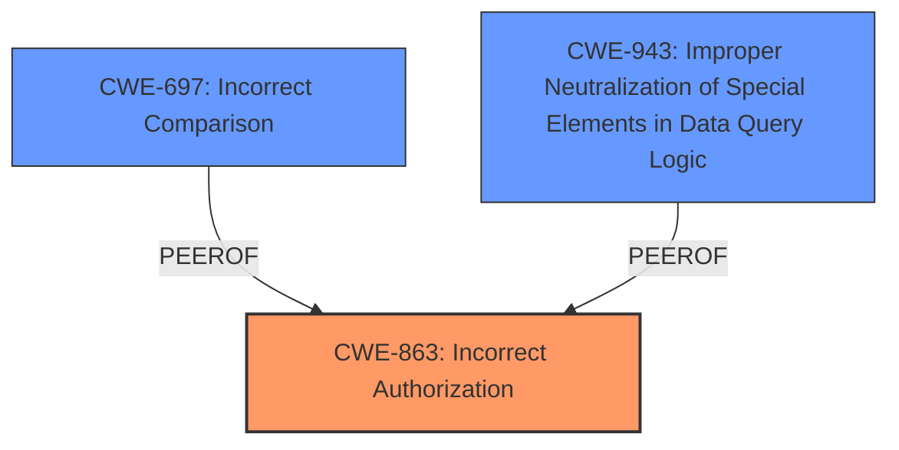

# Raw Analyzer Response for CVE-2024-39701

# Summary
| CWE ID | CWE Name | Confidence | CWE Abstraction Level | CWE Vulnerability Mapping Label | CWE-Vulnerability Mapping Notes |
|---|---|---|---|---|---|
| CWE-863 | Incorrect Authorization | 0.9 | Class | Allowed-with-Review | The product performs an authorization check when an actor attempts to access a resource or perform an action, but it does not correctly perform the check. |
| CWE-697 | Incorrect Comparison | 0.7 | Pillar | Discouraged | The logic of the comparison is incorrect, such as using the wrong operator (>, <, >=, <=, !=, ==) or neglecting to account for the direction of the comparison. |
| CWE-943 | Improper Neutralization of Special Elements in Data Query Logic ('So-called Injection') | 0.6 | Class | Allowed-with-Review | The product constructs all or part of a data query command using externally-influenced input from an upstream component, but it does not neutralize or incorrectly neutralizes special elements that could modify the intended query when it is executed by a downstream component. |

## Evidence and Confidence

*   **Confidence Score:** 0.8
*   **Evidence Strength:** HIGH

## Relationship Analysis
The primary CWE is CWE-863, which is a Class-level weakness describing incorrect authorization. The vulnerability description clearly states that the Directus version incorrectly handles `_in` and `_nin` operators, leading to broken access control. This incorrect handling can be seen as an **incorrect authorization** check.

CWE-697 (Incorrect Comparison) is a Pillar that could be a contributing factor because the `_in` and `_nin` operators perform comparisons, and their **improper handling** leads to incorrect results.

CWE-943 (Improper Neutralization of Special Elements in Data Query Logic) is also a possible contributing factor because the `_in` and `_nin` operators can be considered part of the data query logic, and the system **improperly handles** them.

## Vulnerability Chain
The vulnerability chain starts with the **improper handling** of `_in` and `_nin` operators in Directus. This leads to **incorrect authorization** checks, which then results in broken access control, allowing unauthorized users to access resources.

## Summary of Analysis
The initial analysis pointed towards authorization issues due to the broken access control. The key phrase "**improperly handles _in, _nin operators**" indicates a flaw in the authorization logic. The "CVE Reference Links Content Summary" section confirms that the vulnerability results in broken access control due to the **incorrect handling** of operators.

CWE-863 (Incorrect Authorization) is selected as the primary CWE because it accurately describes the core issue: Directus performs authorization checks, but does so incorrectly. The other CWEs, while relevant, are not as direct. CWE-697 (Incorrect Comparison) is a contributing factor because of the flawed logic in the comparison operators. CWE-943 (Improper Neutralization of Special Elements in Data Query Logic) is also a potential secondary CWE because the operators are part of the data query logic.

The final decision is based on the evidence from the vulnerability description and the mapping guidance provided. CWE-863 is the most specific and appropriate CWE for this vulnerability.