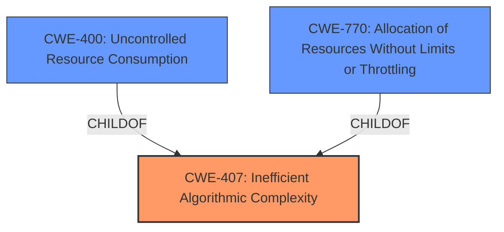

# Analysis Report for CVE-2024-39702

# Vulnerability Analysis Report: CVE-2024-39702

## Description

In lj_str_hash.c in OpenResty 1.19.3.1 through 1.25.3.1, the string hashing function (used during string interning) allows **HashDoS** (Hash Denial of Service) attacks. An attacker could cause excessive resource usage during proxy operations via crafted requests, potentially leading to a denial of service with relatively few incoming requests. This vulnerability only exists in the OpenResty fork in the openresty/luajit2 GitHub repository. The LuaJIT/LuaJIT repository. is unaffected.

## Vulnerability Description Key Phrases

- **Weakness:** HashDoS
- **Impact:** denial of service
- **Vector:** crafted requests
- **Attacker:** attacker
- **Product:** OpenResty
- **Version:** 1.19.3.1 through 1.25.3.1
- **Component:** lj_str_hash.c

## Analysis (with Relationship Data)

# Summary
| CWE ID | CWE Name | Confidence | CWE Abstraction Level | CWE Vulnerability Mapping Label | CWE-Vulnerability Mapping Notes |
|---|---|---|---|---|---|
| CWE-407 | Inefficient Algorithmic Complexity | 0.9 | Class | Allowed-with-Review | Primary CWE. The vulnerability stems from a performance issue related to hash computation optimization within the OpenResty branch of LuaJIT |
| CWE-400 | Uncontrolled Resource Consumption | 0.7 | Class | Discouraged | Secondary Candidate. The **HashDoS** leads to excessive resource usage, but the root cause is the algorithmic complexity. |
| CWE-770 | Allocation of Resources Without Limits or Throttling | 0.6 | Base | Allowed | Secondary Candidate. The product allocates a reusable resource or group of resources on behalf of an actor without imposing any restrictions on the size or number of resources that can be allocated |

## Evidence and Confidence

*   **Confidence Score:** 0.8
*   **Evidence Strength:** MEDIUM

## Relationship Analysis
The primary CWE is CWE-407, which is a Class-level CWE. While it would be ideal to have a more specific Base-level CWE, none of the child CWEs of CWE-407 appear to be a better fit based on the provided information. CWE-400 is related as a potential consequence of the inefficient algorithm, and CWE-770 could be the allocation of resources without limits because of the algorithmic issue.



## Vulnerability Chain
The vulnerability chain starts with **CWE-407 (Inefficient Algorithmic Complexity)**, which leads to **uncontrolled resource consumption (CWE-400)**, and ultimately results in a denial-of-service.

## Summary of Analysis
The primary weakness is the **inefficient algorithmic complexity** in the string hashing function. This inefficiency allows an attacker to cause excessive resource usage via crafted requests, leading to a denial of service. The selection of CWE-407 is based on the vulnerability description key phrases (**HashDoS**) and the CVE reference link content summary ("performance issue related to hash computation optimization within the OpenResty branch of LuaJIT").

CWE-400 (Uncontrolled Resource Consumption) was considered because the attack leads to excessive resource usage. However, CWE-407 is more specific to the root cause, which is the inefficient algorithm itself.

CWE-770 (Allocation of Resources Without Limits or Throttling) was considered since the **HashDoS** could result in the allocation of resources without limits, exhausting system resources. However, the root cause is still the algorithmic complexity.

Relevant CWE Information:

# Enhanced Context (25 CWEs)
The following CWEs were identified as potentially relevant to this vulnerability:

## CWE-407: Inefficient Algorithmic Complexity
**Abstraction Level**: Class
**Similarity Score**: 0.73
**Source**: dense

**Description**:
An algorithm in a product has an inefficient worst-case computational complexity that may be detrimental to system performance and can be triggered by an attacker, typically using crafted manipulations that ensure that the worst case is being reached.

**Mapping Guidance**:
- Usage: Allowed-with-Review
- Rationale: This CWE entry is a Class and might have Base-level children that would be more appropriate

## CWE-400: Uncontrolled Resource Consumption
**Abstraction Level**: Class
**Similarity Score**: 0.315
**Source**: sparse

**Description**:
The software does not properly control the consumption of resources (memory, CPU, disk, network, etc.) which can lead to denial of service, or degradation of performance.

**Mapping Guidance**:
- Usage: Discouraged
- Rationale: This CWE entry is very general and is frequently caused by other more specific weaknesses. It is better to select a more precise CWE when available.


## CWE Relationship Analysis

Current CWEs represent these abstraction levels: .


### Vulnerability Chain Analysis

**Chain starting from CWE-400:**
- 400 (Uncontrolled Resource Consumption) - ROOT


**Chain starting from CWE-407:**
- 407 (Inefficient Algorithmic Complexity) - ROOT


### CWE Relationship Diagram

```mermaid
graph TD
    classDef primary fill:#f96,stroke:#333,stroke-width:2px
    classDef secondary fill:#69f,stroke:#333
    classDef tertiary fill:#9e9,stroke:#333
```


*Report generated on 2025-07-13 11:43:15*
