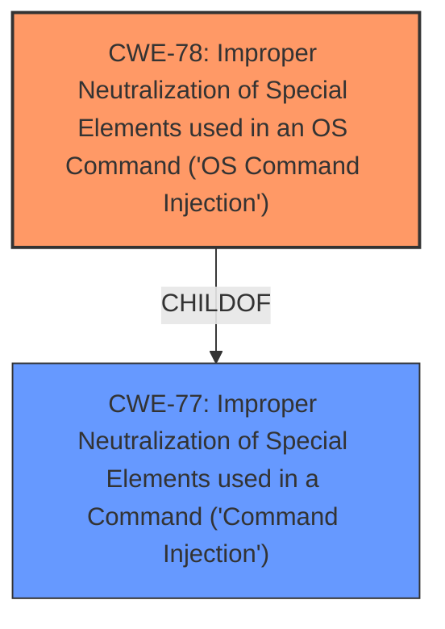

# Analysis for CVE-2024-39703

# Summary

| CWE ID | CWE Name | Confidence | CWE Abstraction Level | CWE Vulnerability Mapping Label | CWE-Vulnerability Mapping Notes |
|---|---|---|---|---|---|
| CWE-78 | Improper Neutralization of Special Elements used in an OS Command ('OS Command Injection') | 1.0 | Base | Allowed | Primary CWE. This is the root cause of the vulnerability as the product **does not properly neutralize** special elements when constructing OS commands.|
| CWE-77 | Improper Neutralization of Special Elements used in a Command ('Command Injection') | 0.7 | Class | Allowed-with-Review | Secondary. Considered as a parent of CWE-78 but less specific. |

## Evidence and Confidence

*   **Confidence Score:** 1.0
*   **Evidence Strength:** HIGH

## Relationship Analysis
The primary relationship that influenced the decision was the parent-child relationship between CWE-77 and CWE-78. CWE-78 is a more specific version of CWE-77.

## Vulnerability Chain
The vulnerability chain starts with the **improper neutralization** of special elements within a command, leading to the ability to **execute arbitrary commands**.

Root Cause: CWE-78 Improper Neutralization of Special Elements used in an OS Command ('OS Command Injection')
Impact: Arbitrary command execution on the system.

## Summary of Analysis
The analysis is based on the provided evidence, which indicates a **command injection** vulnerability due to **improper neutralization** of special elements. The "CVE Reference Links Content Summary" explicitly mentions "Improper Neutralization of Special Elements used in a Command ('Command Injection') - CWE-77" as a weakness. However, based on the description and the ability to execute arbitrary commands, CWE-78, which is a more specific case of CWE-77, is selected as the primary CWE.

The graph relationship between CWE-77 and CWE-78 helped refine the selection to the more specific CWE-78. The vulnerability description clearly states that authenticated users can execute arbitrary commands by sending a crafted request, which aligns with the characteristics of OS Command Injection.

CWE-78 is at the optimal level of specificity because it directly addresses the **improper neutralization** of special elements used in OS commands, leading to the execution of arbitrary commands.

**CWE Considerations:**

*   **CWE-77:** Considered but not chosen as the primary because it is a more general case of command injection. CWE-78 is more specific to OS commands.
*   **CWE-88: Improper Neutralization of Argument Delimiters in a Command ('Argument Injection'):** Not selected because the vulnerability description refers to command injection in general, not specifically argument injection.
*   **CWE-94: Improper Control of Generation of Code ('Code Injection'):** Not selected because while the impact is code execution, the root cause is **improper neutralization**, not the generation of code itself.
*   **CWE-138: Improper Neutralization of Special Elements:** Not selected because it's a high-level class, and CWE-78 provides a more specific description of the vulnerability.
*   **CWE-93: Improper Neutralization of CRLF Sequences ('CRLF Injection'):** Not relevant to the described vulnerability.
*   **CWE-502: Deserialization of Untrusted Data:** Not relevant to the described vulnerability.
*   **CWE-425: Direct Request ('Forced Browsing'):** Not relevant to the described vulnerability.
*   **CWE-22: Improper Limitation of a Pathname to a Restricted Directory ('Path Traversal'):** Not relevant to the described vulnerability.
*   **CWE-89: Improper Neutralization of Special Elements used in an SQL Command ('SQL Injection'):** Not relevant to the described vulnerability.
*   **CWE-98: Improper Control of Filename for Include/Require Statement in PHP Program ('PHP Remote File Inclusion'):** Not relevant to the described vulnerability.