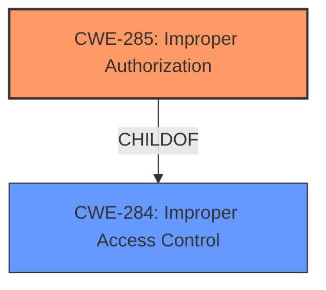

# Enhanced Analysis for CVE-2024-39758

# Summary

| CWE ID   | CWE Name                                                                    | Confidence | CWE Abstraction Level | CWE Vulnerability Mapping Label | CWE-Vulnerability Mapping Notes |
| -------- | --------------------------------------------------------------------------- | ---------- | --------------------- | ------------------------------- | ------------------------------- |
| CWE-285 | Improper Authorization                                                        | 0.9        | Class                 | Primary CWE                     | Discouraged                   |
| CWE-284 | Improper Access Control                                                       | 0.6        | Pillar                 | Secondary Candidate             | Discouraged                   |

## Evidence and Confidence

*   **Confidence Score:** 0.9
*   **Evidence Strength:** HIGH

## Relationship Analysis

The primary CWE selected is CWE-285 (Improper Authorization), a Class-level CWE, because the vulnerability description and CVE content explicitly state "**Improper access control**," and the guidance suggests using a more specific CWE than CWE-284 (Improper Access Control) when authorization flaws are involved. CWE-284 is a Pillar-level CWE and is a parent of CWE-285. If there's an authorization failure, CWE-285 is more appropriate than its parent.



## Vulnerability Chain

The vulnerability chain starts with **improper access control** (**Improper Authorization**), which leads to a potential denial of service.

Improper Authorization -> Denial of Service

The **Primary CWE** identifies the issue that led to the vulnerability i.e. the first in the "Vulnerability Chain"

## Summary of Analysis

The initial analysis focused on identifying the root cause of the vulnerability. The key phrase "**Improper access control**" strongly suggests an access control issue. The Retriever Results listed CWE-284 (Improper Access Control) as a relevant CWE. However, the CWE Classification Guidance emphasizes that when the issue is specifically related to authorization, CWE-285 (Improper Authorization) is preferred over the more general CWE-284.

The CVE Reference Links Content Summary confirms that the **root cause** is "**Improper access control**." This evidence, combined with the CWE Classification Guidance, supports the selection of CWE-285 as the primary CWE.

The graph relationships further support this decision, as CWE-285 is a child of CWE-284, indicating a more specific form of access control issue. CWE-285 is at the optimal level of specificity because the evidence clearly points to an authorization problem.

Relevant CWE Information:

*   CWE-285: Improper Authorization
    *   The product does not perform or incorrectly performs an authorization check when an actor attempts to access a resource or perform an action.
    *   Usage: Discouraged - CWE-285 is high-level and lower-level CWEs can frequently be used instead. It is a level-1 Class (i.e., a child of a Pillar).
    *   The vulnerability description states: "**Improper access control** for some Intel(R) Arc & Iris(R) Xe graphics software...may allow an authenticated user to potentially enable denial of service via local access."

CWEs considered but not used:

*   CWE-284 (Improper Access Control): This CWE was considered but not selected as the primary CWE because the CWE Classification Guidance suggests using more specific child CWEs when the access control issue is related to authorization. While CWE-284 is a relevant and broader category, CWE-285 more accurately reflects the specific nature of the vulnerability.
*   CWE-306 (Missing Authentication for Critical Function): This CWE was considered but not selected because the vulnerability description indicates that the user is authenticated, ruling out a missing authentication issue.
*   CWE-862 (Missing Authorization): This CWE was considered, but the description states that authorization is performed incorrectly, which maps more directly to CWE-285 (Improper Authorization)
*   CWE-863 (Incorrect Authorization): This CWE was considered but is more appropriate when there is a flawed logic. This vulnerability is described as "**Improper access control**" which is a more general authorization failure.


## CWE Relationship Analysis

Current CWEs represent these abstraction levels: .


### Vulnerability Chain Analysis

**Chain starting from CWE-863:**
- 863 (Incorrect Authorization) - ROOT


**Chain starting from CWE-862:**
- 862 (Missing Authorization) - ROOT


### CWE Relationship Diagram

```mermaid
graph TD
    classDef primary fill:#f96,stroke:#333,stroke-width:2px
    classDef secondary fill:#69f,stroke:#333
    classDef tertiary fill:#9e9,stroke:#333
```