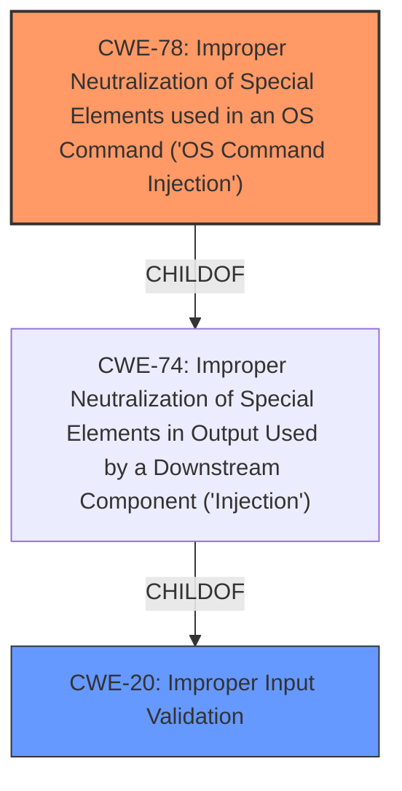

# Analysis Report for CVE-2024-39765

# Vulnerability Analysis Report: CVE-2024-39765

## Description

Multiple **OS command injection** vulnerabilities exist in the internet.cgi set_add_routing() functionality of Wavlink AC3000 M33A8.V5030.210505. A specially crafted HTTP request can lead to arbitrary command execution. An attacker can make an authenticated HTTP request to trigger these vulnerabilities.A command injection vulnerability exists in the `custom_interface` POST parameter.

## Vulnerability Description Key Phrases

- **Component:** internet.cgi set_add_routing() functionality
- **Vector:** specially crafted HTTP request
- **Weakness:** OS command injection
- **Product:** Wavlink AC3000 M33A8
- **Impact:** command execution, arbitrary command execution
- **Version:** V5030.210505

## Analysis (with Relationship Data)

# Summary

| CWE ID | CWE Name | Confidence | CWE Abstraction Level | CWE Vulnerability Mapping Label | CWE-Vulnerability Mapping Notes |
|---|---|---|---|---|---|
| CWE-78 | Improper Neutralization of Special Elements used in an OS Command ('OS Command Injection') | 1.0 | Base | Allowed | Primary CWE: This CWE directly addresses the **OS command injection** vulnerability. |
| CWE-20 | Improper Input Validation | 0.7 | Class | Discouraged | Secondary candidate: There is a **lack of input validation/sanitization** |

## Evidence and Confidence

*   **Confidence Score:** 0.9
*   **Evidence Strength:** HIGH

## Relationship Analysis

The primary relationship influencing the CWE selection is the hierarchical relationship between CWE-78 (Base) and its parent CWEs. While CWE-20 (Improper Input Validation) could be considered a broader cause, CWE-78 provides a more specific classification of the vulnerability. The chain relationship highlights the progression from **improper input validation** to **OS command injection**, ultimately leading to arbitrary command execution.



## Vulnerability Chain

The vulnerability chain starts with the **lack of input validation** which results in **OS Command Injection**, leading to arbitrary command execution.

*   **Root Cause:** **Lack of input validation/sanitization**
*   **Weakness:** **OS Command Injection** (CWE-78)
*   **Impact:** Arbitrary command execution

## Summary of Analysis

The initial analysis strongly points to CWE-78 (Improper Neutralization of Special Elements used in an OS Command ('OS Command Injection')) as the primary CWE due to the explicit mention of "**OS command injection**" in the vulnerability description and the CVE Reference Links Content Summary. The summary states the `internet.cgi` script **does not properly sanitize user-supplied input** before using it in system commands executed via `popen`. Specifically, the `netmask`, `gateway`, `dest`, `custom_interface`, `interface`, `hostnet`, and `comment` parameters are vulnerable.

The retriever results also list CWE-78 as the top candidate.

The relationships between CWEs helped to confirm this assessment. While CWE-20 (Improper Input Validation) is a valid consideration, it's a broader class. CWE-78 provides a more specific and accurate representation of the vulnerability.

The chosen CWEs are at the optimal level of specificity, focusing on the root cause (**OS command injection**) and a contributing factor (**lack of input validation**).

Relevant CWE Information:

*   CWE-78 directly matches the vulnerability description, focusing on **improper neutralization** leading to **OS command injection**.
*   CWE-20 represents the **lack of input validation**, which contributes to the **OS command injection** vulnerability.


## CWE Relationship Analysis

Current CWEs represent these abstraction levels: .


### Vulnerability Chain Analysis

**Chain starting from CWE-74:**
- 74 (Improper Neutralization of Special Elements in Output Used by a Downstream Component ('Injection')) - ROOT


**Chain starting from CWE-78:**
- 78 (Improper Neutralization of Special Elements used in an OS Command ('OS Command Injection')) - ROOT


### CWE Relationship Diagram

```mermaid
graph TD
    classDef primary fill:#f96,stroke:#333,stroke-width:2px
    classDef secondary fill:#69f,stroke:#333
    classDef tertiary fill:#9e9,stroke:#333
```


*Report generated on 2025-07-13 11:48:47*
