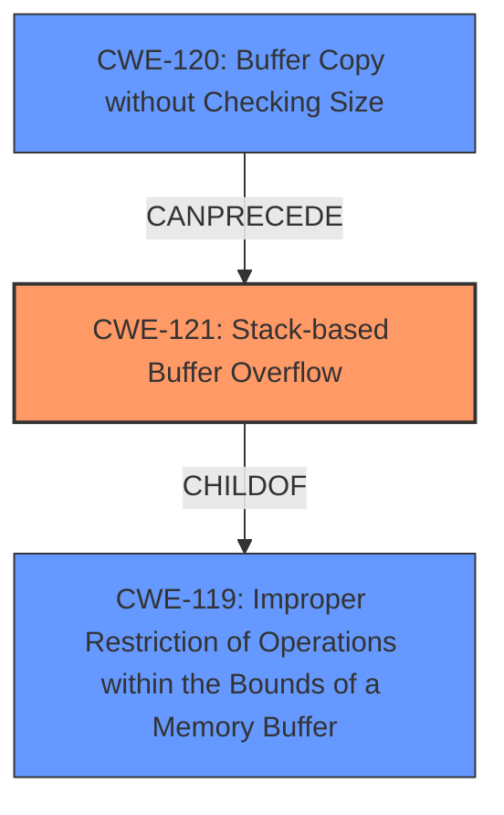

# Enhanced Analysis for CVE-2024-39768

# Summary
| CWE ID  | CWE Name                                                                 | Confidence | CWE Abstraction Level | CWE Vulnerability Mapping Label | CWE-Vulnerability Mapping Notes |
| :-------- | :----------------------------------------------------------------------- | :--------- | :---------------------- | :------------------------------ | :-------------------------------- |
| CWE-121   | Stack-based Buffer Overflow                                                | 1.0        | Variant               | Primary                         | Allowed                           |
| CWE-120   | Buffer Copy without Checking Size of Input ('Classic Buffer Overflow') | 0.7        | Base                  | Secondary                       | Allowed-with-Review             |
| CWE-119   | Improper Restriction of Operations within the Bounds of a Memory Buffer | 0.5        | Class                   | Secondary                       | Discouraged                       |

## Evidence and Confidence

*   **Confidence Score:** 0.9
*   **Evidence Strength:** HIGH

## Relationship Analysis
The primary CWE is CWE-121, a **Variant** of CWE-119. CWE-120, while also relevant, represents the specific coding practice that leads to the overflow. The relationship between CWE-120 and CWE-121/CWE-119 is that a buffer copy without checking size (CWE-120) can **CanPrecede** an out-of-bounds write on the stack (CWE-121), which is a specific instance of improper buffer operation restriction (CWE-119). Since the vulnerability description explicitly mentions a stack-based buffer overflow, CWE-121 is chosen as the primary, most specific, and **Variant** weakness.



## Vulnerability Chain
The vulnerability chain starts with the **improper coding practice of copying a buffer without checking its size (CWE-120)**. This leads to an **out-of-bounds write on the stack (CWE-121)** when the input exceeds the buffer's capacity. This is a specific case of **improper memory buffer operation restriction (CWE-119)**. The ultimate impact is arbitrary code execution, which is not explicitly represented by a CWE here, but is a common consequence of buffer overflows.

## Summary of Analysis
The analysis is based on the vulnerability description, CVE reference links, and retriever results. The CVE reference content clearly identifies a stack-based buffer overflow due to the use of `strcat` without proper input validation.

The primary CWE is CWE-121 (Stack-based Buffer Overflow), which is the most specific **Variant** that accurately reflects the vulnerability.

CWE-120 (Buffer Copy without Checking Size) is also relevant as it describes the root cause of the overflow, but it is less specific than CWE-121. CWE-119 (Improper Restriction of Operations within the Bounds of a Memory Buffer) is a more general **Class** that encompasses both CWE-120 and CWE-121, but it is not as descriptive as the specific stack-based overflow.

The choice of CWE-121 is supported by the vulnerability description: "**weakness: stack-based buffer overflow, buffer overflow**". The evidence from CVE reference summary is: "The script uses `strcat` to concatenate user-supplied data (`cli_name`, `cli_mac`, `en_enable`) into a fixed-size buffer (`buf_0x424`) without checking the length of the input, leading to potential buffer overflows."

The retriever results also suggest CWE-121 and CWE-120 as relevant CWEs. The MITRE mapping guidance for CWE-121 allows its usage. The MITRE mapping guidance for CWE-120 suggests caution because it is often misused, but it is appropriate here because the `strcat` operation represents a buffer copy without checking the size of the input.
The relatively high confidence is due to the explicit mention of "stack-based buffer overflow" in the description.

Relevant CWE Information:

# Enhanced Context (25 CWEs)
The following CWEs were identified as potentially relevant to this vulnerability:

## CWE-131: Incorrect Calculation of Buffer Size
**Abstraction Level**: Base
**Similarity Score**: 0.77
**Source**: dense

**Description**:
The product does not correctly calculate the size to be used when allocating a buffer, which could lead to a buffer overflow.

**Mapping Guidance**:
- Usage: Allowed
- Rationale: This CWE entry is at the Base level of abstraction, which is a preferred level of abstraction for mapping to the root causes of vulnerabilities.


## CWE-134: Use of Externally-Controlled Format String
**Abstraction Level**: Base
**Similarity Score**: 0.76
**Source**: dense

**Description**:
The product uses a function that accepts a format string as an argument, but the format string originates from an external source.

**Mapping Guidance**:
- Usage: Allowed
- Rationale: This CWE entry is at the Base level of abstraction, which is a preferred level of abstraction for mapping to the root causes of vulnerabilities.


## CWE-121: Stack-based Buffer Overflow
**Abstraction Level**: Variant
**Similarity Score**: 0.76
**Source**: dense

**Description**:
A stack-based buffer overflow condition is a condition where the buffer being overwritten is allocated on the stack (i.e., is a local variable or, rarely, a parameter to a function).

**Mapping Guidance**:
- Usage: Allowed
- Rationale: This CWE entry is at the Variant level of abstraction, which is a preferred level of abstraction for mapping to the root causes of vulnerabilities.


## CWE-130: Improper Handling of Length Parameter Inconsistency
**Abstraction Level**: Base
**Similarity Score**: 0.75
**Source**: dense

**Description**:
The product parses a formatted message or structure, but it does not handle or incorrectly handles a length field that is inconsistent with the actual length of the associated data.

**Mapping Guidance**:
- Usage: Allowed
- Rationale: This CWE entry is at the Base level of abstraction, which is a preferred level of abstraction for mapping to the root causes of vulnerabilities.


## CWE-119: Improper Restriction of Operations within the Bounds of a Memory Buffer
**Abstraction Level**: Class
**Similarity Score**: 0.75
**Source**: dense

**Description**:
The product performs operations on a memory buffer, but it reads from or writes to a memory location outside the buffer's intended boundary. This may result in read or write operations on unexpected memory locations that could be linked to other variables, data structures, or internal program data.

**Mapping Guidance**:
- Usage: Discouraged
- Rationale: CWE-119 is commonly misused in low-information vulnerability reports when lower-level CWEs could be used instead, or when more details about the vulnerability are available.


## CWE-790: Improper Filtering of Special Elements
**Abstraction Level**: Class
**Similarity Score**: 0.75
**Source**: dense

**Description**:
The product receives data from an upstream component, but does not filter or incorrectly filters special elements before sending it to a downstream component.

**Mapping Guidance**:
- Usage: Allowed-with-Review
- Rationale: This CWE entry is a Class and might have Base-level children that would be more appropriate


## CWE-193: Off-by-one Error
**Abstraction Level**: Base
**Similarity Score**: 0.75
**Source**: dense

**Description**:
A product calculates or uses an incorrect maximum or minimum value that is 1 more, or 1 less, than the correct value.

**Mapping Guidance**:
- Usage: Allowed
- Rationale: This CWE entry is at the Base level of abstraction, which is a preferred level of abstraction for mapping to the root causes of vulnerabilities.


## CWE-755: Improper Handling of Exceptional Conditions
**Abstraction Level**: Class
**Similarity Score**: 0.75
**Source**: dense

**Description**:
The product does not handle or incorrectly handles an exceptional condition.

**Mapping Guidance**:
- Usage: Discouraged
- Rationale: This CWE entry is a level-1 Class (i.e., a child of a Pillar). It might have lower-level children that would be more appropriate


## CWE-191: Integer Underflow (Wrap or Wraparound)
**Abstraction Level**: Base
**Similarity Score**: 0.75
**Source**: dense

**Description**:
The product subtracts one value from another, such that the result is less than the minimum allowable integer value, which produces a value


## CWE Relationship Analysis

Current CWEs represent these abstraction levels: .


### Vulnerability Chain Analysis

**Chain starting from CWE-121:**
- 121 (Stack-based Buffer Overflow) - ROOT


**Chain starting from CWE-130:**
- 130 (Improper Handling of Length Parameter Inconsistency) - ROOT


### CWE Relationship Diagram

```mermaid
graph TD
    classDef primary fill:#f96,stroke:#333,stroke-width:2px
    classDef secondary fill:#69f,stroke:#333
    classDef tertiary fill:#9e9,stroke:#333
```