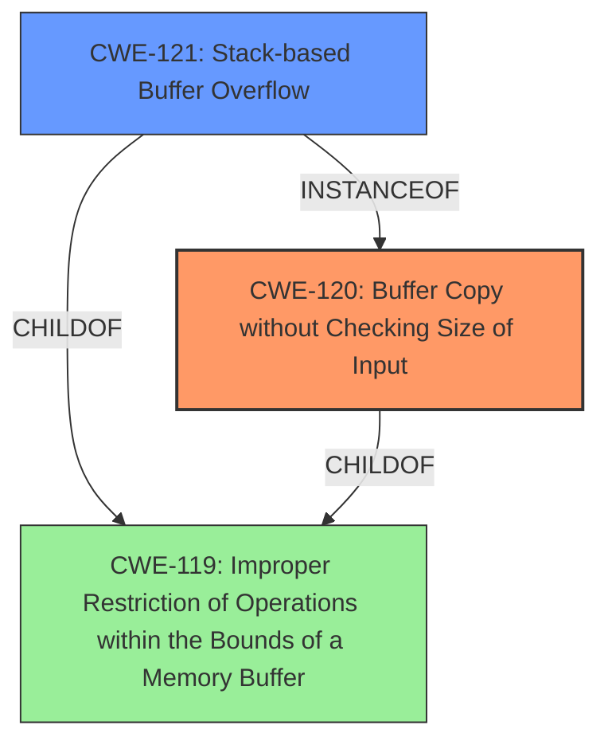

# Raw Analyzer Response for CVE-2024-39770

# Summary
| CWE ID  | CWE Name  | Confidence | CWE Abstraction Level | CWE Vulnerability Mapping Label | CWE-Vulnerability Mapping Notes |
|---|---|---|---|---|---|
| CWE-120 | Buffer Copy without Checking Size of Input ('Classic Buffer Overflow') | 1.0 | Base | Allowed-with-Review | Primary CWE. The `strcat` function copies user-supplied data into a fixed-size buffer without checking the input size. |
| CWE-121 | Stack-based Buffer Overflow | 0.9 | Variant | Allowed | Secondary candidate. The buffer is allocated on the stack. |

## Evidence and Confidence

*   **Confidence Score:** 0.95
*   **Evidence Strength:** HIGH

## Relationship Analysis
The primary weakness is CWE-120 [Buffer Copy without Checking Size of Input ('Classic Buffer Overflow')], which occurs because the code copies data into a buffer without validating the size of the input. This can lead to a buffer overflow, specifically a stack-based buffer overflow (CWE-121 [Stack-based Buffer Overflow]) in this case, since the buffer is allocated on the stack. CWE-121 [Stack-based Buffer Overflow] is a variant of buffer overflow.

## Vulnerability Chain
The vulnerability chain starts with a **missing** check on the size of the input being copied into a buffer (CWE-120 [Buffer Copy without Checking Size of Input ('Classic Buffer Overflow')]). Since the buffer is on the stack, this leads to CWE-121 [Stack-based Buffer Overflow]. The impact of this overflow allows an attacker to overwrite the return address and achieve arbitrary code execution.

## Summary of Analysis
The initial vulnerability description and the CVE Reference Links Content Summary clearly indicate a buffer overflow due to the **lack** of input size validation when copying data into a fixed-size buffer using `strcat`. The Talos report provides strong evidence indicating a stack-based buffer overflow due to the use of `strcat` into `buf_0x424` without input validation.
The **root cause** is the **lack** of input size validation leading to CWE-120 [Buffer Copy without Checking Size of Input ('Classic Buffer Overflow')]. Since the buffer `buf_0x424` is stack allocated, this leads to CWE-121 [Stack-based Buffer Overflow].

CWE-119 [Improper Restriction of Operations within the Bounds of a Memory Buffer] is too high level and doesn't accurately represent the specific vulnerability. CWE-120 [Buffer Copy without Checking Size of Input ('Classic Buffer Overflow')] is more precise, as it describes the **lack** of input size validation during the buffer copy operation.

I considered other CWEs such as CWE-131 [Incorrect Calculation of Buffer Size], CWE-190 [Integer Overflow or Wraparound], and CWE-1284 [Improper Validation of Specified Quantity in Input] but they do not fit the description as well as CWE-120 [Buffer Copy without Checking Size of Input ('Classic Buffer Overflow')] and CWE-121 [Stack-based Buffer Overflow]. The vulnerability is a direct result of copying data without checking its size, not an integer overflow or incorrect buffer size calculation.

Relevant CWE Information:

# Enhanced Context (25 CWEs)
The following CWEs were identified as potentially relevant to this vulnerability:

## CWE-131: Incorrect Calculation of Buffer Size
**Abstraction Level**: Base
**Similarity Score**: 0.76
**Source**: dense

**Description**:
The product does not correctly calculate the size to be used when allocating a buffer, which could lead to a buffer overflow.

**Mapping Guidance**:
- Usage: Allowed
- Rationale: This CWE entry is at the Base level of abstraction, which is a preferred level of abstraction for mapping to the root causes of vulnerabilities.

## CWE-121: Stack-based Buffer Overflow
**Abstraction Level**: Variant
**Similarity Score**: 0.76
**Source**: dense

**Description**:
A stack-based buffer overflow condition is a condition where the buffer being overwritten is allocated on the stack (i.e., is a local variable or, rarely, a parameter to a function).

**Mapping Guidance**:
- Usage: Allowed
- Rationale: This CWE entry is at the Variant level of abstraction, which is a preferred level of abstraction for mapping to the root causes of vulnerabilities.

## CWE-134: Use of Externally-Controlled Format String
**Abstraction Level**: Base
**Similarity Score**: 0.75
**Source**: dense

**Description**:
The product uses a function that accepts a format string as an argument, but the format string originates from an external source.

**Mapping Guidance**:
- Usage: Allowed
- Rationale: This CWE entry is at the Base level of abstraction, which is a preferred level of abstraction for mapping to the root causes of vulnerabilities.

## CWE-790: Improper Filtering of Special Elements
**Abstraction Level**: Class
**Similarity Score**: 0.75
**Source**: dense

**Description**:
The product receives data from an upstream component, but does not filter or incorrectly filters special elements before sending it to a downstream component.

**Mapping Guidance**:
- Usage: Allowed-with-Review
- Rationale: This CWE entry is a Class and might have Base-level children that would be more appropriate

## CWE-130: Improper Handling of Length Parameter Inconsistency
**Abstraction Level**: Base
**Similarity Score**: 0.75
**Source**: dense

**Description**:
The product parses a formatted message or structure, but it does not handle or incorrectly handles a length field that is inconsistent with the actual length of the associated data.

**Mapping Guidance**:
- Usage: Allowed
- Rationale: This CWE entry is at the Base level of abstraction, which is a preferred level of abstraction for mapping to the root causes of vulnerabilities.

## CWE-193: Off-by-one Error
**Abstraction Level**: Base
**Similarity Score**: 0.74
**Source**: dense

**Description**:
A product calculates or uses an incorrect maximum or minimum value that is 1 more, or 1 less, than the correct value.

**Mapping Guidance**:
- Usage: Allowed
- Rationale: This CWE entry is at the Base level of abstraction, which is a preferred level of abstraction for mapping to the root causes of vulnerabilities.

## CWE-755: Improper Handling of Exceptional Conditions
**Abstraction Level**: Class
**Similarity Score**: 0.74
**Source**: dense

**Description**:
The product does not handle or incorrectly handles an exceptional condition.

**Mapping Guidance**:
- Usage: Discouraged
- Rationale: This CWE entry is a level-1 Class (i.e., a child of a Pillar). It might have lower-level children that would be more appropriate

## CWE-119: Improper Restriction of Operations within the Bounds of a Memory Buffer
**Abstraction Level**: Class
**Similarity Score**: 0.74
**Source**: dense

**Description**:
The product performs operations on a memory buffer, but it reads from or writes to a memory location outside the buffer's intended boundary. This may result in read or write operations on unexpected memory locations that could be linked to other variables, data structures, or internal program data.

**Mapping Guidance**:
- Usage: Discouraged
- Rationale: CWE-119 is commonly misused in low-information vulnerability reports when lower-level CWEs could be used instead, or when more details about the vulnerability are available.

## CWE-191: Integer Underflow (Wrap or Wraparound)
**Abstraction Level**: Base
**Similarity Score**: 0.74
**Source**: dense

**Description**:
The product subtracts one value from another, such that the result is less than the minimum allowable integer value, which produces a value that is not equal to the correct result.

**Mapping Guidance**:
- Usage: Allowed
- Rationale: This CWE entry is at the Base level of abstraction, which is a preferred level of abstraction for mapping to the root causes of vulnerabilities.

## CWE-696: Incorrect Behavior Order
**Abstraction Level**: Class
**Similarity Score**: 0.74
**Source**: dense

**Description**:
The product performs multiple related behaviors, but the behaviors are performed in the wrong order in ways which may produce resultant weaknesses.

**Mapping Guidance**:
- Usage: Allowed-with-Review