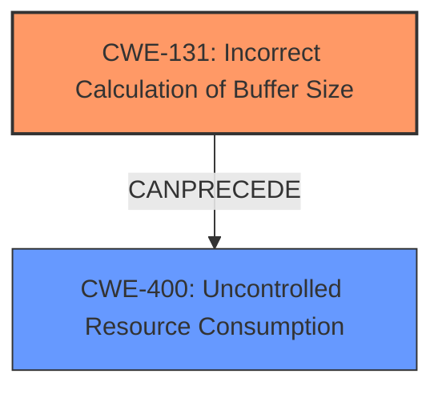

# Analysis Report for CVE-2024-39808

# Vulnerability Analysis Report: CVE-2024-39808

## Description

Incorrect Calculation of Buffer Size (CWE-131) in the Controller 6000 and Controller 7000 OSDP message handling, allows an attacker with physical access to Controller wiring to instigate a reboot leading to a denial of service. This issue affects Controller 6000 and Controller 7000 9.10 prior to vCR9.10.240816a (distributed in 9.10.1530 (MR2)), 9.00 prior to vCR9.00.240816a (distributed in 9.00.2168 (MR4)), 8.90 prior to vCR8.90.240816a (distributed in 8.90.2155 (MR5)), 8.80 prior to vCR8.80.240816b (distributed in 8.80.1938 (MR6)), all versions of 8.70 and prior.

## Vulnerability Description Key Phrases

- **Rootcause:** incorrect calculation of buffer size (CWE-131)
- **Impact:** denial of service
- **Vector:** physical access to Controller wiring
- **Attacker:** attacker
- **Product:** ['Controller 6000', 'Controller 7000']
- **Version:** 9.10 prior to vCR9.10.240816a, 9.00 prior to vCR9.00.240816a, 8.90 prior to vCR8.90.240816a, 8.80 prior to vCR8.80.240816b, all versions of 8.70 and prior
- **Component:** OSDP message handling

## Analysis (with Relationship Data)

# Summary

| CWE ID   | CWE Name                                                                | Confidence | CWE Abstraction Level | CWE Vulnerability Mapping Label | CWE-Vulnerability Mapping Notes |
| :--------- | :---------------------------------------------------------------------- | :--------- | :-------------------- | :------------------------------ | :------------------------------ |
| CWE-131    | Incorrect Calculation of Buffer Size                                    | 1.0        | Base                  | Primary                         | Allowed                       |
| CWE-400    | Uncontrolled Resource Consumption                                       | 0.7        | Class                 | Secondary                       | Allowed-with-Review           |

## Evidence and Confidence

*   **Confidence Score:** 0.9
*   **Evidence Strength:** HIGH

## Relationship Analysis

The primary relationship is that CWE-131 (Incorrect Calculation of Buffer Size) can lead to other vulnerabilities such as buffer overflows, but in this case the impact is a denial of service due to rebooting. CWE-400 (Uncontrolled Resource Consumption) is added to capture the broader impact of the reboot leading to denial of service.



## Vulnerability Chain

The vulnerability chain starts with the **incorrect calculation of the buffer size (CWE-131)**. This leads to a reboot of the controller, which ultimately results in a denial-of-service condition. Therefore, the chain is: CWE-131 -> Reboot -> CWE-400 (Uncontrolled Resource Consumption).

## Summary of Analysis

The initial analysis strongly points to CWE-131 as the primary weakness, supported by the vulnerability description and CVE reference summary, which explicitly state "**incorrect calculation of buffer size (CWE-131)**". The **impact** of the incorrect buffer size calculation is a denial of service, which can be represented by CWE-400 (Uncontrolled Resource Consumption), caused by a reboot of the controller. The retriever results also list CWE-131 as a likely candidate.

The selection of CWE-131 is based on direct evidence from the vulnerability description and the "CVE Reference Links Content Summary". The "**rootcause**" key phrase also identifies **incorrect calculation of buffer size (CWE-131)**. The relationship graph shows how CWE-131 can lead to other memory corruption issues and, in this case, results in a denial of service.

The decision to include CWE-400 is based on the fact that the reboot caused by the primary weakness leads to a denial of service. This is a reasonable addition to capture the impact of the vulnerability.

Both CWEs are at appropriate levels of specificity, with CWE-131 being a Base CWE and CWE-400 being a Class CWE that broadly captures the denial-of-service impact.

Relevant CWE Information:

# Enhanced Context (25 CWEs)
The following CWEs were identified as potentially relevant to this vulnerability:

## CWE-303: Incorrect Implementation of Authentication Algorithm
**Abstraction Level**: Base
**Similarity Score**: 0.77
**Source**: dense

**Description**:
The requirements for the product dictate the use of an established authentication algorithm, but the implementation of the algorithm is incorrect.

**Mapping Guidance**:
- Usage: Allowed
- Rationale: This CWE entry is at the Base level of abstraction, which is a preferred level of abstraction for mapping to the root causes of vulnerabilities.

## CWE-131: Incorrect Calculation of Buffer Size
**Abstraction Level**: Base
**Similarity Score**: 0.76
**Source**: dense

**Description**:
The product does not correctly calculate the size to be used when allocating a buffer, which could lead to a buffer overflow.

**Mapping Guidance**:
- Usage: Allowed
- Rationale: This CWE entry is at the Base level of abstraction, which is a preferred level of abstraction for mapping to the root causes of vulnerabilities.

## CWE-119: Improper Restriction of Operations within the Bounds of a Memory Buffer
**Abstraction Level**: Class
**Similarity Score**: 0.76
**Source**: dense

**Description**:
The product performs operations on a memory buffer, but it reads from or writes to a memory location outside the buffer's intended boundary. This may result in read or write operations on unexpected memory locations that could be linked to other variables, data structures, or internal program data.

**Mapping Guidance**:
- Usage: Discouraged
- Rationale: CWE-119 is commonly misused in low-information vulnerability reports when lower-level CWEs could be used instead, or when more details about the vulnerability are available.

## CWE-755: Improper Handling of Exceptional Conditions
**Abstraction Level**: Class
**Similarity Score**: 0.76
**Source**: dense

**Description**:
The product does not handle or incorrectly handles an exceptional condition.

**Mapping Guidance**:
- Usage: Discouraged
- Rationale: This CWE entry is a level-1 Class (i.e., a child of a Pillar). It might have lower-level children that would be more appropriate

## CWE-294: Authentication Bypass by Capture-replay
**Abstraction Level**: Base
**Similarity Score**: 0.76
**Source**: dense

**Description**:
A capture-replay flaw exists when the design of the product makes it possible for a malicious user to sniff network traffic and bypass authentication by replaying it to the server in question to the same effect as the original message (or with minor changes).

**Mapping Guidance**:
- Usage: Allowed
- Rationale: This CWE entry is at the Base level of abstraction, which is a preferred level of abstraction for mapping to the root causes of vulnerabilities.

## CWE-805: Buffer Access with Incorrect Length Value
**Abstraction Level**: Base
**Similarity Score**: 0.75
**Source**: dense

**Description**:
The product uses a sequential operation to read or write a buffer, but it uses an incorrect length value that causes it to access memory that is outside of the bounds of the buffer.

**Mapping Guidance**:
- Usage: Allowed
- Rationale: This CWE entry is at the Base level of abstraction, which is a preferred level of abstraction for mapping to the root causes of vulnerabilities.

## CWE-1285: Improper Validation of Specified Index, Position, or Offset in Input
**Abstraction Level**: Base
**Similarity Score**: 0.75
**Source**: dense

**Description**:
The product receives input that is expected to specify an index, position, or offset into an indexable resource such as a buffer or file, but it does not validate or incorrectly validates that the specified index/position/offset has the required properties.

**Mapping Guidance**:
- Usage: Allowed
- Rationale: This CWE entry is at the Base level of abstraction, which is a preferred level of abstraction for mapping to the root causes of vulnerabilities.

## CWE-799: Improper Control of Interaction Frequency
**Abstraction Level**: Class
**Similarity Score**: 0.75
**Source**: dense

**Description**:
The product does not properly limit the number or frequency of interactions that it has with an actor, such as the number of incoming requests.

**Mapping Guidance**:
- Usage: Allowed-with-Review
- Rationale: This CWE entry is a Class and might have Base-level children that would be more appropriate

## CWE-696: Incorrect Behavior Order
**Abstraction Level**: Class
**Similarity Score**: 0.75
**Source**: dense

**Description**:
The product performs multiple related behaviors, but the behaviors are performed in the wrong order in ways which may produce resultant weaknesses.

**Mapping Guidance**:
- Usage: Allowed-with-Review
- Rationale: This CWE entry is a Class and might have Base-level children that would be more appropriate

## CWE-1391: Use of Weak Credentials
**Abstraction Level**: Class
**Similarity Score**: 0.75
**Source**: dense

**Description**:
The product uses weak credentials (such as a default key or hard-coded password) that can be calculated, derived, reused, or guessed by an attacker.

**Mapping Guidance**:
- Usage: Allowed-with-Review
- Rationale: This CWE entry is a Class and might have Base-level children that would be more appropriate

## CWE-345: Insufficient Verification of Data Authenticity
**Abstraction Level**: Class
**Similarity Score**: 676.00
**Source**: sparse

**Description**:
The product does not sufficiently verify the origin or authenticity of data, in a way that causes it to accept invalid data.

**Mapping Guidance**:
- Usage: Discouraged
- Rationale: This CWE entry is a level-1 Class (i.e., a child of a Pillar). It might have lower-level children that would be more appropriate

## CWE-131: Incorrect Calculation of Buffer Size
**Abstraction Level**: Base
**Similarity Score**: 669.78
**Source**: sparse

**Description**:
The product


## CWE Relationship Analysis

Current CWEs represent these abstraction levels: .


### Vulnerability Chain Analysis

**Chain starting from CWE-400:**
- 400 (Uncontrolled Resource Consumption) - ROOT


**Chain starting from CWE-805:**
- 805 (Buffer Access with Incorrect Length Value) - ROOT


### CWE Relationship Diagram

```mermaid
graph TD
    classDef primary fill:#f96,stroke:#333,stroke-width:2px
    classDef secondary fill:#69f,stroke:#333
    classDef tertiary fill:#9e9,stroke:#333
```


*Report generated on 2025-07-13 11:55:48*
