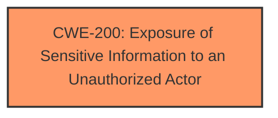

# Enhanced Analysis for CVE-2024-39823

# Summary
| CWE ID  | CWE Name                                                    | Confidence | CWE Abstraction Level | CWE Vulnerability Mapping Label | CWE-Vulnerability Mapping Notes |
| :-------- | :---------------------------------------------------------- | :---------- | :-------------------- | :------------------------------ | :------------------------------ |
| CWE-200   | Exposure of Sensitive Information to an Unauthorized Actor | 0.9         | Class                | Primary                          | Discouraged |

## Evidence and Confidence

*   **Confidence Score:** 0.9
*   **Evidence Strength:** HIGH

## Relationship Analysis
The primary relationship to consider is the parent-child relationship between class-level CWE-200 and its more specific base-level children. However, the provided information does not give enough detail to select a more specific child CWE. The retriever results also showed many potential base CWEs but none were definitive. Therefore, the analysis relies on the class-level CWE-200 for its broad applicability to the sensitive information exposure.



## Vulnerability Chain
The vulnerability chain starts with an unspecified weakness within the Zoom product's code that results in sensitive information being exposed to a privileged user via network access. The root cause is unspecified. The impact is **sensitive information disclosure**.

## Summary of Analysis
The initial assessment identified CWE-200 as the most relevant CWE based on the vulnerability description stating "**Sensitive information disclosure**".

The vulnerability description explicitly states "Sensitive information disclosure...may allow a privileged user to conduct an information disclosure via network access." This directly aligns with the description of CWE-200 which states "The product exposes sensitive information to an actor that is not explicitly authorized to have access to that information."

The confidence level is high (0.9) because the description clearly indicates sensitive information disclosure, which is the core characteristic of CWE-200. While the description mentions network access and privileged users, these are contextual details about the attack vector and attacker capabilities, rather than specific coding errors.

Other CWEs Considered:

*   CWE-126 (Buffer Over-read): While buffer over-reads can lead to information disclosure, there's no evidence of a buffer handling issue in the description.
*   CWE-284 (Improper Access Control): Access control issues could lead to information disclosure, but the description doesn't specify an access control **failure**, only that a privileged user is involved.
*   CWE-321 (Use of Hard-coded Cryptographic Key), CWE-259 (Use of Hard-coded Password): There's no indication of cryptographic keys or passwords being involved.
*   CWE-250 (Execution with Unnecessary Privileges): While a privileged user exploits the vulnerability, the root cause isn't necessarily related to unnecessary privileges.
*   CWE-287 (Improper Authentication): The vulnerability description doesn't indicate any issues with authentication.
*   CWE-248 (Uncaught Exception): There's no evidence of uncaught exceptions.
*   CWE-201 (Insertion of Sensitive Information Into Sent Data): This is more specific than the general disclosure described.
*   CWE-213 (Exposure of Sensitive Information Due to Incompatible Policies): There's no evidence of incompatible policies.

The selection of CWE-200 is at the optimal level of specificity because the vulnerability description lacks specific details about the underlying cause of the information disclosure. Therefore, a more specific CWE cannot be selected.


## CWE Relationship Analysis

Current CWEs represent these abstraction levels: .


### Vulnerability Chain Analysis

**Chain starting from CWE-321:**
- 321 (Use of Hard-coded Cryptographic Key) - ROOT


**Chain starting from CWE-259:**
- 259 (Use of Hard-coded Password) - ROOT


### CWE Relationship Diagram

```mermaid
graph TD
    classDef primary fill:#f96,stroke:#333,stroke-width:2px
    classDef secondary fill:#69f,stroke:#333
    classDef tertiary fill:#9e9,stroke:#333
```