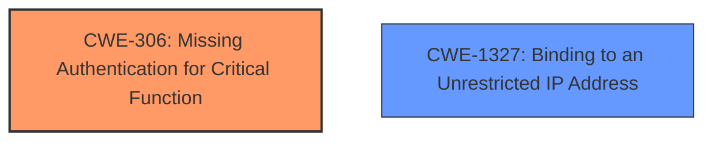

# Analysis for CVE-2024-39864

# Summary
| CWE ID | CWE Name | Confidence | CWE Abstraction Level | CWE Vulnerability Mapping Label | CWE-Vulnerability Mapping Notes |
|---|---|---|---|---|---|
| CWE-306 | Missing Authentication for Critical Function | 1.0 | Base | Allowed | Primary CWE. The integration API service does not require authentication. |
| CWE-1327 | Binding to an Unrestricted IP Address | 0.7 | Base | Allowed | The API service binds to a random port, effectively making it accessible from anywhere on the management network if firewall rules permit. |

## Evidence and Confidence

*   **Confidence Score:** 0.9
*   **Evidence Strength:** HIGH

## Relationship Analysis
The primary weakness is the **lack of authentication** for a critical function (CWE-306). A secondary weakness is the **improper binding** to a random port, effectively making it an unrestricted IP address (CWE-1327), if firewall rules allow. CWE-306 is a base-level CWE, representing a fundamental flaw. CWE-1327 is also a base-level CWE, describing how it binds to an unrestricted IP address.

## Vulnerability Chain
The vulnerability chain starts with an **improper initialization logic**, leading to a disabled service running on a random port **without authentication**. This enables an attacker with access to the management network to perform unauthorized administrative actions and achieve remote code execution.

Improper Initialization Logic -> Unintended Port Exposure (Random Port) + Missing Authentication -> Unauthorized Admin Actions + RCE -> Complete Compromise.

The **improper initialisation logic** is not explicitly mapped because it is implementation specific. The resulting **Missing Authentication (CWE-306)** and **Binding to an Unrestricted IP Address (CWE-1327)** are the core weaknesses that can be addressed.

## Summary of Analysis
The analysis identifies CWE-306 as the primary weakness because the integration API service **does not require authentication**. The **improper initialization logic** results in the service listening on a random port which is an instance of **Binding to an Unrestricted IP Address (CWE-1327)**.

The selection of CWE-306 and CWE-1327 is based on the evidence provided in the vulnerability description and CVE reference. The description explicitly states that the API service is unauthenticated. The analysis also considered other CWEs from the retriever results, but they were either too general (e.g., CWE-287 Improper Authentication) or not directly applicable to the specific vulnerability.

Relevant CWE Information:

# Enhanced Context (25 CWEs)
The following CWEs were identified as potentially relevant to this vulnerability:

## CWE-497: Exposure of Sensitive System Information to an Unauthorized Control Sphere
**Abstraction Level**: Base
**Similarity Score**: 0.76
**Source**: dense
**Description**:
The product does not properly prevent sensitive system-level information from being accessed by unauthorized actors who do not have the same level of access to the underlying system as the product does.
**Mapping Guidance**:
- Usage: Allowed
- Rationale: This CWE entry is at the Base level of abstraction, which is a preferred level of abstraction for mapping to the root causes of vulnerabilities.
*Not Used:* This CWE is too broad. The specific issue is the missing authentication for the API service.

## CWE-303: Incorrect Implementation of Authentication Algorithm
**Abstraction Level**: Base
**Similarity Score**: 0.74
**Source**: dense
**Description**:
The requirements for the product dictate the use of an established authentication algorithm, but the implementation of the algorithm is incorrect.
**Mapping Guidance**:
- Usage: Allowed
- Rationale: This CWE entry is at the Base level of abstraction, which is a preferred level of abstraction for mapping to the root causes of vulnerabilities.
*Not Used:* The vulnerability is not related to the incorrect implementation of an authentication algorithm. Authentication is simply missing.

## CWE-74: Improper Neutralization of Special Elements in Output Used by a Downstream Component ('Injection')
**Abstraction Level**: Class
**Similarity Score**: 0.73
**Source**: dense
**Description**:
The product constructs all or part of a command, data structure, or record using externally-influenced input from an upstream component, but it does not neutralize or incorrectly neutralizes special elements that could modify how it is parsed or interpreted when it is sent to a downstream component.
**Mapping Guidance**:
- Usage: Discouraged
- Rationale: CWE-74 is high-level and often misused when lower-level weaknesses are more appropriate.
*Not Used:* This CWE is not applicable. The vulnerability does not involve injection.

## CWE-941: Incorrectly Specified Destination in a Communication Channel
**Abstraction Level**: Base
**Similarity Score**: 0.73
**Source**: dense
**Description**:
The product creates a communication channel to initiate an outgoing request to an actor, but it does not correctly specify the intended destination for that actor.
**Mapping Guidance**:
- Usage: Allowed
- Rationale: This CWE entry is at the Base level of abstraction, which is a preferred level of abstraction for mapping to the root causes of vulnerabilities.
*Not Used:* This CWE is not directly related to the vulnerability.

## CWE-288: Authentication Bypass Using an Alternate Path or Channel
**Abstraction Level**: Base
**Similarity Score**: 0.73
**Source**: dense
**Description**:
The product requires authentication, but the product has an alternate path or channel that does not require authentication.
**Mapping Guidance**:
- Usage: Allowed
- Rationale: This CWE entry is at the Base level of abstraction, which is a preferred level of abstraction for mapping to the root causes of vulnerabilities.
*Not Used:* This CWE is not a good fit. There isn't an alternate path, there is simply NO authentication.

## CWE-294: Authentication Bypass by Capture-replay
**Abstraction Level**: Base
**Similarity Score**: 0.73
**Source**: dense
**Description**:
A capture-replay flaw exists when the design of the product makes it possible for a malicious user to sniff network traffic and bypass authentication by replaying it to the server in question to the same effect as the original message (or with minor changes).
**Mapping Guidance**:
- Usage: Allowed
- Rationale: This CWE entry is at the Base level of abstraction, which is a preferred level of abstraction for mapping to the root causes of vulnerabilities.
*Not Used:* This CWE is not a good fit. There isn't authentication to replay.

## CWE-668: Exposure of Resource to Wrong Sphere
**Abstraction Level**: Class
**Similarity Score**: 0.73
**Source**: dense
**Description**:
The product exposes a resource to the wrong control sphere, providing unintended actors with inappropriate access to the resource.
**Mapping Guidance**:
- Usage: Discouraged
- Rationale: CWE-668 is high-level and is often misused as a catch-all when lower-level CWE IDs might be applicable. It is sometimes used for low-information vulnerability reports [REF-1287]. It is a level-1 Class (i.e., a child of a Pillar). It is not useful for trend analysis.
*Not Used:* This CWE is too general.

## CWE-267: Privilege Defined With Unsafe Actions
**Abstraction Level**: Base
**Similarity Score**: 0.73
**Source**: dense
**Description**:
A particular privilege, role, capability, or right can be used to perform unsafe actions that were not intended, even when it is assigned to the correct entity.
**Mapping Guidance**:
- Usage: Allowed
- Rationale: This CWE entry is at the Base level of abstraction, which is a preferred level of abstraction for mapping to the root causes of vulnerabilities.
*Not Used:* This CWE is not relevant.

## CWE-306: Missing Authentication for Critical Function
**Abstraction Level**: Base
**Similarity Score**: 0.73
**Source**: dense
**Description**:
The product does not perform any authentication for functionality that requires a provable user identity or consumes a significant amount of resources.
**Mapping Guidance**:
- Usage: Allowed
- Rationale: This CWE entry is at the Base level of abstraction, which is a preferred level of abstraction for mapping to the root causes of vulnerabilities.
*Used:* This is the primary CWE. The integration API service does not require authentication.

## CWE-755: Improper Handling of Exceptional Conditions
**Abstraction Level**: Class
**Similarity Score**: 0.72
**Source**: dense
**Description**:
The product does not handle or incorrectly handles an exceptional condition.
**Mapping Guidance**:
- Usage: Discouraged
- Rationale: This CWE entry is a level-1 Class (i.e., a child of a Pillar). It might have lower-level children that would be more appropriate
*Not Used:* This CWE is not relevant