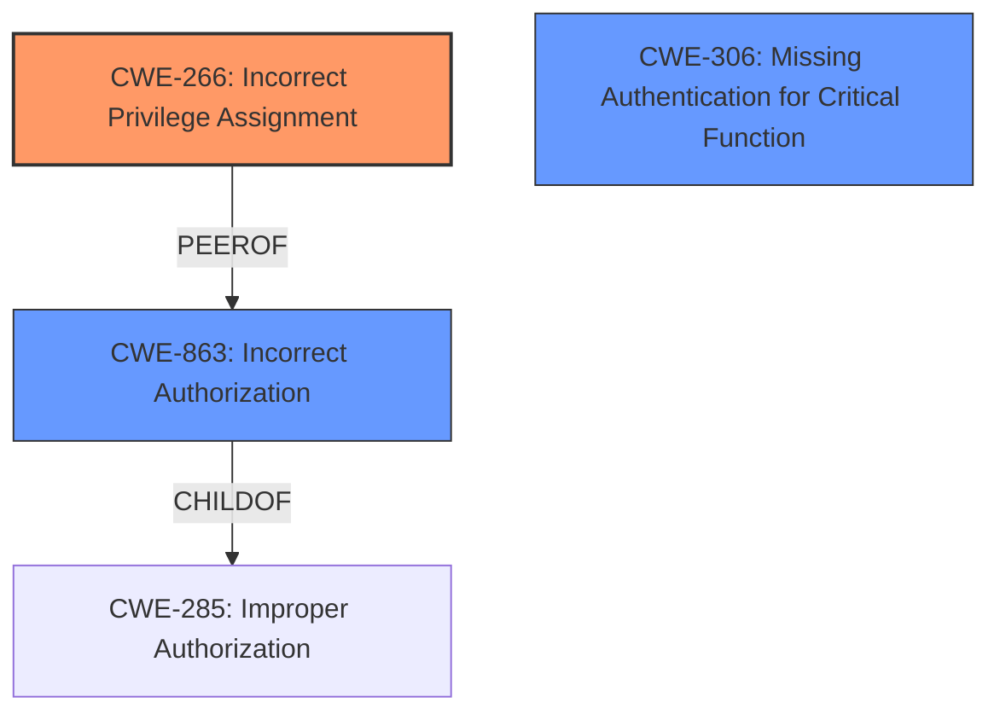

# Analysis Report for CVE-2024-39866

# Vulnerability Analysis Report: CVE-2024-39866

## Description

A vulnerability has been identified in SINEMA Remote Connect Server (All versions < V3.2 SP1). The affected application allows users to upload encrypted backup files. This could allow an attacker with access to the backup encryption key and with the right to upload backup files to create a user with administrative privileges.

## Vulnerability Description Key Phrases

- **Impact:** create a user with administrative privileges
- **Vector:** upload encrypted backup files
- **Attacker:** attacker with access to the backup encryption key and with the right to upload backup files
- **Product:** SINEMA Remote Connect Server
- **Version:** All versions < V3.2 SP1

## Analysis (with Relationship Data)

# Summary
| CWE ID | CWE Name | Confidence | CWE Abstraction Level | CWE Vulnerability Mapping Label | CWE-Vulnerability Mapping Notes |
|---|---|---|---|---|---|
| CWE-266 | Incorrect Privilege Assignment | 0.8 | Base | Primary CWE | Allowed |
| CWE-863 | Incorrect Authorization | 0.6 | Class | Secondary Candidate | Allowed-with-Review |
| CWE-306 | Missing Authentication for Critical Function | 0.5 | Base | Secondary Candidate | Allowed |

## Evidence and Confidence

*   **Confidence Score:** 0.7
*   **Evidence Strength:** MEDIUM

## Relationship Analysis
The primary CWE is CWE-266, representing the **incorrect privilege assignment** that allows an attacker to gain administrative privileges. CWE-863 and CWE-306 are considered but are less specific. CWE-863 (Incorrect Authorization) is a class-level CWE that could apply if the authorization check is flawed but present. CWE-306 (Missing Authentication for Critical Function) is not the primary issue, as the vulnerability stems from the ability to upload manipulated files, not from a complete lack of authentication for the upload functionality itself.


## Vulnerability Chain
The vulnerability chain starts with the ability to upload encrypted backup files. The **root cause** is an **incorrect privilege assignment** (CWE-266), which allows for the creation of a user with administrative privileges through the manipulated backup file. The impact is privilege escalation, leading to full control over the application.

## Summary of Analysis
The primary assessment is based on the evidence from the "CVE Reference Links Content Summary" section, which indicates that the root cause is related to the ability to manipulate backup files to create an admin user.
The evidence states: "The vulnerability lies in the ability to manipulate the backup files to create a user with administrative privileges." The "Vulnerability Description Key Phrases" also includes "impact: create a user with administrative privileges."
The relationship analysis supports selecting CWE-266 as the primary CWE because it directly addresses the issue of **incorrect privilege assignment** during user creation.
CWE-266 is selected because it's at the Base level of abstraction and accurately represents the vulnerability's root cause, aligning with the privilege vs. permission guidance. CWE-863 could be a secondary, but is less specific. CWE-306 is less relevant.

Relevant CWE Information:

# Enhanced Context (25 CWEs)
The following CWEs were identified as potentially relevant to this vulnerability:

## CWE-266: Incorrect Privilege Assignment
**Abstraction Level**: Base
**Similarity Score**: 0.79
**Source**: dense

**Description**:
A product incorrectly assigns a privilege to a particular actor, creating an unintended sphere of control for that actor.

**Mapping Guidance**:
- Usage: Allowed
- Rationale: This CWE entry is at the Base level of abstraction, which is a preferred level of abstraction for mapping to the root causes of vulnerabilities.

## CWE-863: Incorrect Authorization
**Abstraction Level**: Class
**Similarity Score**: 1530.42
**Source**: sparse

**Description**:
The product performs an authorization check when an actor attempts to access a resource or perform an action, but it does not correctly perform the check.

**Mapping Guidance**:
- Usage: Allowed-with-Review
- Rationale: This CWE entry is a Class and might have Base-level children that would be more appropriate

## CWE-306: Missing Authentication for Critical Function
**Abstraction Level**: Base
**Similarity Score**: 1463.48
**Source**: sparse

**Description**:
The product does not perform any authentication for functionality that requires a provable user identity or consumes a significant amount of resources.

**Mapping Guidance**:
- Usage: Allowed
- Rationale: This CWE entry is at the Base level of abstraction, which is a preferred level of abstraction for mapping to the root causes of vulnerabilities.


## CWE Relationship Analysis

Current CWEs represent these abstraction levels: .


### Vulnerability Chain Analysis

**Chain starting from CWE-266:**
- 266 (Incorrect Privilege Assignment) - ROOT


**Chain starting from CWE-306:**
- 306 (Missing Authentication for Critical Function) - ROOT


### CWE Relationship Diagram

```mermaid
graph TD
    classDef primary fill:#f96,stroke:#333,stroke-width:2px
    classDef secondary fill:#69f,stroke:#333
    classDef tertiary fill:#9e9,stroke:#333
```


*Report generated on 2025-07-13 12:01:17*
