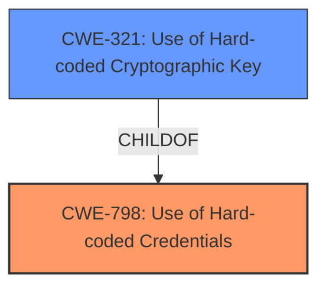

# Enhanced Analysis for CVE-2024-39888

# Summary
| CWE ID | CWE Name | Confidence | CWE Abstraction Level | CWE Vulnerability Mapping Label | CWE-Vulnerability Mapping Notes |
|---|---|---|---|---|---|
| CWE-798 | Use of Hard-coded Credentials | 1.0 | Base | Allowed | Primary CWE. The **hard-coded encryption key** is a credential. |
| CWE-321 | Use of Hard-coded Cryptographic Key | 0.9 | Variant | Allowed | Secondary CWE. This is a more specific type of credential. |

## Evidence and Confidence

*   **Confidence Score:** 1.0
*   **Evidence Strength:** HIGH

## Relationship Analysis
The primary weakness is CWE-798 (Use of Hard-coded Credentials), which is a Base level CWE. A more specific Variant of CWE-798 is CWE-321 (Use of Hard-coded Cryptographic Key). The vulnerability involves a **hard-coded cryptographic key**, which falls under both CWEs. CWE-321 is a child of CWE-798, making it a more precise classification.



## Vulnerability Chain
The vulnerability chain starts with the **hard-coded encryption key** (CWE-798 and CWE-321). This leads to the ability for an attacker to decrypt any encrypted project data.

## Summary of Analysis
The primary root cause is the use of a **hard-coded encryption key**, which directly leads to the vulnerability.

The vulnerability description states: "Affected versions of the module define a **specific hard-coded default value for the EncryptionKey constant**, which is used in projects where no individual EncryptionKey was specified. This could allow to an attacker to decrypt any encrypted project data, as the default encryption key can be considered compromised."

The CVE Reference Links Content Summary confirms this: "The Mendix Encryption module versions V10.0.0 and V10.0.1 use a hard-coded default value for the EncryptionKey constant... The vulnerability is the use of a hard-coded, security-relevant constant, specifically the encryption key (CWE-547). This makes the default encryption key easily compromised. An attacker can decrypt any encrypted project data if the default encryption key was used in the Mendix project."

Based on this evidence, CWE-798 (Use of Hard-coded Credentials) is the most appropriate primary CWE. CWE-321 (Use of Hard-coded Cryptographic Key) is included as a secondary CWE because it provides more specificity.

Other CWEs Considered:

*   CWE-547 (Use of Hard-coded, Security-relevant Constants): While mentioned in the CVE summary, it's less specific than CWE-798 as the constant is specifically a credential.
*   CWE-1394 (Use of Default Cryptographic Key): This is close, but CWE-798 and CWE-321 are more precise in describing the root cause, which is the hard-coding of the key, not just its default usage.

The selected CWEs are at the optimal level of specificity. CWE-798 is a Base CWE, and CWE-321 is a Variant, providing a detailed understanding of the vulnerability.

Relevant CWE Information:

# Enhanced Context (25 CWEs)
The following CWEs were identified as potentially relevant to this vulnerability:

## CWE-311: Missing Encryption of Sensitive Data
**Abstraction Level**: Class
**Similarity Score**: 0.71
**Source**: dense

**Description**:
The product does not encrypt sensitive or critical information before storage or transmission.

**Mapping Guidance**:
- Usage: Discouraged
- Rationale: CWE-311 is high-level with more precise children available. It is a level-1 Class (i.e., a child of a Pillar).

*Not Used:* The vulnerability is not about missing encryption, but about the **hard-coded key** used for encryption.

## CWE-1391: Use of Weak Credentials
**Abstraction Level**: Class
**Similarity Score**: 0.69
**Source**: dense

**Description**:
The product uses weak credentials (such as a default key or hard-coded password) that can be calculated, derived, reused, or guessed by an attacker.

**Mapping Guidance**:
- Usage: Allowed-with-Review
- Rationale: This CWE entry is a Class and might have Base-level children that would be more appropriate

*Not Used:* While the **hard-coded key** can be considered a weak credential, CWE-798 is more specific about the root cause of the vulnerability.

## CWE-321: Use of Hard-coded Cryptographic Key
**Abstraction Level**: Variant
**Similarity Score**: 0.68
**Source**: dense

**Description**:
The use of a hard-coded cryptographic key significantly increases the possibility that encrypted data may be recovered.

**Mapping Guidance**:
- Usage: Allowed
- Rationale: This CWE entry is at the Variant level of abstraction, which is a preferred level of abstraction for mapping to the root causes of vulnerabilities.

*Used:* As a secondary CWE. The vulnerability involves a **hard-coded encryption key**.

## CWE-1394: Use of Default Cryptographic Key
**Abstraction Level**: Base
**Similarity Score**: 0.68
**Source**: dense

**Description**:
The product uses a default cryptographic key for potentially critical functionality.

**Mapping Guidance**:
- Usage: Allowed
- Rationale: This CWE entry is at the Base level of abstraction, which is a preferred level of abstraction for mapping to the root causes of vulnerabilities.

*Not Used:* While the key is a default key, the more important aspect is that it is **hard-coded**.

## CWE-312: Cleartext Storage of Sensitive Information
**Abstraction Level**: Base
**Similarity Score**: 0.67
**Source**: dense

**Description**:
The product stores sensitive information in cleartext within a resource that might be accessible to another control sphere.

**Mapping Guidance**:
- Usage: Allowed
- Rationale: This CWE entry is at the Base level of abstraction, which is a preferred level of abstraction for mapping to the root causes of vulnerabilities.

*Not Used:* The vulnerability is not about storing data in cleartext.

## CWE-328: Use of Weak Hash
**Abstraction Level**: Base
**Similarity Score**: 0.66
**Source**: dense

**Description**:
The product uses an algorithm that produces a digest (output value) that does not meet security expectations for a hash function that allows an adversary to reasonably determine the original input (preimage attack), find another input that can produce the same hash (2nd preimage attack), or find multiple inputs that evaluate to the same hash (birthday attack).

**Mapping Guidance**:
- Usage: Allowed
- Rationale: This CWE entry is at the Base level of abstraction, which is a preferred level of abstraction for mapping to the root causes of vulnerabilities.

*Not Used:* The vulnerability is not about weak hashes.

## CWE-330: Use of Insufficiently Random Values
**Abstraction Level**: Class
**Similarity Score**: 0.66
**Source**: dense

**Description**:
The product uses insufficiently random numbers or values in a security context that depends on unpredictable numbers.

**Mapping Guidance**:
- Usage: Discouraged
- Rationale: This CWE entry is a level-1 Class (i.e., a child of a Pillar). It might have lower-level children that would be more appropriate

*Not Used:* The vulnerability is not about insufficient randomness.

## CWE-916: Use of Password Hash With Insufficient Computational Effort
**Abstraction Level**: Base
**Similarity Score**: 0.66
**Source**: dense

**Description**:
The product generates a hash for a password, but it uses a scheme that does not provide a sufficient level of computational effort that would make password cracking attacks infeasible or expensive.

**Mapping Guidance**:
- Usage: Allowed
- Rationale: This CWE entry is at the Base level of abstraction, which is a preferred level of abstraction for mapping to the root causes of vulnerabilities.

*Not Used:* The vulnerability is not about password hashing.

## CWE-326: Inadequate Encryption Strength
**Abstraction Level**: Class
**Similarity Score**: 0.66
**Source**: dense

**Description**:
The product stores or transmits sensitive data using an encryption scheme that is theoretically sound, but is not strong enough for the level of protection required.

**Mapping Guidance**:
- Usage: Allowed-with-Review
- Rationale: This CWE entry is a Class and might have Base-level children that would be more appropriate

*Not Used:* The vulnerability is not about the strength of the encryption algorithm, but the **hard-coded key**.

## CWE-209: Generation of Error Message Containing Sensitive Information
**Abstraction Level**: Base
**Similarity Score**:


## CWE Relationship Analysis

Current CWEs represent these abstraction levels: .


### Vulnerability Chain Analysis

**Chain starting from CWE-321:**
- 321 (Use of Hard-coded Cryptographic Key) - ROOT


**Chain starting from CWE-1394:**
- 1394 (Use of Default Cryptographic Key) - ROOT


### CWE Relationship Diagram

```mermaid
graph TD
    classDef primary fill:#f96,stroke:#333,stroke-width:2px
    classDef secondary fill:#69f,stroke:#333
    classDef tertiary fill:#9e9,stroke:#333
```