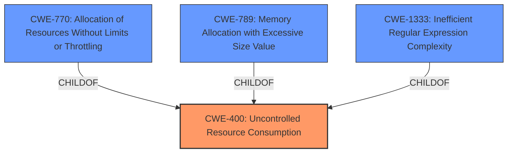

# Analysis Report for CVE-2024-39895

# Vulnerability Analysis Report: CVE-2024-39895

## Description

Directus is a real-time API and App dashboard for managing SQL database content. A denial of service (DoS) attack by **field duplication in GraphQL** is a type of attack where an attacker exploits the flexibility of GraphQL to overwhelm a server by requesting the same field multiple times in a single query. This can cause the server to perform redundant computations and consume excessive resources, leading to a denial of service for legitimate users. Request to the endpoint /graphql are sent when visualizing graphs generated at a dashboard. By modifying the data sent and duplicating many times the fields a DoS attack is possible. This vulnerability is fixed in 10.12.0.

## Vulnerability Description Key Phrases

- **Rootcause:** field duplication in GraphQL
- **Impact:** ['DoS attack', 'denial of service']
- **Product:** Directus
- **Version:** 10.12.0
- **Component:** /graphql endpoint

## Analysis (with Relationship Data)

# Summary
| CWE ID | CWE Name | Confidence | CWE Abstraction Level | CWE Vulnerability Mapping Label | CWE-Vulnerability Mapping Notes |
|---|---|---|---|---|---|
| CWE-400 | Uncontrolled Resource Consumption | 1.0 | Class | Allowed-with-Review | The primary weakness is the lack of a limit on the number of tokens parsed in GraphQL queries, leading to excessive resource consumption. |

## Evidence and Confidence

*   **Confidence Score:** 1.0
*   **Evidence Strength:** HIGH

## Relationship Analysis
The primary relationship that influenced my decision was the parent-child relationship between CWE-400 and its potential children. While more specific CWEs like CWE-770 (Allocation of Resources Without Limits or Throttling) exist, the vulnerability description focuses on the general exhaustion of resources due to the **field duplication in GraphQL**. Therefore, CWE-400, a class-level CWE, is the most appropriate.



## Vulnerability Chain
The vulnerability chain starts with the **uncontrolled** **field duplication in GraphQL** leading to excessive resource consumption, and culminating in a denial-of-service (DoS) attack.

**Chain:**
1.  **Root Cause:** **Uncontrolled** **field duplication in GraphQL** (Lack of input validation or limits)
2.  **Weakness:** Excessive Resource Consumption
3.  **Impact:** Denial of Service

## Summary of Analysis
The initial analysis strongly pointed towards CWE-400 (Uncontrolled Resource Consumption) as the primary weakness. The description clearly states that the vulnerability allows an attacker to overwhelm the server by requesting the same field multiple times, leading to excessive resource consumption and a denial of service. The provided evidence from the CVE Reference Links Content Summary reinforces this assessment, highlighting the lack of a limit on the number of tokens parsed in GraphQL queries as the root cause.

The graph relationships further solidified this decision. While CWE-770 (Allocation of Resources Without Limits or Throttling) and CWE-789 (Memory Allocation with Excessive Size Value) are potential candidates, they are more specific cases of uncontrolled resource consumption. The vulnerability description does not specifically mention memory allocation or resource throttling issues, making CWE-400 the most appropriate and general classification.

The selected CWE is at the optimal level of specificity because it captures the core weakness of uncontrolled resource consumption without being overly specific about the type of resource being consumed or the mechanism by which it is being exhausted.

Relevant CWE Information:

# Enhanced Context (25 CWEs)
The following CWEs were identified as potentially relevant to this vulnerability:

## CWE-400: Uncontrolled Resource Consumption
**Abstraction Level**: Class
**Similarity Score**: 0.68
**Source**: dense

**Description**:
The product does not properly control the allocation and maintenance of a limited resource, thereby enabling an actor to influence the amount of resources consumed, eventually leading to the exhaustion of available resources.

**Mapping Guidance**:
- Usage: Discouraged
- Rationale: CWE-400 is intended for incorrect behaviors in which the product is expected to track and restrict how many resources it consumes, but CWE-400 is often misused because it is conflated with the "technical impact" of vulnerabilities in which resource consumption occurs. It is sometimes used for low-information vulnerability reports. It is a level-1 Class (i.e., a child of a Pillar).

## CWE-770: Allocation of Resources Without Limits or Throttling
**Abstraction Level**: Base
**Similarity Score**: 0.68
**Source**: dense

**Description**:
The product allocates a reusable resource or group of resources on behalf of an actor without imposing any restrictions on the size or number of resources that can be allocated, in violation of the intended security policy for that actor.

**Mapping Guidance**:
- Usage: Allowed
- Rationale: This CWE entry is at the Base level of abstraction, which is a preferred level of abstraction for mapping to the root causes of vulnerabilities.

## CWE-1284: Improper Validation of Specified Quantity in Input
**Abstraction Level**: Base
**Similarity Score**: 0.68
**Source**: dense

**Description**:
The product receives input that is expected to specify a quantity (such as size or length), but it does not validate or incorrectly validates that the quantity has the required properties.

**Mapping Guidance**:
- Usage: Allowed
- Rationale: This CWE entry is at the Base level of abstraction, which is a preferred level of abstraction for mapping to the root causes of vulnerabilities.

## CWE-789: Memory Allocation with Excessive Size Value
**Abstraction Level**: Variant
**Similarity Score**: 2.60
**Source**: graph

**Description**:
The product allocates memory based on an untrusted, large size value, but it does not ensure that the size is within expected limits, allowing arbitrary amounts of memory to be allocated.

**Mapping Guidance**:
- Usage: Allowed
- Rationale: This CWE entry is at the Variant level of abstraction, which is a preferred level of abstraction for mapping to the root causes of vulnerabilities.

**CWEs Considered but Not Used:**

*   **CWE-770 (Allocation of Resources Without Limits or Throttling):** While this CWE is related to resource consumption, it focuses specifically on the allocation of resources without limits. The vulnerability description is broader and encompasses general resource exhaustion, not just allocation issues. Therefore, CWE-400 is a more appropriate fit.
*   **CWE-1284 (Improper Validation of Specified Quantity in Input):** This CWE relates to the improper validation of input quantities. While the **field duplication in GraphQL** can be seen as a quantity, the primary issue is not the validation of that quantity but the lack of a limit on the complexity of the query.
*   **CWE-789 (Memory Allocation with Excessive Size Value):** Similar to CWE-770, this CWE is more specific than the general resource exhaustion described in the vulnerability. It focuses on memory allocation with excessive size values, which is not the primary issue in this case.

I am overriding the discouraged usage of CWE-400 as a class level CWE because the description of this CVE is high-level and doesn't go into the details of the resources consumed which would allow selection of a lower level CWE.


## CWE Relationship Analysis

Current CWEs represent these abstraction levels: .


### Vulnerability Chain Analysis

**Chain starting from CWE-1284:**
- 1284 (Improper Validation of Specified Quantity in Input) - ROOT


**Chain starting from CWE-400:**
- 400 (Uncontrolled Resource Consumption) - ROOT


### CWE Relationship Diagram

```mermaid
graph TD
    classDef primary fill:#f96,stroke:#333,stroke-width:2px
    classDef secondary fill:#69f,stroke:#333
    classDef tertiary fill:#9e9,stroke:#333
```


*Report generated on 2025-07-13 12:02:37*
