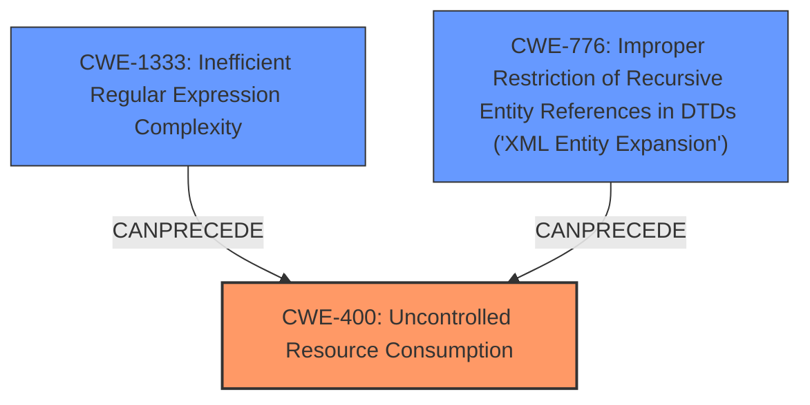

# Analysis Report for CVE-2024-39908

# Vulnerability Analysis Report: CVE-2024-39908

## Description

REXML is an XML toolkit for Ruby. The REXML gem before 3.3.1 has some DoS vulnerabilities when it parses an XML that has many specific characters such as ``. If you need to parse untrusted XMLs, you many be impacted to these vulnerabilities. The REXML gem 3.3.2 or later include the patches to fix these vulnerabilities. Users are advised to upgrade. Users unable to upgrade should avoid parsing untrusted XML strings.

## Vulnerability Description Key Phrases

- **Rootcause:** If you need to parse untrusted XMLs you may be impacted to these vulnerabilities
- **Impact:** DoS
- **Product:** REXML gem
- **Version:** before 3.3.1

## Analysis (with Relationship Data)

# Summary
| CWE ID  | CWE Name | Confidence | CWE Abstraction Level | CWE Vulnerability Mapping Label | CWE-Vulnerability Mapping Notes |
|----------------|-----------------------------------------------------------------------------------------------------------------------------------|----------------|-------------------------|------------------------------------|-----------------------------------------------------------------------------------------------------------------------------------------------------------------|
| CWE-400 | Uncontrolled Resource Consumption  | 0.85 | Class | Allowed-with-Review  | The vulnerability results in a DoS due to excessive resource consumption. A more specific base CWE may exist. |
| CWE-1333 | Inefficient Regular Expression Complexity | 0.70 | Base | Allowed  |  Possibly a contributing factor if regular expressions are used in parsing. |
| CWE-776 | Improper Restriction of Recursive Entity References in DTDs ('XML Entity Expansion') | 0.60 | Base | Allowed  | Possibly a contributing factor if XML entity expansion is not properly controlled. |

## Evidence and Confidence

*   **Confidence Score:** 0.80
*   **Evidence Strength:** MEDIUM

## Relationship Analysis
The primary relationship considered was the parent-child relationship between CWE-400 and its potential base-level children. The analysis also considered chain relationships with CWE-776 and CWE-1333, where improper handling of XML entities or inefficient regular expressions can lead to uncontrolled resource consumption and DoS. The class level of CWE-400 indicates that a more specific base CWE may exist.



## Vulnerability Chain
The vulnerability chain starts with the parsing of untrusted XML, potentially leading to:
1.  **Inefficient Parsing:** (CWE-1333) or (CWE-776)
2.  **Resource Consumption:** (CWE-400)
3.  **Denial of Service (DoS):** The impact of the vulnerability.

The primary CWE is CWE-400 as it represents the direct cause of the DoS.

## Summary of Analysis
The initial analysis focused on the description of a DoS vulnerability in the REXML gem due to parsing XML with specific characters. The retriever results suggested CWE-1333 (Inefficient Regular Expression Complexity) and CWE-776 (Improper Restriction of Recursive Entity References in DTDs) as potential candidates. However, the description explicitly mentions a DoS, making CWE-400 (Uncontrolled Resource Consumption) a more direct match, although it is a class-level CWE.

The evidence supports that the parsing of specific XML characters leads to excessive processing time, resulting in a DoS. While regular expressions or entity expansion could be involved, the primary issue is the uncontrolled consumption of resources. Therefore, CWE-400 is the most appropriate primary mapping.

The selection of CWE-400 is at a class level. While the description lacks sufficient detail to pinpoint the exact base-level weakness, CWE-400 accurately reflects the vulnerability's nature: uncontrolled resource consumption leading to a DoS.

Relevant CWE Information:

# Enhanced Context (25 CWEs)
The following CWEs were identified as potentially relevant to this vulnerability:

## CWE-611: Improper Restriction of XML External Entity Reference
**Abstraction Level**: Base
**Similarity Score**: 0.75
**Source**: dense

**Description**:
The product processes an XML document that can contain XML entities with URIs that resolve to documents outside of the intended sphere of control, causing the product to embed incorrect documents into its output.

**Mapping Guidance**:
- Usage: Allowed
- Rationale: This CWE entry is at the Base level of abstraction, which is a preferred level of abstraction for mapping to the root causes of vulnerabilities.

## CWE-1333: Inefficient Regular Expression Complexity
**Abstraction Level**: Base
**Similarity Score**: 0.73
**Source**: dense

**Description**:
The product uses a regular expression with an inefficient, possibly exponential worst-case computational complexity that consumes excessive CPU cycles.

**Mapping Guidance**:
- Usage: Allowed
- Rationale: This CWE entry is at the Base level of abstraction, which is a preferred level of abstraction for mapping to the root causes of vulnerabilities.

## CWE-776: Improper Restriction of Recursive Entity References in DTDs ('XML Entity Expansion')
**Abstraction Level**: Base
**Similarity Score**: 0.73
**Source**: dense

**Description**:
The product uses XML documents and allows their structure to be defined with a Document Type Definition (DTD), but it does not properly control the number of recursive definitions of entities.

**Mapping Guidance**:
- Usage: Allowed
- Rationale: This CWE entry is at the Base level of abstraction, which is a preferred level of abstraction for mapping to the root causes of vulnerabilities.

## CWE-918: Server-Side Request Forgery (SSRF)
**Abstraction Level**: Base
**Similarity Score**: 0.71
**Source**: dense

**Description**:
The web server receives a URL or similar request from an upstream component and retrieves the contents of this URL, but it does not sufficiently ensure that the request is being sent to the expected destination.

**Mapping Guidance**:
- Usage: Allowed
- Rationale: This CWE entry is at the Base level of abstraction, which is a preferred level of abstraction for mapping to the root causes of vulnerabilities.

## CWE-674: Uncontrolled Recursion
**Abstraction Level**: Class
**Similarity Score**: 0.70
**Source**: dense

**Description**:
The product does not properly control the amount of recursion that takes place, consuming excessive resources, such as allocated memory or the program stack.

**Mapping Guidance**:
- Usage: Allowed-with-Review
- Rationale: This CWE entry is a Class and might have Base-level children that would be more appropriate

## CWE-116: Improper Encoding or Escaping of Output
**Abstraction Level**: Class
**Similarity Score**: 0.69
**Source**: dense

**Description**:
The product prepares a structured message for communication with another component, but encoding or escaping of the data is either missing or done incorrectly. As a result, the intended structure of the message is not preserved.

**Mapping Guidance**:
- Usage: Allowed-with-Review
- Rationale: This CWE entry is a Class and might have Base-level children that would be more appropriate

## CWE-212: Improper Removal of Sensitive Information Before Storage or Transfer
**Abstraction Level**: Base
**Similarity Score**: 0.69
**Source**: dense

**Description**:
The product stores, transfers, or shares a resource that contains sensitive information, but it does not properly remove that information before the product makes the resource available to unauthorized actors.

**Mapping Guidance**:
- Usage: Allowed
- Rationale: This CWE entry is at the Base level of abstraction, which is a preferred level of abstraction for mapping to the root causes of vulnerabilities.

## CWE-502: Deserialization of Untrusted Data
**Abstraction Level**: Base
**Similarity Score**: 0.69
**Source**: dense

**Description**:
The product deserializes untrusted data without sufficiently ensuring that the resulting data will be valid.

**Mapping Guidance**:
- Usage: Allowed
- Rationale: This CWE entry is at the Base level of abstraction, which is a preferred level of abstraction for mapping to the root causes of vulnerabilities.

## CWE-407: Inefficient Algorithmic Complexity
**Abstraction Level**: Class
**Similarity Score**: 0.69
**Source**: dense

**Description**:
An algorithm in a product has an inefficient worst-case computational complexity that may be detrimental to system performance and can be triggered by an attacker, typically using crafted manipulations that ensure that the worst case is being reached.

**Mapping Guidance**:
- Usage: Allowed-with-Review
- Rationale: This CWE entry is a Class and might have Base-level children that would be more appropriate

## CWE-112: Missing XML Validation
**Abstraction Level**: Base
**Similarity Score**: 0.68
**Source**: dense

**Description**:
The product accepts XML from an untrusted source but does not validate the XML against the proper schema.

**Mapping Guidance**:
- Usage: Allowed
- Rationale: This CWE entry is at the Base level of abstraction, which is a preferred level of abstraction for mapping to the root causes of vulnerabilities.

## CWE-1333: Inefficient Regular Expression Complexity
**Abstraction Level**: Base
**Similarity Score**: 977.44
**Source**: sparse

**Description**:
The product uses a regular expression with an inefficient, possibly exponential worst-case computational complexity that consumes excessive CPU cycles.


## CWE Relationship Analysis

Current CWEs represent these abstraction levels: .


### Vulnerability Chain Analysis

**Chain starting from CWE-502:**
- 502 (Deserialization of Untrusted Data) - ROOT


**Chain starting from CWE-611:**
- 611 (Improper Restriction of XML External Entity Reference) - ROOT


### CWE Relationship Diagram

```mermaid
graph TD
    classDef primary fill:#f96,stroke:#333,stroke-width:2px
    classDef secondary fill:#69f,stroke:#333
    classDef tertiary fill:#9e9,stroke:#333
```


*Report generated on 2025-07-13 12:03:38*
