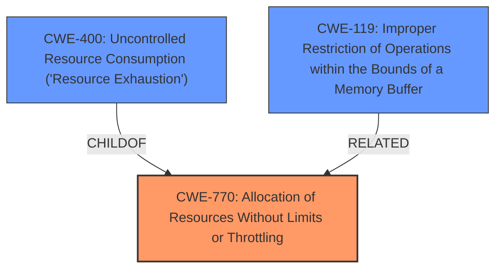

# Analysis Report for CVE-2024-39944

# Vulnerability Analysis Report: CVE-2024-39944

## Description

A vulnerability has been found in Dahua products.Attackers can send carefully crafted data packets to the interface with vulnerabilities, causing the device to crash.

## Vulnerability Description Key Phrases

- **Impact:** device crash
- **Vector:** carefully crafted data packets
- **Attacker:** attackers
- **Product:** Dahua products

## Analysis (with Relationship Data)

# Summary
| CWE ID    | CWE Name                                                      | Confidence | CWE Abstraction Level | CWE Vulnerability Mapping Label | CWE-Vulnerability Mapping Notes |
| :--------- | :------------------------------------------------------------ | :--------- | :---------------------- | :------------------------------ | :------------------------------ |
| CWE-770     | Allocation of Resources Without Limits or Throttling        | 0.75       | Base                    | Primary CWE                   | Allowed                       |
| CWE-400     | Uncontrolled Resource Consumption ('Resource Exhaustion')    | 0.5        | Class                   | Secondary Candidate             | Allowed                       |
| CWE-119     | Improper Restriction of Operations within the Bounds of a Memory Buffer | 0.3 | Class | Secondary Candidate | Discouraged |

## Evidence and Confidence

*   **Confidence Score:** 0.70
*   **Evidence Strength:** MEDIUM

## Relationship Analysis

The primary relationship that influenced the decision was the parent-child relationship between CWE-770 and CWE-400, as well as the chain relationship to CWE-119. CWE-770 represents a root cause by allocating resources without limits, and CWE-400 represents the resulting resource exhaustion due to that allocation. CWE-119 is considered because the crafted packets may be overflowing a buffer and, if so, this could be a related weakness. The abstraction levels were carefully considered to ensure the most specific and accurate representation of the vulnerability.



## Vulnerability Chain

The vulnerability chain starts with **improper** or **missing** limits on resource allocation (**CWE-770**). This can lead to uncontrolled resource consumption (**CWE-400**), ultimately resulting in a device crash (denial of service). Sending carefully crafted packets may also lead to a buffer overflow (**CWE-119**).

## Summary of Analysis

The initial analysis focused on the **impact** of device crash due to crafted packets. The most direct evidence comes from the "CVE Reference Links Content Summary" section, which states the root cause is the device's handling of carefully crafted data packets and the resulting impact is a device crash. The Retriever results pointed to several memory-related CWEs, and CWE-770 was chosen as the primary weakness because the crafted packets likely trigger excessive resource allocation.

CWE-400 (Uncontrolled Resource Consumption) is a likely consequence of CWE-770.

CWE-119 (Improper Restriction of Operations within the Bounds of a Memory Buffer) is a possible secondary weakness, as the crafted packets might be exploiting a buffer overflow. However, the evidence is not strong enough to confirm this.

The selection of CWE-770 is based on the reasoning that the device is allocating resources without proper limits when processing the crafted packets, which directly leads to resource exhaustion and a crash. This is at the optimal level of specificity, as it captures the underlying cause rather than just the symptom.

Relevant CWE Information:

**CWE-770: Allocation of Resources Without Limits or Throttling**
The product allocates a reusable resource or group of resources on behalf of an actor without imposing any restrictions on the size or number of resources that can be allocated, in violation of the intended security policy for that actor. This aligns with the vulnerability description of crafted packets causing a device crash, suggesting that the device doesn't properly limit the resources allocated to processing network packets.

**CWE-400: Uncontrolled Resource Consumption ('Resource Exhaustion')**
The software does not properly control the consumption of resources, which can lead to denial of service or reduced performance. The "impact: device crash" phrase strongly supports this CWE, as the crash is a direct result of resource exhaustion.

**CWE-119: Improper Restriction of Operations within the Bounds of a Memory Buffer**
The product performs operations on a memory buffer, but it reads from or writes to a memory location outside the buffer's intended boundary. This is a possible secondary weakness, as the crafted packets might be exploiting a buffer overflow.

I considered CWE-789 (Memory Allocation with Excessive Size Value), but it is less specific than CWE-770, which captures the broader issue of allocating resources without limits, not just excessive size. I also considered CWE-1284 (Improper Validation of Specified Quantity in Input), but the primary issue is not the validation of the quantity but the lack of limits on resource allocation.


## CWE Relationship Analysis

Current CWEs represent these abstraction levels: .


### Vulnerability Chain Analysis

**Chain starting from CWE-1284:**
- 1284 (Improper Validation of Specified Quantity in Input) - ROOT


**Chain starting from CWE-400:**
- 400 (Uncontrolled Resource Consumption) - ROOT


### CWE Relationship Diagram

```mermaid
graph TD
    classDef primary fill:#f96,stroke:#333,stroke-width:2px
    classDef secondary fill:#69f,stroke:#333
    classDef tertiary fill:#9e9,stroke:#333
```


*Report generated on 2025-07-13 12:07:27*
