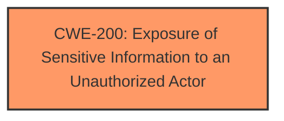

# Raw Analyzer Response for CVE-2024-40090

# Summary
| CWE ID | CWE Name | Confidence | CWE Abstraction Level | CWE Vulnerability Mapping Label | CWE-Vulnerability Mapping Notes |
|---|---|---|---|---|---|
| CWE-200 | Exposure of Sensitive Information to an Unauthorized Actor | 0.8 | Class | Allowed | Primary CWE |

## Evidence and Confidence

*   **Confidence Score:** 0.8
*   **Evidence Strength:** MEDIUM

## Relationship Analysis
The primary CWE selected is CWE-200, which is a Class-level CWE. While it is generally preferred to select a Base or Variant level CWE, in this case, the available information does not point to a more specific weakness. CWE-200 is a parent of many information exposure CWEs, but the description doesn't provide enough detail to select a child.

## Vulnerability Chain
The vulnerability chain consists of a missing or insufficient protection mechanism, leading to the exposure of sensitive information.

## Summary of Analysis
The vulnerability description states that an information leak in the Boa webserver allows remote, unauthenticated attackers to leak memory addresses of uClibc and the stack via sending a GET request to the index page.
The primary weakness identified is **CWE-200: Exposure of Sensitive Information to an Unauthorized Actor**. This is because the core issue is the **exposure of sensitive system information** (memory addresses of uClibc and the stack) to unauthorized actors (remote, unauthenticated attackers).

The retriever results also list CWE-200 as the top candidate.

The evidence for this mapping is:
- "Information Disclosure" - **impact** listed in Vulnerability Description Key Phrases
- "An information leak in the Boa webserver allows remote, unauthenticated attackers to leak memory addresses of uClibc and the stack via sending a GET request to the index page."

Other CWEs Considered:

*   CWE-497: Exposure of Sensitive System Information to an Unauthorized Control Sphere: This CWE is more specific than CWE-200, but the description doesn't provide enough information to determine if the exposed information is specifically system-level information.
*   CWE-306: Missing Authentication for Critical Function: While the attack is unauthenticated, the core issue is the information leak, not the missing authentication. Authentication might prevent the leak, but the vulnerability is the leak itself.
*   CWE-79: Improper Neutralization of Input During Web Page Generation ('Cross-site Scripting'): This CWE is not applicable as the vulnerability is not related to XSS.
*   CWE-74: Improper Neutralization of Special Elements in Output Used by a Downstream Component ('Injection'): This CWE is not applicable as the vulnerability is not related to injection.
*   CWE-20: Improper Input Validation: This CWE is too broad and doesn't accurately reflect the specific weakness.