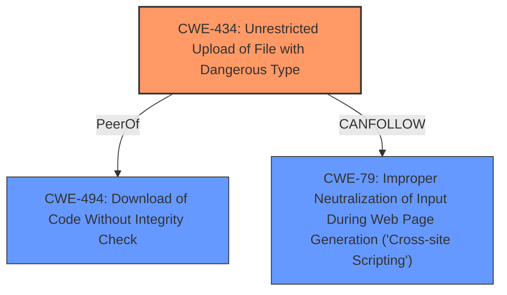

# Raw Analyzer Response for CVE-2024-40110

# Summary
| CWE ID | CWE Name | Confidence | CWE Abstraction Level | CWE Vulnerability Mapping Label | CWE-Vulnerability Mapping Notes |
|---|---|---|---|---|---|
| CWE-434 | Unrestricted Upload of File with Dangerous Type | 1.0 | Base | Allowed | Primary CWE |
| CWE-494 | Download of Code Without Integrity Check | 0.5 | Base | Allowed | Secondary Candidate |
| CWE-79 | Improper Neutralization of Input During Web Page Generation ('Cross-site Scripting') | 0.5 | Base | Allowed | Secondary Candidate |

## Evidence and Confidence

*   **Confidence Score:** 0.8
*   **Evidence Strength:** HIGH

## Relationship Analysis
The primary relationship that influenced my decision was the direct match between the vulnerability description and CWE-434 (Unrestricted Upload of File with Dangerous Type). The vulnerability involves an unauthenticated file upload that allows the attacker to upload a malicious PHP file, which directly aligns with the description of CWE-434.

## Vulnerability Chain
The vulnerability chain starts with the **Unrestricted Upload of File with Dangerous Type (CWE-434)**. Because the system doesn't validate the uploaded file, a malicious PHP file is uploaded which leads to Remote Code Execution (RCE). The file is then executed.

## Summary of Analysis
The initial analysis strongly pointed towards CWE-434 due to the **unrestricted file upload** **weakness**. The vulnerability description explicitly states that the system does not properly validate or sanitize the uploaded file, allowing an attacker to upload a malicious PHP file. The CVE Reference Links Content Summary confirms that this is an unauthenticated file upload vulnerability.

The Retriever Results also listed CWE-434 as the top candidate.

I considered CWE-494 (Download of Code Without Integrity Check), but the primary issue is the unrestricted upload, not the download. I am including this as a secondary candidate because the malicious file is then executed.

I considered CWE-79 (Improper Neutralization of Input During Web Page Generation ('Cross-site Scripting')), but it's not directly related to XSS; it is the execution of the file.

The final decision is based on the evidence that clearly indicates an **unrestricted file upload** as the root cause. CWE-434 is the most specific and accurate representation of this vulnerability.

Relevant CWE Information:

# Enhanced Context (25 CWEs)
The following CWEs were identified as potentially relevant to this vulnerability:

## CWE-434: Unrestricted Upload of File with Dangerous Type
**Abstraction Level**: Base
**Similarity Score**: 0.82
**Source**: dense

**Description**:
The product allows the upload or transfer of dangerous file types that are automatically processed within its environment.

**Mapping Guidance**:
- Usage: Allowed
- Rationale: This CWE entry is at the Base level of abstraction, which is a preferred level of abstraction for mapping to the root causes of vulnerabilities.

**Technical Explanation:**

CWE-434 (Unrestricted Upload of File with Dangerous Type) is the primary CWE.
*   **How the vulnerability matches the CWE's characteristics:** The vulnerability allows an attacker to upload a malicious PHP file due to the **lack of file validation**.
*   **Security implications and potential impact:** The attacker can achieve Remote Code Execution (RCE).
*   **Parent-child relationships or chain patterns:** None.
*   **Whether the weakness is primary or secondary in the vulnerability:** Primary.
*   **How the official MITRE mapping guidance influenced your decision:** The Usage is ALLOWED.

## CWE-494: Download of Code Without Integrity Check
**Abstraction Level**: base
**Similarity Score**: 2.21
**Source**: graph

**Description**:
CWE-494: Download of Code Without Integrity Check

**Mapping Guidance**:
- Usage: Allowed
- Rationale: This CWE entry is at the Base level of abstraction, which is a preferred level of abstraction for mapping to the root causes of vulnerabilities.

**Relationships**:
- CANFOLLOW -> CWE-79
- CHILDOF -> CWE-669
- CHILDOF -> CWE-669
- CHILDOF -> CWE-345
- CANPRECEDE -> CWE-494

**Technical Explanation:**

CWE-494 (Download of Code Without Integrity Check) is a secondary CWE.
*   **How the vulnerability matches the CWE's characteristics:** The uploaded malicious file is executed without any integrity check.
*   **Security implications and potential impact:** This can lead to remote code execution.
*   **Parent-child relationships or chain patterns:** Can follow CWE-79.
*   **Whether the weakness is primary or secondary in the vulnerability:** Secondary.
*   **How the official MITRE mapping guidance influenced your decision:** The Usage is ALLOWED.

## CWE-79: Improper Neutralization of Input During Web Page Generation ('Cross-site Scripting')
**Abstraction Level**: base
**Similarity Score**: 4.33
**Source**: graph

**Description**:
CWE-79: Improper Neutralization of Input During Web Page Generation ('Cross-site Scripting')

**Mapping Guidance**:
- Usage: Allowed
- Rationale: This CWE entry is at the Base level of abstraction, which is a preferred level of abstraction for mapping to the root causes of vulnerabilities.

**Relationships**:
- PARENTOF -> CWE-87
- PARENTOF -> CWE-86
- PARENTOF -> CWE-85
- PARENTOF -> CWE-84
- PARENTOF -> CWE-83

**Technical Explanation:**

CWE-79 (Improper Neutralization of Input During Web Page Generation ('Cross-site Scripting')) is a secondary CWE.
*   **How the vulnerability matches the CWE's characteristics:** The uploaded malicious file is not neutralized.
*   **Security implications and potential impact:** This can lead to remote code execution.
*   **Parent-child relationships or chain patterns:** None.
*   **Whether the weakness is primary or secondary in the vulnerability:** Secondary.
*   **How the official MITRE mapping guidance influenced your decision:** The Usage is ALLOWED.