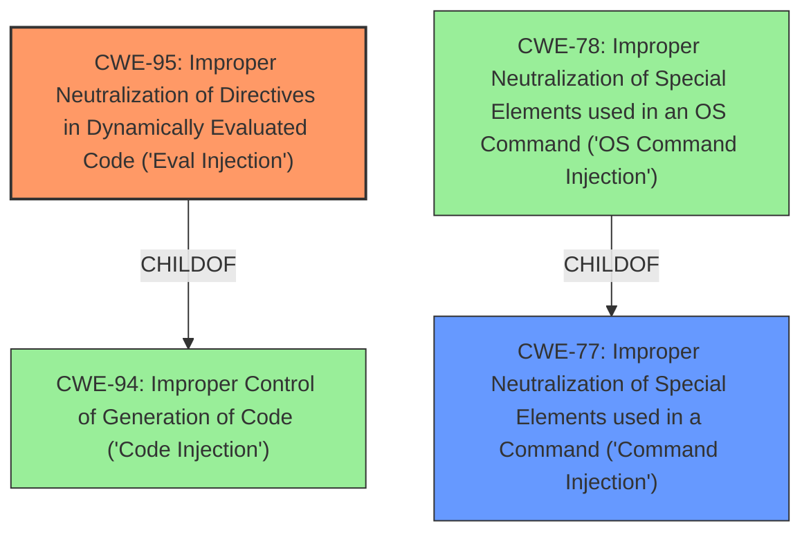

# Enhanced Analysis for CVE-2024-40137

# Summary
| CWE ID | CWE Name | Confidence | CWE Abstraction Level | CWE Vulnerability Mapping Label | CWE-Vulnerability Mapping Notes |
|---|---|---|---|---|---|
| CWE-95 | Improper Neutralization of Directives in Dynamically Evaluated Code ('Eval Injection') | 0.9 | Variant | Allowed | Primary CWE. The **improper neutralization** allows the execution of arbitrary code. |
| CWE-77 | Improper Neutralization of Special Elements used in a Command ('Command Injection') | 0.7 | Class | Allowed-with-Review | Secondary candidate. The **improper neutralization** of special elements leads to command injection. |

## Evidence and Confidence

*   **Confidence Score:** 0.8
*   **Evidence Strength:** MEDIUM

## Relationship Analysis
The primary CWE is CWE-95, which is a variant of CWE-94 (Improper Control of Generation of Code), and CWE-77 is a class. CWE-77 is a parent of more specific command injection CWEs such as CWE-78 (Improper Neutralization of Special Elements used in an OS Command ('OS Command Injection')). CWE-95 is more specific than CWE-77 and accurately reflects the **eval injection** vulnerability.



## Vulnerability Chain
The vulnerability chain starts with **improper input sanitization** in the "Computed field" text box, leading to **command injection** and ultimately resulting in **remote code execution (RCE)**.

## Summary of Analysis
The primary CWE is CWE-95 because the vulnerability involves **improper neutralization** in dynamically evaluated code. The supporting evidence includes the vulnerability description, which states that there is a **remote code execution vulnerability** via the Computed field parameter, and the CVE reference summary, which states that the root cause is **improper input sanitization** leading to **command injection**. The relationship graph shows that CWE-95 is a variant of CWE-94, which is more specific than other command injection CWEs like CWE-77 and CWE-78.

Relevant CWE Information:
- "The 'Computed field' text box within the 'Users Module Setup' functionality of Dolibarr does not properly sanitize user input."
- "Improper input sanitization leading to command injection."
- "Remote Code Execution (RCE), allowing an attacker to execute arbitrary commands on the server."
- "The vulnerability can be exploited through the 'Computed field' text box in the Dolibarr 'Users Module Setup'."

CWE-77 was considered because the CVE summary mentions **command injection**. However, since the vulnerability involves dynamic evaluation of code, CWE-95 is a more precise classification. Other CWEs like CWE-78 (OS Command Injection) and CWE-89 (SQL Injection) were considered but deemed less relevant as the vulnerability isn't specifically tied to OS commands or SQL queries. CWE-74 (Improper Neutralization of Special Elements in Output Used by a Downstream Component ('Injection')) is too generic and therefore not appropriate.


## CWE Relationship Analysis

Current CWEs represent these abstraction levels: .


### Vulnerability Chain Analysis

**Chain starting from CWE-89:**
- 89 (Improper Neutralization of Special Elements used in an SQL Command ('SQL Injection')) - ROOT


**Chain starting from CWE-94:**
- 94 (Improper Control of Generation of Code ('Code Injection')) - ROOT


### CWE Relationship Diagram

```mermaid
graph TD
    classDef primary fill:#f96,stroke:#333,stroke-width:2px
    classDef secondary fill:#69f,stroke:#333
    classDef tertiary fill:#9e9,stroke:#333
```