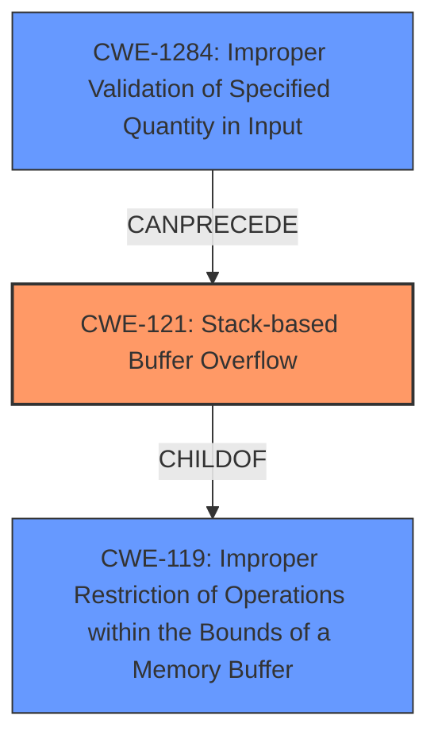

# Analysis for CVE-2024-40427

# Summary

| CWE ID  | CWE Name                                                                               | Confidence | CWE Abstraction Level | CWE Vulnerability Mapping Label | CWE-Vulnerability Mapping Notes |
| ------- | -------------------------------------------------------------------------------------- | ---------- | --------------------- | ------------------------------- | ----------------------------- |
| CWE-121 | Stack-based Buffer Overflow                                                            | 0.9        | Variant               | Primary                         | Allowed                       |
| CWE-1284 | Improper Validation of Specified Quantity in Input                                     | 0.7        | Base                  | Secondary                       | Allowed                       |
| CWE-119 | Improper Restriction of Operations within the Bounds of a Memory Buffer                | 0.6        | Class                 | Secondary                       | Discouraged                   |

## Evidence and Confidence

*   **Confidence Score:** 0.8
*   **Evidence Strength:** HIGH

## Relationship Analysis

The primary CWE is CWE-121, which is a variant of the class CWE-119. CWE-119 describes improper restrictions of operations within memory buffer bounds, while CWE-121 specifies that the buffer is stack-based. CWE-1284 can precede CWE-121 because **improper validation** of the input size can lead to a buffer overflow on the stack.

## Vulnerability Chain

The vulnerability chain starts with **improper validation** of the input quantity (CWE-1284). This **lack of validation** allows an attacker to provide a larger-than-expected size, leading to a **stack-based buffer overflow** (CWE-121). The overflow can then cause a denial of service (program crash) or unexpected drone behavior if critical data is overwritten.

## Summary of Analysis

The initial analysis identified a **stack buffer overflow** in PX4-Autopilot. The provided evidence from the CVE reference links content summary strongly supports this, detailing a **lack of bounds checking** on the `serial_control_mavlink.count` variable when writing to the `serial_control_mavlink.data` buffer, which is located on the stack.

The analysis of the Retriever Results and Complete CWE Specifications confirmed that CWE-121 (Stack-based Buffer Overflow) is the most appropriate primary CWE. This is a variant-level CWE, providing greater specificity than the class-level CWE-119 (Improper Restriction of Operations within the Bounds of a Memory Buffer). The root cause of the vulnerability is the **lack of input validation** which is best captured as CWE-1284 (Improper Validation of Specified Quantity in Input).

The evidence from the "CVE Reference Links Content Summary" section:

*   "The root cause is a **lack of bounds checking** on the `serial_control_mavlink.count` variable when writing data to the `serial_control_mavlink.data` buffer."
*   "Stack-based buffer overflow: The vulnerability allows an attacker to write beyond the allocated buffer on the stack, potentially overwriting adjacent memory regions."
*   "**Lack of input validation**: The code fails to validate the size of the incoming data (`serial_control_mavlink.count`) before copying it into the buffer."

This evidence directly supports the selection of CWE-121 as the primary CWE, with CWE-1284 capturing the root cause of the vulnerability.

Relevant CWE Information:

# Enhanced Context (25 CWEs)
The following CWEs were identified as potentially relevant to this vulnerability:

## CWE-131: Incorrect Calculation of Buffer Size
**Abstraction Level**: Base
**Similarity Score**: 0.71

**Description**:
The product does not correctly calculate the size to be used when allocating a buffer, which could lead to a buffer overflow.

## CWE-824: Access of Uninitialized Pointer
**Abstraction Level**: Base
**Similarity Score**: 0.71

**Description**:
The product accesses or uses a pointer that has not been initialized.

## CWE-126: Buffer Over-read
**Abstraction Level**: Variant
**Similarity Score**: 0.70

**Description**:
The product reads from a buffer using buffer access mechanisms such as indexes or pointers that reference memory locations after the targeted buffer.

## CWE-1285: Improper Validation of Specified Index, Position, or Offset in Input
**Abstraction Level**: Base
**Similarity Score**: 0.70

**Description**:
The product receives input that is expected to specify an index, position, or offset into an indexable resource such as a buffer or file, but it does not validate or incorrectly validates that the specified index/position/offset has the required properties.

## CWE-1284: Improper Validation of Specified Quantity in Input
**Abstraction Level**: Base
**Similarity Score**: 0.70

**Description**:
The product receives input that is expected to specify a quantity (such as size or length), but it does not validate or incorrectly validates that the quantity has the required properties.

## CWE-121: Stack-based Buffer Overflow
**Abstraction Level**: Variant
**Similarity Score**: 0.70

**Description**:
A stack-based buffer overflow condition is a condition where the buffer being overwritten is allocated on the stack (i.e., is a local variable or, rarely, a parameter to a function).

## CWE-129: Improper Validation of Array Index
**Abstraction Level**: Variant
**Similarity Score**: 0.70

**Description**:
The product uses untrusted input when calculating or using an array index, but the product does not validate or incorrectly validates the index to ensure the index references a valid position within the array.

## CWE-755: Improper Handling of Exceptional Conditions
**Abstraction Level**: Class
**Similarity Score**: 0.70

**Description**:
The product does not handle or incorrectly handles an exceptional condition.

## CWE-119: Improper Restriction of Operations within the Bounds of a Memory Buffer
**Abstraction Level**: Class
**Similarity Score**: 0.70

**Description**:
The product performs operations on a memory buffer, but it reads from or writes to a memory location outside the buffer's intended boundary. This may result in read or write operations on unexpected memory locations that could be linked to other variables, data structures, or internal program data.

## CWE-193: Off-by-one Error
**Abstraction Level**: Base
**Similarity Score**: 0.69

**Description**:
A product calculates or uses an incorrect maximum or minimum value that is 1 more, or 1 less, than the correct value.

## CWE-190: Integer Overflow or Wraparound
**Abstraction Level**: Base
**Similarity Score**: 1198.84

**Description**:
The product performs a calculation that can
         produce an integer overflow or wraparound when the logic
         assumes that the resulting value will always be larger than
         the original value. This occurs when an integer value is
         incremented to a value that is too large to store in the
         associated representation. When this occurs, the value may
         become a very small or negative number.

## CWE-1284: Improper Validation of Specified Quantity in Input
**Abstraction Level**: Base
**Similarity Score**: 1190.26

**Description**:
The product receives input that is expected to specify a quantity (such as size or length), but it does not validate or incorrectly validates that the quantity has the required properties.

## CWE-193: Off-by-one Error
**Abstraction Level**: Base
**Similarity Score**: 1131.98

**Description**:
A product calculates or uses an incorrect maximum or minimum value that is 1 more, or 1 less, than the correct value.

## CWE-122: Heap-based Buffer Overflow
**Abstraction Level**: Variant
**Similarity Score**: 1119.08

**Description**:
A heap overflow condition is a buffer overflow, where the buffer that can be overwritten is allocated in the heap portion of memory, generally meaning that the buffer was allocated using a routine such as malloc().

## CWE-125: Out-of-bounds Read
**Abstraction Level**: Base
**Similarity Score**: 1103.95

**Description**:
The product reads data past the end, or before the beginning, of the intended buffer.

## CWE-128: Wrap-around Error
**Abstraction Level**: base
**Similarity Score**: 5.03

**Description**:
CWE-128: Wrap-around Error

## CWE-