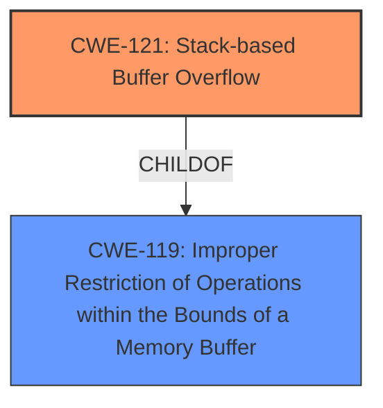

# Enhanced Analysis for CVE-2024-40536

# Summary
| CWE ID | CWE Name | Confidence | CWE Abstraction Level | CWE Vulnerability Mapping Label | CWE-Vulnerability Mapping Notes |
|---|---|---|---|---|---|
| CWE-121 | Stack-based Buffer Overflow | 1.0 | Variant | Allowed | Primary CWE: The vulnerability description explicitly mentions a stack overflow. |

## Evidence and Confidence

*   **Confidence Score:** 1.0
*   **Evidence Strength:** HIGH

## Relationship Analysis
The primary identified CWE is CWE-121 (Stack-based Buffer Overflow), which is a variant of CWE-119 (Improper Restriction of Operations within the Bounds of a Memory Buffer). The vulnerability is a classic stack overflow, where data written to a buffer on the stack exceeds its allocated size, overwriting adjacent memory. The abstraction level (Variant) is appropriate as it specifies the location of the buffer (stack).



## Vulnerability Chain
The vulnerability chain is straightforward:
1.  **Root Cause:** CWE-121 (Stack-based Buffer Overflow) due to insufficient bounds checking when writing to a stack-allocated buffer.
2.  **Impact:** Overwriting adjacent memory on the stack, potentially leading to arbitrary code execution or denial of service.

## Summary of Analysis
The vulnerability description clearly states a **stack overflow** condition in the `config_3g_para` function due to the `pin_3g_code` parameter. This aligns directly with CWE-121 (Stack-based Buffer Overflow). The retriever results also prioritize CWE-121 as the top match. The evidence is strong and directly supports the mapping to CWE-121. The abstraction level is optimal as it specifies the location of the buffer.

Relevant CWE Information:

# Enhanced Context (25 CWEs)
The following CWEs were identified as potentially relevant to this vulnerability:

## CWE-121: Stack-based Buffer Overflow
**Abstraction Level**: Variant
**Similarity Score**: 0.69
**Source**: dense

**Description**:
A stack-based buffer overflow condition is a condition where the buffer being overwritten is allocated on the stack (i.e., is a local variable or, rarely, a parameter to a function).

**Mapping Guidance**:
- Usage: Allowed
- Rationale: This CWE entry is at the Variant level of abstraction, which is a preferred level of abstraction for mapping to the root causes of vulnerabilities.

## CWE-120: Buffer Copy without Checking Size of Input ('Classic Buffer Overflow')
**Abstraction Level**: base
**Similarity Score**: 4.14
**Source**: graph

**Description**:
CWE-120: Buffer Copy without Checking Size of Input ('Classic Buffer Overflow')

**Mapping Guidance**:
- Usage: Allowed-with-Review
- Rationale: There are some indications that this CWE ID might be misused and selected simply because it mentions "buffer overflow" - an increasingly vague term. This CWE entry is only appropriate for "Buffer Copy" operations (not buffer reads), in which where there is no "Checking [the] Size of Input", and (by implication of the copy) writing past the end of the buffer.

**Relationships**:
- PARENTOF -> CWE-785
- CANFOLLOW -> CWE-456
- CANFOLLOW -> CWE-416
- CANFOLLOW -> CWE-231
- CANFOLLOW -> CWE-170

**Other CWEs Considered:**

*   **CWE-120: Buffer Copy without Checking Size of Input ('Classic Buffer Overflow')**: While related to buffer overflows, CWE-120 is more specific to copy operations where the size is not checked. The vulnerability description doesn't explicitly mention a copy operation, making CWE-121 a more direct fit.
*   **CWE-190: Integer Overflow or Wraparound**: This CWE is related to integer handling issues, but the vulnerability description focuses on buffer overflows, making it less relevant.
*   **CWE-125: Out-of-bounds Read, CWE-124: Buffer Underwrite, CWE-122: Heap-based Buffer Overflow**: These are all types of buffer access errors, but the description specifically mentions a stack overflow.
*   **CWE-1284: Improper Validation of Specified Quantity in Input**: This CWE is related to validating input size, but the primary issue is the overflow itself, not necessarily the validation of the input size.


## CWE Relationship Analysis

Current CWEs represent these abstraction levels: .


### Vulnerability Chain Analysis

**Chain starting from CWE-121:**
- 121 (Stack-based Buffer Overflow) - ROOT


**Chain starting from CWE-416:**
- 416 (Use After Free) - ROOT


### CWE Relationship Diagram

```mermaid
graph TD
    classDef primary fill:#f96,stroke:#333,stroke-width:2px
    classDef secondary fill:#69f,stroke:#333
    classDef tertiary fill:#9e9,stroke:#333
```