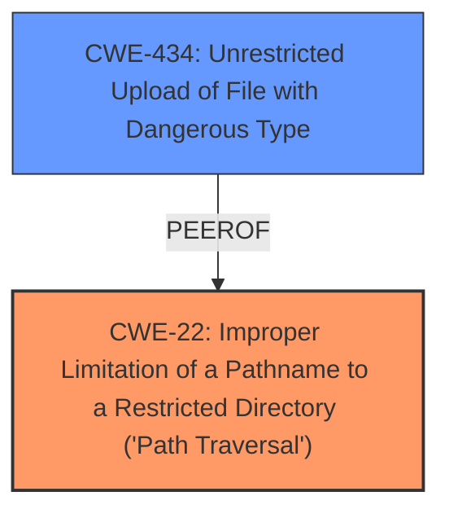

# Analysis for CVE-2024-40547

# Summary
| CWE ID | CWE Name | Confidence | CWE Abstraction Level | CWE Vulnerability Mapping Label | CWE-Vulnerability Mapping Notes |
|---|---|---|---|---|---|
| CWE-22 | Improper Limitation of a Pathname to a Restricted Directory ('Path Traversal') | 1.0 | Base | Allowed | Primary CWE: This is the root cause that allows the file replacement to occur outside the intended directory. |
| CWE-434 | Unrestricted Upload of File with Dangerous Type | 0.7 | Base | Allowed | Secondary CWE: The ability to replace file content resembles the impact of uploading dangerous file types. |

## Evidence and Confidence

*   **Confidence Score:** 0.9
*   **Evidence Strength:** HIGH

## Relationship Analysis
The primary weakness is CWE-22, **Improper Limitation of a Pathname to a Restricted Directory ('Path Traversal')**. This is because the application **does not properly neutralize special elements** within the pathname, allowing it to resolve to locations outside the restricted directory. CWE-22 can lead to other weaknesses such as CWE-73 (External Control of File Name or Path). The relationship to CWE-434 is peer-like, as both involve manipulating file system resources.

## Vulnerability Chain
1.  The application **fails to properly neutralize pathnames**, leading to CWE-22.
2.  This allows attackers to specify arbitrary file paths.
3.  Attackers can replace the content of those files, effectively taking over critical application files.

## Summary of Analysis
The primary classification is CWE-22, which is supported by the evidence of **improper pathname limitation** and the ability to use directory traversal sequences (`../`). The evidence for this is found in the "CVE Reference Links Content Summary" section, which states: "The lack of input sanitization in the controller allows the attacker to use path traversal sequences (e.g., `../`) to navigate outside the intended directory and target any file."

CWE-434 is considered a secondary weakness because the arbitrary file content replacement is similar in impact to uploading a dangerous file.

I considered CWE-74, CWE-78, CWE-79, CWE-89, CWE-94, CWE-96, and CWE-1336, but they were less appropriate as they focus on specific injection types or code generation issues, rather than the fundamental problem of **improper path handling**.

# Relevant CWE Information:
CWE-22: Improper Limitation of a Pathname to a Restricted Directory ('Path Traversal')

CWE-434: Unrestricted Upload of File with Dangerous Type