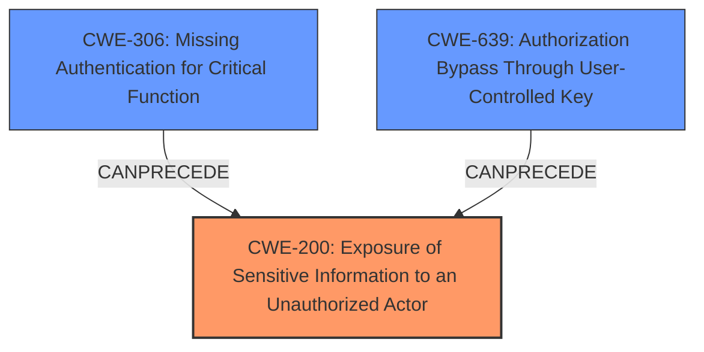

# Analysis Report for CVE-2024-40633

# Vulnerability Analysis Report: CVE-2024-40633

## Description

Sylius is an Open Source eCommerce Framework on Symfony. A security vulnerability was discovered in the `/api/v2/shop/adjustments/{id}` endpoint, which retrieves order adjustments based on incremental integer IDs. The vulnerability allows an attacker to enumerate valid adjustment IDs and retrieve order tokens. Using these tokens, an attacker can access guest customer order details - sensitive guest customer information. The issue is fixed in versions 1.12.19, 1.13.4 and above. The `/api/v2/shop/adjustments/{id}` will always return `404` status. Users are advised to upgrade. Users unable to upgrade may alter their config to mitigate this issue. Please see the linked GHSA for details.

## Vulnerability Description Key Phrases

- **Impact:** access guest customer order details
- **Vector:** incremental integer IDs
- **Attacker:** attacker
- **Product:** Sylius
- **Version:** before 1.12.19, 1.13.4
- **Component:** /api/v2/shop/adjustments/{id} endpoint

## Analysis (with Relationship Data)

# Summary
| CWE ID | CWE Name | Confidence | CWE Abstraction Level | CWE Vulnerability Mapping Label | CWE-Vulnerability Mapping Notes |
|---|---|---|---|---|---|
| CWE-200 | Exposure of Sensitive Information to an Unauthorized Actor | 0.9 | Class | Primary | Allowed-with-Review, but used because more specific options don't fit |
| CWE-306 | Missing Authentication for Critical Function | 0.7 | Base | Secondary | Allowed |
| CWE-639 | Authorization Bypass Through User-Controlled Key | 0.6 | Base | Secondary | Allowed |

## Evidence and Confidence

*   **Confidence Score:** 0.8
*   **Evidence Strength:** MEDIUM

## Relationship Analysis
The primary relationship that influenced my decision was the parent-child relationship between CWE-200 and its children. While CWE-200 is generally discouraged, the available evidence does not support a more specific child CWE. The vulnerability chain also played a role, as the **missing authentication** (CWE-306) led to the **exposure of sensitive information** (CWE-200). CWE-639 (Authorization Bypass Through User-Controlled Key) is also considered since the incremental ID can be viewed as a user-controlled key.



## Vulnerability Chain
The vulnerability chain starts with the **missing authentication** and/or **authorization bypass** on the `/api/v2/shop/adjustments/{id}` endpoint. Because of the endpoint's design, it is possible to enumerate valid adjustment IDs and retrieve order tokens. This leads directly to the **exposure of sensitive guest customer order details**, resulting in the impact.

*   **Root Cause:** Missing Authentication (CWE-306) and/or Authorization Bypass (CWE-639)
*   **Weakness:** Exposure of Sensitive Information (CWE-200)
*   **Impact:** Access to Guest Customer Order Details

## Summary of Analysis
My analysis is primarily based on the provided evidence, including the vulnerability description and the CVE reference links content summary. The key phrases highlight the **impact** of accessing guest customer order details and the **vector** of incremental integer IDs. The content summary clearly states the **information disclosure** weakness due to the lack of proper access control.

The initial assessment leaned towards CWE-200 as the primary weakness due to the explicit mention of information disclosure and the high retriever score. However, the retriever results also suggested CWE-306 and CWE-639 as potential candidates related to the **missing authentication** and **authorization bypass**, respectively.

The final decision involves mapping CWE-200 as the primary weakness, acknowledging that while it is a Class-level CWE and generally discouraged, the provided evidence does not strongly support a more specific Base-level CWE. CWE-306 and CWE-639 are added as secondary CWEs due to the lack of authentication and/or authorization checks on the vulnerable endpoint, which directly contributed to the information exposure. This combination provides a more complete picture of the vulnerability. The selected CWEs are at the optimal level of specificity given the available evidence.

Relevant CWE Information:

# Enhanced Context (25 CWEs)
The following CWEs were identified as potentially relevant to this vulnerability:

## CWE-639: Authorization Bypass Through User-Controlled Key
**Abstraction Level**: Base
**Similarity Score**: 0.69
**Source**: dense

**Description**:
The system's authorization functionality does not prevent one user from gaining access to another user's data or record by modifying the key value identifying the data.

**Mapping Guidance**:
- Usage: Allowed
- Rationale: This CWE entry is at the Base level of abstraction, which is a preferred level of abstraction for mapping to the root causes of vulnerabilities.

## CWE-303: Incorrect Implementation of Authentication Algorithm
**Abstraction Level**: Base
**Similarity Score**: 0.69
**Source**: dense

**Description**:
The requirements for the product dictate the use of an established authentication algorithm, but the implementation of the algorithm is incorrect.

**Mapping Guidance**:
- Usage: Allowed
- Rationale: This CWE entry is at the Base level of abstraction, which is a preferred level of abstraction for mapping to the root causes of vulnerabilities.

## CWE-79: Improper Neutralization of Input During Web Page Generation ('Cross-site Scripting')
**Abstraction Level**: Base
**Similarity Score**: 0.69
**Source**: dense

**Description**:
The product does not neutralize or incorrectly neutralizes user-controllable input before it is placed in output that is used as a web page that is served to other users.

**Mapping Guidance**:
- Usage: Allowed
- Rationale: This CWE entry is at the Base level of abstraction, which is a preferred level of abstraction for mapping to the root causes of vulnerabilities.

## CWE-201: Insertion of Sensitive Information Into Sent Data
**Abstraction Level**: Base
**Similarity Score**: 0.69
**Source**: dense

**Description**:
The code transmits data to another actor, but a portion of the data includes sensitive information that should not be accessible to that actor.

**Mapping Guidance**:
- Usage: Allowed
- Rationale: This CWE entry is at the Base level of abstraction, which is a preferred level of abstraction for mapping to the root causes of vulnerabilities.

## CWE-200: Exposure of Sensitive Information to an Unauthorized Actor
**Abstraction Level**: Class
**Similarity Score**: 0.69
**Source**: dense

**Description**:
The product exposes sensitive information to an actor that is not explicitly authorized to have access to that information.

**Mapping Guidance**:
- Usage: Discouraged
- Rationale: CWE-200 is commonly misused to represent the loss of confidentiality in a vulnerability, but confidentiality loss is a technical impact - not a root cause error. As of CWE 4.9, over 400 CWE entries can lead to a loss of confidentiality. Other options are often available. [REF-1287].

## CWE-209: Generation of Error Message Containing Sensitive Information
**Abstraction Level**: Base
**Similarity Score**: 0.69
**Source**: dense

**Description**:
The product generates an error message that includes sensitive information about its environment, users, or associated data.

**Mapping Guidance**:
- Usage: Allowed
- Rationale: This CWE entry is at the Base level of abstraction, which is a preferred level of abstraction for mapping to the root causes of vulnerabilities.

## CWE-203: Observable Discrepancy
**Abstraction Level**: Base
**Similarity Score**: 0.68
**Source**: dense

**Description**:
The product behaves differently or sends different responses under different circumstances in a way that is observable to an unauthorized actor, which exposes security-relevant information about the state of the product, such as whether a particular operation was successful or not.

**Mapping Guidance**:
- Usage: Allowed
- Rationale: This CWE entry is at the Base level of abstraction, which is a preferred level of abstraction for mapping to the root causes of vulnerabilities.

## CWE-89: Improper Neutralization of Special Elements used in an SQL Command ('SQL Injection')
**Abstraction Level**: Base
**Similarity Score**: 0.68
**Source**: dense

**Description**:
The product constructs all or part of an SQL command using externally-influenced input from an upstream component, but it does not neutralize or incorrectly neutralizes special elements that could modify the intended SQL command when it is sent to a downstream component. Without sufficient removal or quoting of SQL syntax in user-controllable inputs, the generated SQL query can cause those inputs to be interpreted as SQL instead of ordinary user data.

**Mapping Guidance**:
- Usage: Allowed
- Rationale: This CWE entry is at the Base level of abstraction, which is a preferred level of abstraction for mapping to the root causes of vulnerabilities.

## CWE-116: Improper Encoding or Escaping of Output
**Abstraction Level**: Class
**Similarity Score**: 0.68
**Source**: dense

**Description**:
The product prepares a structured message for communication with another component, but encoding or escaping of the data is either missing or done incorrectly. As a result, the intended structure of the message is not preserved.

**Mapping Guidance**:
- Usage: Allowed-with-Review
- Rationale: This CWE entry is a Class and might have Base-level children that would be more appropriate

## CWE-212: Improper Removal of Sensitive Information Before Storage or Transfer
**Abstraction Level**: Base
**Similarity Score**: 0.68
**Source**: dense

**


## CWE Relationship Analysis

Current CWEs represent these abstraction levels: .


### Vulnerability Chain Analysis

**Chain starting from CWE-89:**
- 89 (Improper Neutralization of Special Elements used in an SQL Command ('SQL Injection')) - ROOT


**Chain starting from CWE-203:**
- 203 (Observable Discrepancy) - ROOT


### CWE Relationship Diagram

```mermaid
graph TD
    classDef primary fill:#f96,stroke:#333,stroke-width:2px
    classDef secondary fill:#69f,stroke:#333
    classDef tertiary fill:#9e9,stroke:#333
```


*Report generated on 2025-07-13 12:24:32*
