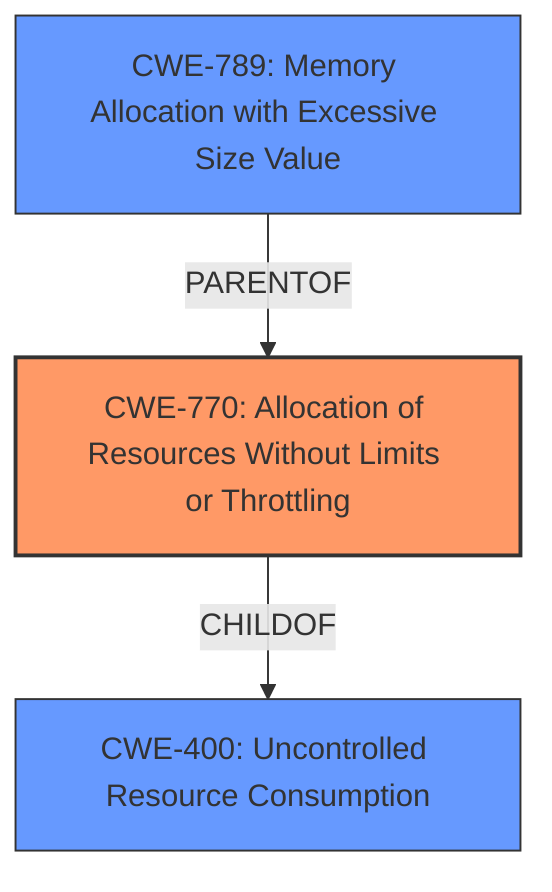

# Analysis for CVE-2024-40634

# Summary
| CWE ID  | CWE Name                                                         | Confidence | CWE Abstraction Level | CWE Vulnerability Mapping Label | CWE-Vulnerability Mapping Notes |
| :-------- | :--------------------------------------------------------------- | :--------- | :-------------------- | :------------------------------ | :------------------------------ |
| CWE-770   | Allocation of Resources Without Limits or Throttling          | 0.9        | Base                  | Primary                         | Allowed                       |
| CWE-400   | Uncontrolled Resource Consumption                              | 0.7        | Class                 | Secondary                       | Discouraged                    |
| CWE-789   | Memory Allocation with Excessive Size Value                    | 0.6        | Variant                 | Secondary                       | Allowed                    |

## Evidence and Confidence

*   **Confidence Score:** 0.8
*   **Evidence Strength:** HIGH

## Relationship Analysis
The primary CWE is CWE-770, which describes the **allocation of resources without limits or throttling**. This is a base class that accurately reflects the root cause where the server allocates memory without any restrictions on the size of the request. CWE-770 is a child of CWE-400 (Uncontrolled Resource Consumption), but CWE-770 is a more precise and better fit since it identifies the specific weakness. CWE-789 (Memory Allocation with Excessive Size Value) is a variant of CWE-770 and is also considered, but CWE-770 represents the vulnerability more completely.

## Vulnerability Chain
The vulnerability chain starts with the **lack of input validation** on the size of the JSON payload, leading to uncontrolled resource allocation. This results in excessive memory consumption and ultimately causes a denial-of-service condition due to the OOM kill.

1.  **Root Cause:** CWE-770 Allocation of Resources Without Limits or Throttling. The server **does not limit the size** of the JSON payload.
2.  **Resulting Impact:** CWE-400 Uncontrolled Resource Consumption. The excessive memory allocation leads to resource exhaustion.

## Summary of Analysis
The primary weakness is the **allocation of resources without limits or throttling** (CWE-770). The vulnerability description clearly states that an unauthenticated attacker can send a specially crafted large JSON payload, leading to excessive memory allocation. This aligns perfectly with the definition of CWE-770, where a product allocates resources without imposing any restrictions on the size.

The "CVE Reference Links Content Summary" section reinforces this by stating that "The vulnerability stems from the **lack of a limit on the size of the JSON payload** that can be sent to the `/api/webhook` endpoint in Argo CD. This allows an attacker to send an arbitrarily large payload, causing excessive memory allocation."

CWE-400 is a more general class, and while the vulnerability leads to uncontrolled resource consumption, the root cause is more accurately described by CWE-770. CWE-789 (Memory Allocation with Excessive Size Value) is also a good fit but is a variant of CWE-770 and is not as complete a representation of the vulnerability.

The decision to select CWE-770 as the primary CWE is based on the clear evidence of **unlimited resource allocation** and the MITRE mapping guidance, which allows the use of Base level CWEs. The graph relationships support this by showing how CWE-770 relates to both the more general CWE-400 and the more specific CWE-789.
The selected CWEs are at the optimal level of specificity because CWE-770 accurately describes the root cause, while CWE-400 describes the impact, and CWE-789 is a variant that is not as complete.

Relevant CWE Information:

# Enhanced Context (25 CWEs)
The following CWEs were identified as potentially relevant to this vulnerability:

## CWE-789: Memory Allocation with Excessive Size Value
**Abstraction Level**: Variant
**Similarity Score**: 0.76
**Source**: dense

**Description**:
The product allocates memory based on an untrusted, large size value, but it does not ensure that the size is within expected limits, allowing arbitrary amounts of memory to be allocated.

**Mapping Guidance**:
- Usage: Allowed
- Rationale: This CWE entry is at the Variant level of abstraction, which is a preferred level of abstraction for mapping to the root causes of vulnerabilities.

## CWE-770: Allocation of Resources Without Limits or Throttling
**Abstraction Level**: Base
**Similarity Score**: 0.72
**Source**: dense

**Description**:
The product allocates a reusable resource or group of resources on behalf of an actor without imposing any restrictions on the size or number of resources that can be allocated, in violation of the intended security policy for that actor.

**Mapping Guidance**:
- Usage: Allowed
- Rationale: This CWE entry is at the Base level of abstraction, which is a preferred level of abstraction for mapping to the root causes of vulnerabilities.

## CWE-502: Deserialization of Untrusted Data
**Abstraction Level**: Base
**Similarity Score**: 0.72
**Source**: dense

**Description**:
The product deserializes untrusted data without sufficiently ensuring that the resulting data will be valid.

**Mapping Guidance**:
- Usage: Allowed
- Rationale: This CWE entry is at the Base level of abstraction, which is a preferred level of abstraction for mapping to the root causes of vulnerabilities.

## CWE-212: Improper Removal of Sensitive Information Before Storage or Transfer
**Abstraction Level**: Base
**Similarity Score**: 0.72
**Source**: dense

**Description**:
The product stores, transfers, or shares a resource that contains sensitive information, but it does not properly remove that information before the product makes the resource available to unauthorized actors.

**Mapping Guidance**:
- Usage: Allowed
- Rationale: This CWE entry is at the Base level of abstraction, which is a preferred level of abstraction for mapping to the root causes of vulnerabilities.

## CWE-88: Improper Neutralization of Argument Delimiters in a Command ('Argument Injection')
**Abstraction Level**: Base
**Similarity Score**: 0.71
**Source**: dense

**Description**:
The product constructs a string for a command to be executed by a separate component
in another control sphere, but it does not properly delimit the
intended arguments, options, or switches within that command string.

**Mapping Guidance**:
- Usage: Allowed
- Rationale: This CWE entry is at the Base level of abstraction, which is a preferred level of abstraction for mapping to the root causes of vulnerabilities.

## CWE-674: Uncontrolled Recursion
**Abstraction Level**: Class
**Similarity Score**: 0.70
**Source**: dense

**Description**:
The product does not properly control the amount of recursion that takes place,  consuming excessive resources, such as allocated memory or the program stack.

**Mapping Guidance**:
- Usage: Allowed-with-Review
- Rationale: This CWE entry is a Class and might have Base-level children that would be more appropriate

## CWE-400: Uncontrolled Resource Consumption
**Abstraction Level**: Class
**Similarity Score**: 0.70
**Source**: dense

**Description**:
The product does not properly control the allocation and maintenance of a limited resource, thereby enabling an actor to influence the amount of resources consumed, eventually leading to the exhaustion of available resources.

**Mapping Guidance**:
- Usage: Discouraged
- Rationale: CWE-400 is intended for incorrect behaviors in which the product is expected to track and restrict how many resources it consumes, but CWE-400 is often misused because it is conflated with the "technical impact" of vulnerabilities in which resource consumption occurs. It is sometimes used for low-information vulnerability reports. It is a level-1 Class (i.e., a child of a Pillar).

## CWE-1284: Improper Validation of Specified Quantity in Input
**Abstraction Level**: Base
**Similarity Score**: 0.70
**Source**: dense

**Description**:
The product receives input that is expected to specify a quantity (such as size or length), but it does not validate or incorrectly validates that the quantity has the required properties.

**Mapping Guidance**:
- Usage: Allowed
- Rationale: This CWE entry is at the Base level of abstraction, which is a preferred level of abstraction for mapping to the root causes of vulnerabilities.

## CWE-193: Off-by-one Error
**Abstraction Level**: Base
**Similarity Score**: 0.70
**Source**: dense

**Description**:
A product calculates or uses an incorrect maximum or minimum value that is 1 more