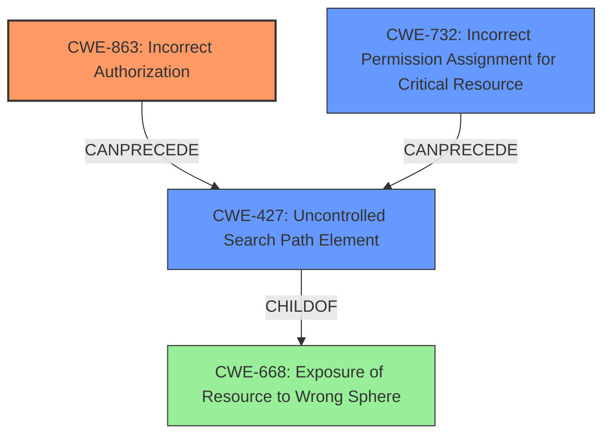

# Enhanced Analysis for CVE-2024-40637

# Summary
| CWE ID | CWE Name | Confidence | CWE Abstraction Level | CWE Vulnerability Mapping Label | CWE-Vulnerability Mapping Notes |
|---|---|---|---|---|---|
| CWE-863 | Incorrect Authorization | 0.8 | Class | Primary | Allowed-with-Review |
| CWE-427 | Uncontrolled Search Path Element | 0.6 | Base | Secondary | Allowed |
| CWE-732 | Incorrect Permission Assignment for Critical Resource | 0.5 | Class | Secondary | Allowed-with-Review |

## Evidence and Confidence

*   **Confidence Score:** 0.7
*   **Evidence Strength:** MEDIUM

## Relationship Analysis
The primary relationship influencing the CWE selection is the hierarchical relationship, especially focusing on finding the most appropriate level of abstraction.
CWE-863 (Incorrect Authorization) is a Class-level CWE, and more specific Base or Variant CWEs might exist. However, the description focuses on the general **ability to override core components**, indicating a broader authorization issue.
CWE-427 (Uncontrolled Search Path Element) and CWE-732 (Incorrect Permission Assignment for Critical Resource) were considered because a malicious package can be installed from an external source and the **permissions of the dbt user running the package must be sufficient to execute the malicious command**, respectively.
The chain relationship is relevant, as the **lack of authorization** can lead to the execution of arbitrary code, causing impacts such as data exfiltration.



## Vulnerability Chain
The vulnerability chain starts with the **incorrect authorization**, where dbt allows packages to override core components. This leads to the **installation of a malicious package (uncontrolled search path)**, which then leverages **incorrect permissions** to execute harmful code, ultimately resulting in data manipulation or exfiltration.

## Summary of Analysis
The analysis is heavily based on the provided vulnerability description and the associated CVE reference links. The key evidence lies in the **ability of dbt packages to override core components**, which is explicitly stated as the **root cause** in multiple sources. The provided CVE references also emphasize the **implicit overriding of built-in materializations** as a key weakness.

The selection of CWE-863 is justified by the fact that the **root cause** is related to the dbt product's **incorrect authorization** mechanism that allows packages to override macros, materializations, and other core components. This **lack of proper authorization** enables a malicious package to execute harmful code.

CWE-427 and CWE-732 are added as secondary to highlight the **uncontrolled search path** when installing malicious packages combined with **incorrect data warehouse permissions**.

The evidence to support this is quoted below:

*   "The vulnerability arises from the ability of dbt packages to override core dbt components like macros and materializations. A malicious package could exploit this by replacing built-in components with harmful code."
*   "Implicit overriding of built-in materializations by packages."
*   "The vulnerability lies in how dbt packages can override core dbt components, enabling potential SQL injection attacks by malicious packages."

The selected CWEs are at the optimal level of specificity, providing a balance between accurately representing the vulnerability and avoiding overly granular details. CWE-863 captures the core authorization issue, while CWE-427 and CWE-732 point out the secondary weaknesses.

Relevant CWE Information:

# Enhanced Context (25 CWEs)
The following CWEs were identified as potentially relevant to this vulnerability:

## CWE-212: Improper Removal of Sensitive Information Before Storage or Transfer
**Abstraction Level**: Base
**Similarity Score**: 0.77
**Source**: dense

**Description**:
The product stores, transfers, or shares a resource that contains sensitive information, but it does not properly remove that information before the product makes the resource available to unauthorized actors.

**Mapping Guidance**:
- Usage: Allowed
- Rationale: This CWE entry is at the Base level of abstraction, which is a preferred level of abstraction for mapping to the root causes of vulnerabilities.

*   **Why Not Used:** While data exfiltration is a possible impact, this CWE focuses on the **improper removal of sensitive information**, which is not the primary issue.

## CWE-538: Insertion of Sensitive Information into Externally-Accessible File or Directory
**Abstraction Level**: Base
**Similarity Score**: 0.76
**Source**: dense

**Description**:
The product places sensitive information into files or directories that are accessible to actors who are allowed to have access to the files, but not to the sensitive information.

**Mapping Guidance**:
- Usage: Allowed
- Rationale: This CWE entry is at the Base level of abstraction, which is a preferred level of abstraction for mapping to the root causes of vulnerabilities.

*   **Why Not Used:** This is similar to CWE-212, focusing on the placement of sensitive information, not the **authorization issue** that leads to the vulnerability.

## CWE-668: Exposure of Resource to Wrong Sphere
**Abstraction Level**: Class
**Similarity Score**: 0.76
**Source**: dense

**Description**:
The product exposes a resource to the wrong control sphere, providing unintended actors with inappropriate access to the resource.

**Mapping Guidance**:
- Usage: Discouraged
- Rationale: CWE-668 is high-level and is often misused as a catch-all when lower-level CWE IDs might be applicable. It is sometimes used for low-information vulnerability reports [REF-1287]. It is a level-1 Class (i.e., a child of a Pillar). It is not useful for trend analysis.

*   **Why Not Used:** While technically applicable, CWE-668 is too broad and doesn't capture the specific **authorization** and **package override** issues.

## CWE-41: Improper Resolution of Path Equivalence
**Abstraction Level**: Base
**Similarity Score**: 0.76
**Source**: dense

**Description**:
The product is vulnerable to file system contents disclosure through path equivalence. Path equivalence involves the use of special characters in file and directory names. The associated manipulations are intended to generate multiple names for the same object.

**Mapping Guidance**:
- Usage: Allowed
- Rationale: This CWE entry is at the Base level of abstraction, which is a preferred level of abstraction for mapping to the root causes of vulnerabilities.

*   **Why Not Used:** This is not relevant to the described vulnerability.

## CWE-923: Improper Restriction of Communication Channel to Intended Endpoints
**Abstraction Level**: Class
**Similarity Score**: 0.75
**Source**: dense

**Description**:
The product establishes a communication channel to (or from) an endpoint for privileged or protected operations, but it does not properly ensure that it is communicating with the correct endpoint.

**Mapping Guidance**:
- Usage: Allowed-with-Review
- Rationale: This CWE entry is a Class and might have Base-level children that would be more appropriate

*   **Why Not Used:** This is not relevant to the described vulnerability.

## CWE-1286: Improper Validation of Syntactic Correctness of Input
**Abstraction Level**: Base
**Similarity Score**: 0.75
**Source**: dense

**Description**:
The product receives input that is expected to be well-formed - i.e., to comply with a certain syntax - but it does not validate or incorrectly validates that the input complies with the syntax.

**Mapping Guidance**:
- Usage: Allowed
- Rationale: This CWE entry is at the Base level of abstraction, which is a preferred level of abstraction for mapping to the root causes of vulnerabilities.

*   **Why Not Used:** This is not relevant to the described vulnerability.

## CWE-138: Improper Neutralization of Special Elements
**Abstraction Level**: Class
**Similarity Score**: 0.75
**Source**: dense

**Description**:
The product receives input from an upstream component, but it does not neutralize or incorrectly neutralizes special elements that could be interpreted as control elements or syntactic markers when they are sent to a downstream component.

**Mapping Guidance**:
- Usage: Discouraged
- Rationale: This CWE entry is a level-1 Class (i.e., a child of a Pillar). It might have lower-level children that would be more appropriate

*   **Why Not Used:** This is not relevant to the described vulnerability.

## CWE-497: Exposure of Sensitive System Information to an Unauthorized Control


## CWE Relationship Analysis

Current CWEs represent these abstraction levels: .


### Vulnerability Chain Analysis

**Chain starting from CWE-863:**
- 863 (Incorrect Authorization) - ROOT


**Chain starting from CWE-427:**
- 427 (Uncontrolled Search Path Element) - ROOT


### CWE Relationship Diagram

```mermaid
graph TD
    classDef primary fill:#f96,stroke:#333,stroke-width:2px
    classDef secondary fill:#69f,stroke:#333
    classDef tertiary fill:#9e9,stroke:#333
```