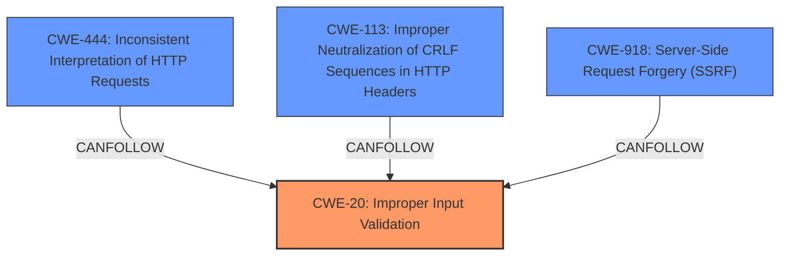

# Analysis Report for CVE-2024-40642

# Vulnerability Analysis Report: CVE-2024-40642

## Description

The netty incubator codec.bhttp is a java language binary http parser. In affected versions the `BinaryHttpParser` class does not properly validate input values thus giving attackers almost complete control over the HTTP requests constructed from the parsed output. Attackers can abuse several issues individually to perform various injection attacks including **HTTP request smuggling**, desync attacks, HTTP **header injections**, request queue poisoning, caching attacks and Server Side Request Forgery (SSRF). Attacker could also combine several issues to create well-formed messages for other text-based protocols which may result in attacks beyond the HTTP protocol. The BinaryHttpParser class implements the readRequestHead method which performs most of the relevant parsing of the received request. The data structure prefixes values with a variable length integer value. The parsing code below first gets the lengths of the values from the prefixed variable length integer. After it has all of the lengths and calculates all of the indices, the parser casts the applicable slices of the ByteBuf to String. Finally, it passes these values into a new `DefaultBinaryHttpRequest` object where no further parsing or validation occurs. Method is partially validated while other values are not validated at all. Software that relies on netty to apply input validation for binary HTTP data may be vulnerable to various injection and protocol based attacks. This issue has been addressed in version 0.0.13.Fi

## Vulnerability Description Key Phrases

- **Rootcause:** improper input validation
- **Weakness:** ['HTTP request smuggling', 'header injections']
- **Impact:** ['HTTP header injections', 'caching attacks', 'desync attacks', 'request queue poisoning', 'server side request forgery']
- **Attacker:** attackers
- **Product:** netty incubator codec.bhttp
- **Version:** before 0.0.13
- **Component:** BinaryHttpParser class

## Analysis (with Relationship Data)

# Summary
| CWE ID    | CWE Name                                                                    | Confidence | CWE Abstraction Level | CWE Vulnerability Mapping Label | CWE-Vulnerability Mapping Notes |
| :---------- | :-------------------------------------------------------------------------- | :--------- | :---------------------- | :-------------------------------- | :-------------------------------- |
| CWE-20      | Improper Input Validation                                                   | 0.9        | Class                   | Primary                           | Discouraged                     |
| CWE-444     | Inconsistent Interpretation of HTTP Requests ('HTTP Request/Response Smuggling')   | 0.8        | Base                    | Secondary                         | Allowed                         |
| CWE-113     | Improper Neutralization of CRLF Sequences in HTTP Headers ('HTTP Request/Response Splitting') | 0.7        | Variant                 | Secondary                         | Allowed                         |
| CWE-918     | Server-Side Request Forgery (SSRF)                                        | 0.6        | Base                    | Secondary                         | Allowed                         |

## Evidence and Confidence

*   **Confidence Score:** 0.8
*   **Evidence Strength:** HIGH

## Relationship Analysis
The primary weakness is **Improper Input Validation (CWE-20)**, which is a broad class. However, the vulnerability description clearly states that the `BinaryHttpParser` class does not properly validate input values. Several other CWEs are related as consequences of this **improper input validation**, leading to HTTP request smuggling (**CWE-444**), HTTP header injections due to **Improper Neutralization of CRLF Sequences in HTTP Headers (CWE-113)**, and potentially Server-Side Request Forgery (**CWE-918**). The abstraction levels were considered to choose the most specific applicable CWEs. CWE-20 is a class-level CWE, but it is the most accurate representation of the **root cause**.



## Vulnerability Chain
The vulnerability chain starts with **improper input validation (CWE-20)**. This leads to several potential exploits: **HTTP request smuggling (CWE-444)**, **header injections (CWE-113)**, and ultimately **Server-Side Request Forgery (CWE-918)**.
- **CWE-20**: Root cause: Improper Input Validation
- **CWE-444**: Consequence: HTTP Request Smuggling
- **CWE-113**: Consequence: HTTP Header Injection
- **CWE-918**: Consequence: Server-Side Request Forgery

## Summary of Analysis
The primary assessment is based on the explicit statement in the vulnerability description that the `BinaryHttpParser` class does not properly validate input values. The evidence is strong, as the description directly identifies **improper input validation** as the **root cause** of the vulnerability. The graph relationships confirm that other identified CWEs are consequences of this **improper input validation**. **CWE-20** is selected as the primary CWE because it directly reflects the **root cause**, while **CWE-444**, **CWE-113**, and **CWE-918** represent the potential impacts resulting from this weakness.

Relevant CWE Information:
- The **root cause** is **improper input validation**.
- Impacts include **HTTP request smuggling**, **HTTP header injections**, and **Server-Side Request Forgery**.

# Enhanced Context (25 CWEs)

## CWE-113: Improper Neutralization of CRLF Sequences in HTTP Headers ('HTTP Request/Response Splitting')
**Abstraction Level**: Variant
**Similarity Score**: 0.74
**Source**: dense

**Description**:
The product receives data from an HTTP agent/component (e.g., web server, proxy, browser, etc.), but it does not neutralize or incorrectly neutralizes CR and LF characters before the data is included in outgoing HTTP headers.

**Mapping Guidance**:
- Usage: Allowed
- Rationale: This CWE entry is at the Variant level of abstraction, which is a preferred level of abstraction for mapping to the root causes of vulnerabilities.

## CWE-444: Inconsistent Interpretation of HTTP Requests ('HTTP Request/Response Smuggling')
**Abstraction Level**: Base
**Similarity Score**: 0.73
**Source**: dense

**Description**:
The product acts as an intermediary HTTP agent
         (such as a proxy or firewall) in the data flow between two
         entities such as a client and server, but it does not
         interpret malformed HTTP requests or responses in ways that
         are consistent with how the messages will be processed by
         those entities that are at the ultimate destination.

**Mapping Guidance**:
- Usage: Allowed
- Rationale: This CWE entry is at the Base level of abstraction, which is a preferred level of abstraction for mapping to the root causes of vulnerabilities.

## CWE-74: Improper Neutralization of Special Elements in Output Used by a Downstream Component ('Injection')
**Abstraction Level**: Class
**Similarity Score**: 0.72
**Source**: dense

**Description**:
The product constructs all or part of a command, data structure, or record using externally-influenced input from an upstream component, but it does not neutralize or incorrectly neutralizes special elements that could modify how it is parsed or interpreted when it is sent to a downstream component.

**Mapping Guidance**:
- Usage: Discouraged
- Rationale: CWE-74 is high-level and often misused when lower-level weaknesses are more appropriate.

## CWE-799: Improper Control of Interaction Frequency
**Abstraction Level**: Class
**Similarity Score**: 0.71
**Source**: dense

**Description**:
The product does not properly limit the number or frequency of interactions that it has with an actor, such as the number of incoming requests.

**Mapping Guidance**:
- Usage: Allowed-with-Review
- Rationale: This CWE entry is a Class and might have Base-level children that would be more appropriate

## CWE-407: Inefficient Algorithmic Complexity
**Abstraction Level**: Class
**Similarity Score**: 0.71
**Source**: dense

**Description**:
An algorithm in a product has an inefficient worst-case computational complexity that may be detrimental to system performance and can be triggered by an attacker, typically using crafted manipulations that ensure that the worst case is being reached.

**Mapping Guidance**:
- Usage: Allowed-with-Review
- Rationale: This CWE entry is a Class and might have Base-level children that would be more appropriate

## CWE-668: Exposure of Resource to Wrong Sphere
**Abstraction Level**: Class
**Similarity Score**: 0.71
**Source**: dense

**Description**:
The product exposes a resource to the wrong control sphere, providing unintended actors with inappropriate access to the resource.

**Mapping Guidance**:
- Usage: Discouraged
- Rationale: CWE-668 is high-level and is often misused as a catch-all when lower-level CWE IDs might be applicable. It is sometimes used for low-information vulnerability reports [REF-1287]. It is a level-1 Class (i.e., a child of a Pillar). It is not useful for trend analysis.

## CWE-134: Use of Externally-Controlled Format String
**Abstraction Level**: Base
**Similarity Score**: 0.71
**Source**: dense

**Description**:
The product uses a function that accepts a format string as an argument, but the format string originates from an external source.

**Mapping Guidance**:
- Usage: Allowed
- Rationale: This CWE entry is at the Base level of abstraction, which is a preferred level of abstraction for mapping to the root causes of vulnerabilities.

## CWE-1391: Use of Weak Credentials
**Abstraction Level**: Class
**Similarity Score**: 0.71
**Source**: dense

**Description**:
The product uses weak credentials (such as a default key or hard-coded password) that can be calculated, derived, reused, or guessed by an attacker.

**Mapping Guidance**:
- Usage: Allowed-with-Review
- Rationale: This CWE entry is a Class and might have Base-level children that would be more appropriate

## CWE-807: Reliance on Untrusted Inputs in a Security Decision
**Abstraction Level**: Base
**Similarity Score**: 0.71
**Source**: dense

**Description**:
The product uses a protection mechanism that relies on the existence or values of an input, but the input can be modified by an untrusted actor in a way that


## CWE Relationship Analysis

Current CWEs represent these abstraction levels: .


### Vulnerability Chain Analysis

**Chain starting from CWE-1391:**
- 1391 (Use of Weak Credentials) - ROOT


**Chain starting from CWE-807:**
- 807 (Reliance on Untrusted Inputs in a Security Decision) - ROOT


### CWE Relationship Diagram

```mermaid
graph TD
    classDef primary fill:#f96,stroke:#333,stroke-width:2px
    classDef secondary fill:#69f,stroke:#333
    classDef tertiary fill:#9e9,stroke:#333
```


*Report generated on 2025-07-13 12:25:32*
