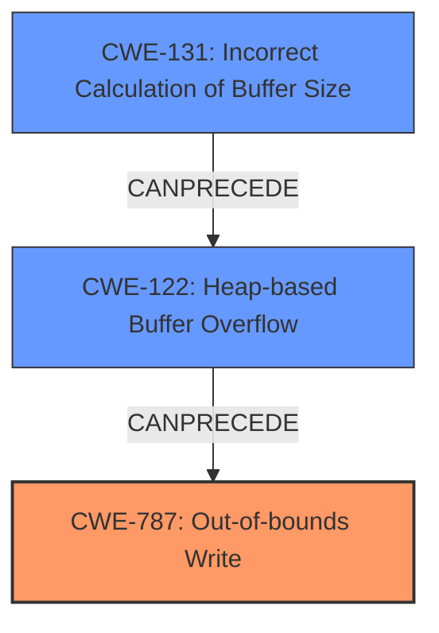

# Enhanced Analysis for CVE-2024-40658

# Summary

| CWE ID | CWE Name | Confidence | CWE Abstraction Level | CWE Vulnerability Mapping Label | CWE-Vulnerability Mapping Notes |
|---|---|---|---|---|---|
| CWE-787 | Out-of-bounds Write | 1.0 | Base |  | Allowed |
| CWE-122 | Heap-based Buffer Overflow | 0.8 | Base |  | Allowed |
| CWE-131 | Incorrect Calculation of Buffer Size | 0.7 | Base |  | Allowed |

## Evidence and Confidence

*   **Confidence Score:** 0.9
*   **Evidence Strength:** HIGH

## Relationship Analysis
The primary weakness is **CWE-787: Out-of-bounds Write**, which is a base-level CWE. **CWE-122: Heap-based Buffer Overflow** is closely related, as the vulnerability occurs on the heap. **CWE-131: Incorrect Calculation of Buffer Size** is a potential cause of the overflow. These CWEs are related in that an incorrect buffer size calculation (CWE-131) can lead to a heap-based buffer overflow (CWE-122), which results in an out-of-bounds write (CWE-787).



## Vulnerability Chain
The vulnerability chain starts with a potential **incorrect calculation of buffer size** (CWE-131). This leads to a **heap-based buffer overflow** (CWE-122), which then results in an **out-of-bounds write** (CWE-787). The final impact is a local escalation of privilege.

## Summary of Analysis
The vulnerability description clearly states an "**out of bounds write** due to a **heap buffer overflow**". The analysis focuses on identifying the root cause and the direct consequence of the overflow. The primary CWE is **CWE-787: Out-of-bounds Write**, representing the direct consequence of the vulnerability. **CWE-122: Heap-based Buffer Overflow** is included as it specifies the location of the buffer overflow. **CWE-131: Incorrect Calculation of Buffer Size** is added as a possible root cause for the heap overflow.

The retriever results and keyphrase analysis consistently point to these CWEs. The relationships between these CWEs help clarify the vulnerability chain.

The selection of **CWE-787: Out-of-bounds Write**, **CWE-122: Heap-based Buffer Overflow**, and **CWE-131: Incorrect Calculation of Buffer Size** is based on the evidence provided and the relationships between these weaknesses. These CWEs are at the appropriate level of specificity.

**CWE-190: Integer Overflow or Wraparound** and **CWE-191: Integer Underflow (Wrap or Wraparound)** were considered but not selected because there isn't enough information to determine that an integer overflow or underflow caused the buffer overflow. The vulnerability description does not explicitly mention integer overflow/underflow.
**CWE-908: Use of Uninitialized Resource** was considered, but the description does not suggest that the resource was uninitialized, only that there was an out-of-bounds write due to a heap buffer overflow.


## CWE Relationship Analysis

Current CWEs represent these abstraction levels: .


### Vulnerability Chain Analysis

**Chain starting from CWE-131:**
- 131 (Incorrect Calculation of Buffer Size) - ROOT


**Chain starting from CWE-787:**
- 787 (Out-of-bounds Write) - ROOT


### CWE Relationship Diagram

```mermaid
graph TD
    classDef primary fill:#f96,stroke:#333,stroke-width:2px
    classDef secondary fill:#69f,stroke:#333
    classDef tertiary fill:#9e9,stroke:#333
```